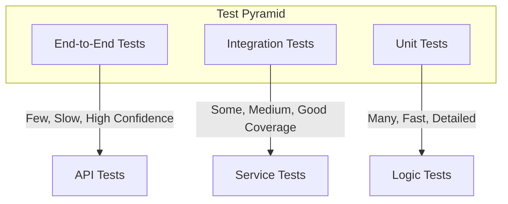

# Contributing to OpenFrame OSS Library

We're excited you're interested in contributing to OpenFrame OSS Library! This document provides guidelines and information for contributors.

## 🤝 Welcome Contributors

OpenFrame OSS Library is the foundational library powering the OpenFrame ecosystem. Your contributions help make device and organization management more accessible, secure, and scalable for developers worldwide.

## 🚀 Quick Start for Contributors

### 1. Join Our Community

Before contributing, join our community:

- 💬 **[OpenMSP Slack Community](https://join.slack.com/t/openmsp/shared_invite/zt-36bl7mx0h-3~U2nFH6nqHqoTPXMaHEHA)** - All discussions happen here
- 🌐 **[OpenFrame Platform](https://openframe.ai)** - Learn about the broader platform
- 📚 **[Documentation](./docs/README.md)** - Comprehensive guides and API reference

> **Important**: We manage all discussions, feature requests, and support through our **OpenMSP Slack community**. GitHub Issues and Discussions are not actively monitored.

### 2. Development Setup

Follow our comprehensive setup guide:

- **[Environment Setup](./docs/development/setup/environment.md)** - Configure your development environment
- **[Local Development](./docs/development/setup/local-development.md)** - Run OpenFrame locally
- **[Development Guide](./docs/development/README.md)** - Complete development documentation

### Prerequisites

- **Java 21+** - OpenJDK or Oracle JDK
- **Maven 3.6+** - Build and dependency management
- **MongoDB 7.0+** - Primary database
- **Redis 7.0+** - Caching (optional)
- **Docker & Docker Compose** - Containerization
- **IDE** - IntelliJ IDEA, Eclipse, or VS Code

## 🎯 How to Contribute

### Types of Contributions

We welcome various types of contributions:

#### 🐛 Bug Fixes
- Fix existing bugs or issues
- Improve error handling
- Enhance validation logic

#### ✨ Feature Enhancements
- Add new API endpoints
- Extend existing DTOs
- Implement new integrations

#### 📚 Documentation
- Improve README files
- Enhance API documentation
- Add code examples

#### 🧪 Testing
- Add unit tests
- Create integration tests
- Improve test coverage

#### 🔧 Infrastructure
- CI/CD improvements
- Build optimizations
- Configuration enhancements

### Getting Started

1. **Fork the Repository**
   ```bash
   # Fork on GitHub, then clone your fork
   git clone https://github.com/YOUR_USERNAME/openframe-oss-lib.git
   cd openframe-oss-lib
   ```

2. **Set Up Development Environment**
   ```bash
   # Install dependencies
   ./gradlew build
   
   # Run tests to verify setup
   ./gradlew test
   ```

3. **Create a Feature Branch**
   ```bash
   git checkout -b feature/your-feature-name
   ```

## 📝 Development Guidelines

### Code Standards

#### Java Code Style
- **Formatting**: Use Google Java Format
- **Naming**: Follow Java naming conventions
- **Documentation**: Javadoc for public APIs
- **Validation**: Input validation for all endpoints

#### Project Structure
```text
openframe-oss-lib/
├── openframe-api-lib/           # API DTOs and interfaces
├── openframe-api-service-core/   # Main API implementation
├── openframe-data-mongo/        # MongoDB data models
├── openframe-security-core/     # Security framework
└── openframe-core/             # Shared utilities
```

#### Package Conventions
```text
com.openframe.{module}
├── config/          # Configuration classes
├── controller/      # REST controllers  
├── service/         # Business logic services
├── repository/      # Data access layer
├── dto/            # Data Transfer Objects
├── model/          # Domain models
└── util/           # Utility classes
```

### API Design Principles

#### RESTful Conventions
- **GET** `/api/devices` - List resources with filtering
- **GET** `/api/devices/{id}` - Get specific resource
- **POST** `/api/devices` - Create new resource
- **PUT** `/api/devices/{id}` - Update entire resource
- **PATCH** `/api/devices/{id}` - Partial update
- **DELETE** `/api/devices/{id}` - Delete resource

#### Response Format Standards
```json
{
  "success": true,
  "data": {
    "id": "device-123",
    "name": "Production Server"
  },
  "pagination": {
    "hasNext": true,
    "cursor": "eyJpZCI6ImRldmljZS0xMjMifQ=="
  },
  "meta": {
    "total": 150,
    "took": 45
  }
}
```

#### Error Handling
```json
{
  "success": false,
  "error": {
    "code": "DEVICE_NOT_FOUND",
    "message": "Device with ID 'device-123' not found",
    "details": {
      "field": "id",
      "value": "device-123"
    }
  },
  "meta": {
    "timestamp": "2024-01-15T10:30:00Z",
    "requestId": "req-abc-123"
  }
}
```

### Testing Requirements

#### Test Coverage
- **Minimum 80%** line coverage
- Unit tests for all business logic
- Integration tests for API endpoints
- Contract tests for external integrations

#### Testing Strategy


#### Running Tests
```bash
# Run all tests
./gradlew test

# Run specific test class
./gradlew test --tests DeviceServiceTest

# Run with coverage
./gradlew test jacocoTestReport
```

### Git Workflow

#### Commit Message Format
Use [Conventional Commits](https://conventionalcommits.org/):

```text
feat: add device filtering API
fix: resolve null pointer in organization service
docs: update API documentation for events
test: add integration tests for device management
refactor: improve error handling in security module
```

#### Branch Naming
- `feature/description` - New features
- `bugfix/description` - Bug fixes
- `docs/description` - Documentation updates
- `refactor/description` - Code refactoring

#### Pull Request Process

1. **Create Quality PR**
   - Clear title and description
   - Reference related issues
   - Include testing details
   - Add screenshots if UI changes

2. **Automated Checks**
   - All tests must pass
   - Code coverage requirements
   - Code quality checks (SonarQube)
   - Security scans

3. **Code Review**
   - Peer review by team members
   - Address feedback promptly
   - Security review for sensitive changes

4. **Merge Requirements**
   - All checks passing
   - Approved by maintainers
   - Up-to-date with main branch

## 🔒 Security Guidelines

### Security Best Practices

- **Input Validation**: Validate all user inputs
- **Output Encoding**: Prevent XSS attacks
- **Authentication**: Secure JWT handling
- **Authorization**: Proper role-based access
- **Data Protection**: Encrypt sensitive data
- **Audit Logging**: Log security events

### Reporting Security Issues

**Do NOT create public issues for security vulnerabilities.**

Instead:
1. Contact us via **[OpenMSP Slack](https://join.slack.com/t/openmsp/shared_invite/zt-36bl7mx0h-3~U2nFH6nqHqoTPXMaHEHA)**
2. Send direct message to maintainers
3. Provide detailed vulnerability information
4. Allow time for fix before public disclosure

## 📋 Code Quality Standards

### Quality Gates

All contributions must meet these standards:

- ✅ **Test Coverage** - Minimum 80% line coverage
- ✅ **Code Duplication** - Less than 3% duplication
- ✅ **Complexity** - Cyclomatic complexity under 10
- ✅ **Security** - No high/critical security issues
- ✅ **Style** - Pass Checkstyle validation
- ✅ **Documentation** - Updated documentation

### Code Analysis Tools

- **Checkstyle** - Java code style enforcement
- **SpotBugs** - Static code analysis
- **SonarQube** - Code quality metrics
- **OWASP Dependency Check** - Security vulnerabilities

## 🎉 Recognition

### Contributor Recognition

We recognize contributors in several ways:

- **GitHub Contributors** - Listed in repository contributors
- **Release Notes** - Mentioned in release announcements
- **Community Shoutouts** - Recognition in Slack community
- **Flamingo Credits** - Platform credits for significant contributions

### Maintainer Path

Interested in becoming a maintainer?

1. **Consistent Contributions** - Regular, quality contributions
2. **Community Engagement** - Active in Slack community
3. **Code Reviews** - Help review other contributions
4. **Documentation** - Improve documentation and examples
5. **Mentoring** - Help new contributors

## 🆘 Getting Help

### Support Channels

- 💬 **[OpenMSP Slack](https://join.slack.com/t/openmsp/shared_invite/zt-36bl7mx0h-3~U2nFH6nqHqoTPXMaHEHA)** - Real-time help and discussions
- 📚 **[Documentation](./docs/README.md)** - Comprehensive guides
- 🚀 **[OpenFrame Platform](https://openframe.ai)** - Product information

### Before Asking for Help

1. **Check Documentation** - Review relevant docs
2. **Search Slack** - Look for previous discussions
3. **Reproduce Issue** - Provide clear reproduction steps
4. **Share Context** - Include environment details

### Asking Effective Questions

When seeking help:
- **Be Specific** - Describe the exact problem
- **Provide Context** - Share relevant code and logs
- **Show Effort** - Explain what you've tried
- **Be Patient** - Allow time for community response

## 📄 License

By contributing to OpenFrame OSS Library, you agree that your contributions will be licensed under the [Flamingo AI Unified License v1.0](./LICENSE.md).

## 🙏 Thank You

Thank you for contributing to OpenFrame OSS Library! Every contribution, no matter how small, helps make device management more accessible and powerful for developers worldwide.

Your efforts help build the future of open-source device and organization management platforms.

---

**Ready to contribute?** Join our [OpenMSP Slack community](https://join.slack.com/t/openmsp/shared_invite/zt-36bl7mx0h-3~U2nFH6nqHqoTPXMaHEHA) and start building with us! 🚀

<div align="center">
  Built with 💛 by the <a href="https://www.flamingo.run/about"><b>Flamingo</b></a> community
</div>