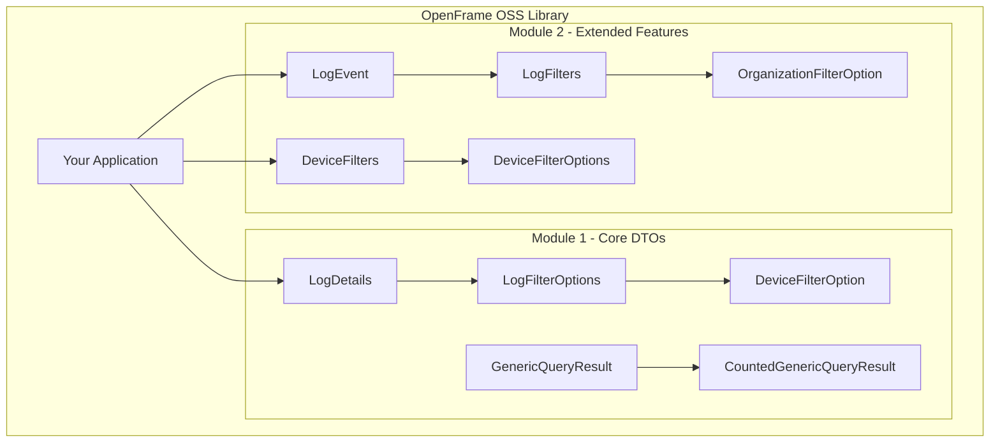

<div align="center">
  <picture>
    <source media="(prefers-color-scheme: dark)" srcset="https://raw.githubusercontent.com/flamingo-stack/openframe-oss-tenant/main/docs/assets/logo-openframe-full-dark-bg.png">
    <source media="(prefers-color-scheme: light)" srcset="https://raw.githubusercontent.com/flamingo-stack/openframe-oss-tenant/main/docs/assets/logo-openframe-full-light-bg.png">
    
  </picture>
</div>

<p align="center">
  <a href="LICENSE.md"></a>
</p>

# OpenFrame OSS Library

A comprehensive Java library designed to facilitate the management and querying of audit logs and device-related data within the OpenFrame API ecosystem. Built with modern Java practices and Lombok annotations, this library provides a clean, maintainable foundation for your OpenFrame API integrations.

## ✨ Features

- **🔍 Comprehensive Audit Logging** - Full support for audit log events with detailed metadata and filtering capabilities
- **🖥️ Advanced Device Management** - Sophisticated filtering options for device queries and status management
- **🛡️ Type-Safe DTOs** - Strongly typed data structures for reliable data handling and reduced runtime errors
- **⚡ Lombok Integration** - Reduced boilerplate with automatic getter/setter generation and builder patterns
- **📊 Pagination Support** - Built-in support for paginated queries and large dataset handling
- **🔧 Generic Query Results** - Flexible result structures for various data types and filtering scenarios
- **🏢 Enterprise Ready** - Production-grade reliability and performance for enterprise applications

## 🚀 Quick Start

### Prerequisites

- Java 17 or higher
- Maven 3.8 or higher

### Installation

Add the dependency to your `pom.xml`:

```xml
<dependency>
    <groupId>com.openframe</groupId>
    <artifactId>openframe-oss-lib</artifactId>
    <version>1.0.0</version>
</dependency>
```

### Basic Usage

```java
// Create an audit log event
LogEvent event = LogEvent.builder()
    .toolEventId("evt-12345")
    .eventType("USER_LOGIN")
    .severity("INFO")
    .userId("user-789")
    .organizationName("Acme Corp")
    .timestamp(Instant.now())
    .build();

// Apply filters to device queries
DeviceFilters filters = DeviceFilters.builder()
    .statuses(Arrays.asList("ACTIVE", "PENDING"))
    .deviceTypes(Arrays.asList("LAPTOP", "MOBILE"))
    .build();

// Create paginated query results
CountedGenericQueryResult<LogDetails> results = CountedGenericQueryResult.<LogDetails>builder()
    .items(logDetailsList)
    .totalCount(150)
    .hasMore(true)
    .build();
```

## 🏗️ Architecture Overview

The library is organized into two main modules:



- **Module 1**: Core DTOs for audit logging and device filtering
- **Module 2**: Extended features for log events and organization management

## 📚 Documentation

📚 See the [Documentation](./docs/README.md) for comprehensive guides including:

- **[Getting Started](./docs/getting-started/introduction.md)** - Introduction and setup guides
- **[Development](./docs/development/README.md)** - Contributing and development guides
- **[Architecture](./docs/reference/architecture/overview.md)** - Technical reference documentation
- **[API Reference](./docs/reference/)** - Complete API documentation

## 🤝 Contributing

We welcome contributions! Please see our [Contributing Guidelines](./CONTRIBUTING.md) for details on:

- Setting up your development environment
- Code style and conventions
- Submitting pull requests
- Issue reporting guidelines

## 📄 License

This project is licensed under the Flamingo AI Unified License v1.0. See the [LICENSE](LICENSE.md) file for details.

## 🆘 Support

- **Documentation**: Check our [comprehensive docs](./docs/README.md)
- **Issues**: Report bugs or request features via [GitHub Issues](../../issues)
- **Discussions**: Join the conversation in [GitHub Discussions](../../discussions)

---
<div align="center">
  Built with 💛 by the <a href="https://www.flamingo.run/about"><b>Flamingo</b></a> team
</div>