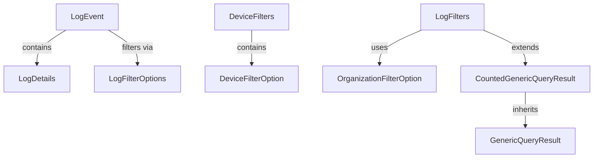

<div align="center">
  <picture>
    <source media="(prefers-color-scheme: dark)" srcset="https://raw.githubusercontent.com/flamingo-stack/openframe-oss-tenant/main/docs/assets/logo-openframe-full-dark-bg.png">
    <source media="(prefers-color-scheme: light)" srcset="https://raw.githubusercontent.com/flamingo-stack/openframe-oss-tenant/main/docs/assets/logo-openframe-full-light-bg.png">
    
  </picture>
</div>

<p align="center">
  <a href="LICENSE.md"></a>
</p>

# OpenFrame OSS Library

A comprehensive Java library providing data transfer objects (DTOs) and filtering mechanisms for managing audit logs and device information within the OpenFrame API ecosystem. This library enhances data retrieval and management capabilities by offering structured ways to filter logs and devices based on specific criteria.

## ✨ Features

- **🔍 Advanced Filtering System** - Comprehensive filtering options for logs, devices, and organizations with multiple criteria support
- **📊 Audit Log Management** - Structured DTOs for capturing, storing, and querying audit events with detailed metadata
- **🖥️ Device Management** - Robust device filtering and categorization with support for various device types and statuses
- **📄 Pagination Support** - Built-in pagination with counted results for efficient data handling at scale
- **🏗️ Clean Architecture** - Modern Java design patterns with Lombok integration for reduced boilerplate code
- **🔧 Developer Friendly** - Intuitive builder patterns and comprehensive documentation for easy integration
- **⚡ Performance Optimized** - Lightweight DTOs designed for high-performance API operations
- **🔗 Type Safe** - Generic query results with compile-time type safety

## 🚀 Quick Start

### Prerequisites

| Requirement | Minimum Version | Recommended | Notes |
|-------------|----------------|-------------|--------|
| Java | 8+ | 17+ | Required for running the library |
| Maven | 3.6+ | 3.8+ | For dependency management |

### Installation

Add the following dependency to your Maven `pom.xml`:

```xml
<dependency>
    <groupId>com.openframe</groupId>
    <artifactId>openframe-api-lib</artifactId>
    <version>1.0.0</version>
</dependency>
```

Or for Gradle projects:

```gradle
implementation 'com.openframe:openframe-api-lib:1.0.0'
```

### Basic Usage

#### Creating a Log Event

```java
import com.openframe.api.dto.audit.LogEvent;
import java.time.Instant;

LogEvent event = LogEvent.builder()
    .toolEventId("evt_" + System.currentTimeMillis())
    .eventType("USER_LOGIN")
    .toolType("WEB_APP")
    .severity("MEDIUM")
    .userId("user123")
    .deviceId("device456")
    .summary("User successfully logged in")
    .timestamp(Instant.now())
    .build();
```

#### Setting Up Device Filters

```java
import com.openframe.api.dto.device.DeviceFilterOption;
import com.openframe.api.dto.device.DeviceFilters;

DeviceFilters filters = DeviceFilters.builder()
    .statuses(Arrays.asList(
        DeviceFilterOption.builder()
            .value("ACTIVE")
            .label("Active Devices")
            .build()
    ))
    .types(Arrays.asList(
        DeviceFilterOption.builder()
            .value("LAPTOP")
            .label("Laptop Computers")
            .build()
    ))
    .build();
```

#### Working with Query Results

```java
import com.openframe.api.dto.GenericQueryResult;
import com.openframe.api.dto.CountedGenericQueryResult;

// Standard query results with pagination
GenericQueryResult<LogEvent> results = GenericQueryResult.<LogEvent>builder()
    .items(eventsList)
    .pageInfo(pageInfo)
    .build();

// Counted results for advanced filtering
CountedGenericQueryResult<LogEvent> countedResults = 
    CountedGenericQueryResult.<LogEvent>builder()
        .items(eventsList)
        .pageInfo(pageInfo)
        .filteredCount(totalFilteredItems)
        .build();
```

## 📚 Documentation

### Core Components

The library is organized into two main modules:

#### Module 1: Audit Logs & Basic Device Filtering
- **LogEvent** - Individual audit event representation
- **LogDetails** - Detailed log event information  
- **LogFilterOptions** - Basic log filtering capabilities
- **DeviceFilters** - Device collection filtering
- **DeviceFilterOption** - Individual device filter options

#### Module 2: Advanced Filtering & Query Management
- **LogFilters** - Comprehensive log filtering system
- **OrganizationFilterOption** - Organization-based filtering
- **DeviceFilterOptions** - Advanced device filtering
- **GenericQueryResult** - Generic paginated query results
- **CountedGenericQueryResult** - Enhanced query results with counts

### Architecture Overview



### Getting Started Guides

- **[User Getting Started](docs/tutorials/user/getting-started.md)** - Complete setup and usage guide
- **[Common Use Cases](docs/tutorials/user/common-use-cases.md)** - Real-world examples and patterns
- **[Developer Guide](docs/tutorials/dev/getting-started-dev.md)** - Development environment setup
- **[Architecture Overview](docs/tutorials/dev/architecture-overview-dev.md)** - Deep dive into system design

### API Documentation

Detailed documentation for each component:

- [GenericQueryResult](docs/dev/GenericQueryResult.md)
- [CountedGenericQueryResult](docs/dev/CountedGenericQueryResult.md)
- [LogEvent](docs/dev/LogEvent.md)
- [LogDetails](docs/dev/LogDetails.md)
- [LogFilters](docs/dev/LogFilters.md)
- [LogFilterOptions](docs/dev/LogFilterOptions.md)
- [DeviceFilters](docs/dev/DeviceFilters.md)
- [DeviceFilterOptions](docs/dev/DeviceFilterOptions.md)
- [DeviceFilterOption](docs/dev/DeviceFilterOption.md)
- [OrganizationFilterOption](docs/dev/OrganizationFilterOption.md)

## 💻 Development

### Building the Project

```bash
# Clone the repository
git clone https://github.com/your-org/openframe-oss-lib.git
cd openframe-oss-lib

# Build and install dependencies
mvn clean install

# Run tests
mvn test

# Generate documentation
mvn javadoc:javadoc
```

### Code Style

The project follows Google Java Style guidelines and uses Lombok for boilerplate reduction. Key conventions:

- Use `@Data`, `@Builder`, `@NoArgsConstructor`, `@AllArgsConstructor` for DTOs
- Follow builder pattern for object creation
- Use appropriate Java types (`Instant` for timestamps, `List<>` for collections)
- Include comprehensive JavaDoc for public APIs

### Contributing

We welcome contributions! Please see [CONTRIBUTING.md](CONTRIBUTING.md) for detailed guidelines on:

- Development environment setup
- Code style and conventions
- Testing requirements
- Pull request process

## 🔧 Integration Examples

### REST API Integration

```java
@RestController
@RequestMapping("/api/logs")
public class LogController {
    
    @PostMapping("/search")
    public CountedGenericQueryResult<LogEvent> searchLogs(
            @RequestBody LogFilters filters) {
        // Use OpenFrame DTOs in your API endpoints
        return logService.searchLogs(filters);
    }
    
    @PostMapping
    public ResponseEntity<LogEvent> createLog(
            @RequestBody LogEvent logEvent) {
        LogEvent saved = logService.save(logEvent);
        return ResponseEntity.ok(saved);
    }
}
```

### Service Layer Integration

```java
@Service
public class AuditService {
    
    public void logUserAction(String userId, String action, String deviceId) {
        LogEvent event = LogEvent.builder()
            .toolEventId(generateEventId())
            .eventType("USER_ACTION")
            .toolType("WEB_APP")
            .severity("INFO")
            .userId(userId)
            .deviceId(deviceId)
            .summary("User performed: " + action)
            .timestamp(Instant.now())
            .build();
            
        // Save to your audit system
        auditRepository.save(event);
    }
}
```

## 📦 Maven Central

This library is available on Maven Central. Always use the latest version for bug fixes and new features:

```xml
<dependency>
    <groupId>com.openframe</groupId>
    <artifactId>openframe-api-lib</artifactId>
    <version>${openframe.version}</version>
</dependency>
```

## 🤝 Support

- **Documentation**: Check our comprehensive [tutorial guides](docs/tutorials/)
- **Issues**: Report bugs and request features on [GitHub Issues](https://github.com/your-org/openframe-oss-lib/issues)
- **Community**: Join discussions in our community channels

## 📄 License

This project is licensed under the Flamingo AI Unified License v1.0. See [LICENSE.md](LICENSE.md) for details.

---
<div align="center">
  Built with 💛 by the <a href="https://www.flamingo.run/about"><b>Flamingo</b></a> team
</div>