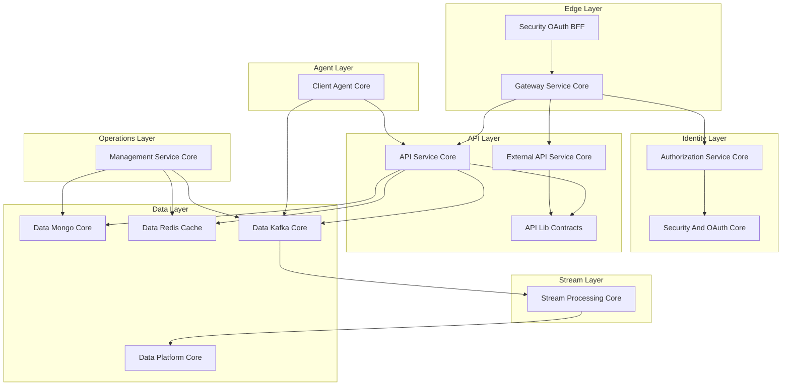

<div align="center">
  <picture>
    <source media="(prefers-color-scheme: dark)" srcset="https://shdrojejslhgnojzkzak.supabase.co/storage/v1/object/public/public/doc-orchestrator/logos/1771384787765-92lldo-logo-openframe-full-dark-bg.png">
    <source media="(prefers-color-scheme: light)" srcset="https://shdrojejslhgnojzkzak.supabase.co/storage/v1/object/public/public/doc-orchestrator/logos/1771384795200-4l8vh-logo-openframe-full-light-bg.png">
    
  </picture>
</div>

<p align="center">
  <a href="LICENSE.md"></a>
</p>

# OpenFrame OSS Lib

**The modular, open-source foundation powering the OpenFrame platform** - A full-stack, multi-tenant, event-driven backend foundation for building AI-powered MSP platforms and modern IT automation systems.

OpenFrame OSS Lib replaces expensive proprietary software with open-source alternatives enhanced by intelligent automation, serving as the core infrastructure that powers Flamingo's AI-driven MSP platform and the unified OpenFrame interface.

## 🎥 Platform Demo

[](https://www.youtube.com/watch?v=a45pzxtg27k)

## ✨ Key Features

### 🏗️ **Microservice-Ready Architecture**
- **15 modular core libraries** - Independent deployment capability with clear separation of concerns
- **Event-driven communication** - Real-time processing and integration across services
- **Multi-tenant by design** - Built for SaaS-scale tenant isolation

### 🔐 **Enterprise Security**
- **Multi-tenant JWT authentication** (RS256) with per-tenant RSA key management  
- **OAuth2 Authorization Server** with OIDC support and SSO integration (Google, Microsoft)
- **API key management** with rate limiting and tenant-scoped access control
- **Reactive Spring Cloud Gateway** with WebSocket support

### 📊 **Real-Time Data Processing**
- **Apache Kafka** event streaming with tenant-aware configuration
- **Apache Pinot** analytics with real-time ingestion
- **Apache Cassandra** time-series storage for logs and events
- **Redis** distributed caching with tenant-aware key prefixing
- **Stream processing engine** for event enrichment and normalization

### 🤖 **Agent Management**
- **Machine agent lifecycle management** with heartbeat processing
- **Tool installation orchestration** across FleetDM and TacticalRMM
- **OAuth token issuance** for secure agent communication
- **NATS event listeners** for real-time agent communication

### 🌐 **API-First Design**
- **GraphQL API** with cursor-based pagination and Netflix DGS framework
- **REST API** for external integrations with comprehensive OpenAPI documentation
- **Reactive gateway** with JWT validation and token propagation
- **WebSocket proxy** support for tools and agents

## 🏛️ Architecture Overview

OpenFrame OSS Lib implements a layered, event-driven system optimized for scale:



## 🚀 Quick Start

### Prerequisites
- Java 21
- Maven 3.8+
- Docker & Docker Compose

### Get Started in 5 Minutes

```bash
# 1. Clone the repository
git clone https://github.com/flamingo-stack/openframe-oss-lib.git
cd openframe-oss-lib

# 2. Build all modules
mvn clean install -DskipTests

# 3. Start development services
docker-compose up -d

# 4. Verify the build
mvn test -Dtest=*Test -DfailIfNoTests=false
```

For detailed setup instructions, see the [Quick Start Guide](docs/getting-started/quick-start.md).

## 🛠️ Technology Stack

| Layer | Technologies |
|-------|-------------|
| **Framework** | Spring Boot 3.3.0, Java 21 |
| **Security** | OAuth2, JWT (RS256), Spring Security |
| **Data Storage** | MongoDB, Apache Cassandra, Redis |
| **Streaming** | Apache Kafka, NATS, Debezium |
| **Analytics** | Apache Pinot |
| **API** | GraphQL (Netflix DGS), REST, OpenAPI |
| **Gateway** | Spring Cloud Gateway (Reactive) |
| **Testing** | Spring Boot Test, RestAssured, Testcontainers |

## 📦 Module Structure

The library is organized into 15 modular cores:

```text
openframe-oss-lib/
├── api-lib-contracts/          # Shared DTOs and contracts
├── api-service-core/           # Internal GraphQL + REST API
├── authorization-service-core/ # OAuth2 Authorization Server  
├── client-agent-core/          # Machine agent management
├── core-utilities/             # Shared utilities and validation
├── data-kafka-core/           # Kafka infrastructure
├── data-mongo-core/           # MongoDB persistence
├── data-redis-cache/          # Redis caching layer
├── data-platform-core/        # Pinot + Cassandra orchestration
├── external-api-service-core/ # Public REST API
├── gateway-service-core/      # Reactive API Gateway
├── management-service-core/   # Infrastructure control plane
├── security-and-oauth-core/   # JWT + PKCE utilities
├── security-oauth-bff/        # OAuth BFF layer
└── stream-processing-core/    # Event processing engine
```

Each module is independently reusable but designed to interoperate within a unified OpenFrame deployment.

## 📚 Documentation

📚 **[Complete Documentation](./docs/README.md)** - Comprehensive guides, API references, and tutorials

### Quick Links

- **[Getting Started](./docs/getting-started/introduction.md)** - Introduction and setup guide
- **[Quick Start](./docs/getting-started/quick-start.md)** - 5-minute setup guide  
- **[Development Setup](./docs/development/setup/local-development.md)** - Local development environment
- **[Architecture Guide](./docs/development/architecture/README.md)** - System design and patterns
- **[Contributing](./CONTRIBUTING.md)** - How to contribute to the project

### Watch the Full Platform Walkthrough

[](https://www.youtube.com/watch?v=bINdW0CQbvY)

## 🎯 Target Audience

### **MSP Developers & Platform Engineers**
- Building next-generation MSP platforms
- Integrating multiple tools into unified interfaces
- Scaling IT automation workflows

### **Enterprise Development Teams**
- Creating multi-tenant SaaS applications
- Implementing event-driven architectures  
- Building real-time analytics platforms

### **Open Source Contributors**
- Contributing to the OpenFrame ecosystem
- Extending MSP platform capabilities
- Building community-driven integrations

## 🌟 Core Design Principles

✅ **Multi-tenant by design** - Built for SaaS-scale isolation  
✅ **Event-driven architecture** - Real-time processing and integration  
✅ **Cursor-based pagination** - Efficient data access patterns  
✅ **Asymmetric JWT cryptography** - Secure token validation  
✅ **Tool-agnostic normalization** - Universal event and data models  
✅ **Infrastructure auto-bootstrap** - Zero-configuration deployments  
✅ **Reactive edge gateway** - High-performance API routing  
✅ **Clear separation of concerns** - Maintainable modular design  

## 🤝 Community & Support

Join the OpenFrame community for support, discussions, and collaboration:

- **🚀 Community Slack**: [OpenMSP Slack](https://join.slack.com/t/openmsp/shared_invite/zt-36bl7mx0h-3~U2nFH6nqHqoTPXMaHEHA) - All discussions and support
- **🌐 Flamingo Platform**: [flamingo.run](https://flamingo.run)  
- **🔧 OpenFrame Platform**: [openframe.ai](https://openframe.ai)
- **📂 GitHub Repository**: [flamingo-stack/openframe-oss-lib](https://github.com/flamingo-stack/openframe-oss-lib)

> **Note**: We use the OpenMSP Slack community for all discussions, issues, and collaboration. GitHub Issues and Discussions are not actively monitored.

## 📄 License

This project is licensed under the [Flamingo AI Unified License v1.0](LICENSE.md).

---
<div align="center">
  Built with 💛 by the <a href="https://www.flamingo.run/about"><b>Flamingo</b></a> team
</div>