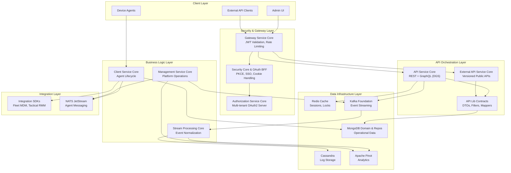
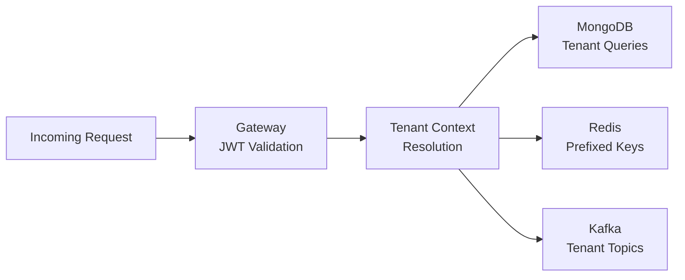

<div align="center">
  <picture>
    <source media="(prefers-color-scheme: dark)" srcset="https://shdrojejslhgnojzkzak.supabase.co/storage/v1/object/public/public/doc-orchestrator/logos/1771384787765-92lldo-logo-openframe-full-dark-bg.png">
    <source media="(prefers-color-scheme: light)" srcset="https://shdrojejslhgnojzkzak.supabase.co/storage/v1/object/public/public/doc-orchestrator/logos/1771384795200-4l8vh-logo-openframe-full-light-bg.png">
    
  </picture>
</div>

<p align="center">
  <a href="LICENSE.md"></a>
</p>

# OpenFrame OSS Lib

**The foundational backend library suite powering the OpenFrame AI-driven MSP platform.**

OpenFrame OSS Lib provides enterprise-grade, modular Spring Boot libraries designed for modern MSP (Managed Service Provider) platforms. With 15+ specialized modules, it delivers multi-tenant security, real-time streaming, and tool-agnostic integration in a clean, event-driven architecture.

[](https://www.youtube.com/watch?v=awc-yAnkhIo)

## ✨ Key Features

### 🔐 Enterprise Security
- **Multi-tenant OAuth2 Authorization Server** with per-tenant RSA signing keys
- **SSO Integration** (Google, Microsoft) with invitation-based onboarding  
- **JWT-based authentication** with secure HttpOnly cookie handling
- **PKCE utilities** and Backend-for-Frontend (BFF) OAuth flows
- **Tenant-aware data isolation** across all data layers

### 🌐 Scalable API Infrastructure  
- **Reactive Spring Cloud Gateway** with multi-issuer JWT validation
- **REST + GraphQL APIs** powered by Netflix DGS with DataLoader optimization
- **API key enforcement** with rate limiting and tenant scoping
- **WebSocket routing** for real-time communication (NATS, tools)
- **External API service** with versioned public endpoints

### 📊 Real-Time Data & Analytics
- **Event-driven architecture** with Kafka streaming and Kafka Streams
- **Multi-database support**: MongoDB (operational), Cassandra (logs), Apache Pinot (analytics), Redis (cache)
- **Stream processing** with unified event normalization and enrichment
- **Real-time device monitoring** and log aggregation
- **Cursor-based pagination** for efficient data access

### 🔧 Universal Tool Integration
- **MSP tool connector hub** supporting Fleet MDM, Tactical RMM, MeshCentral
- **Agent lifecycle management** with NATS JetStream messaging
- **Tool-agnostic integration** preserving existing MSP investments
- **Distributed scheduling** with Redis locks for operational tasks
- **Platform bootstrapping** and self-healing infrastructure

### 🚀 Production-Ready Architecture
- **Multi-tenant SaaS architecture** with tenant isolation by design
- **Microservice foundation** with clean separation of concerns
- **Extensible processor hooks** for custom business logic
- **Distributed caching** and session management
- **Operational orchestration** with Pinot schema deployment and Debezium connectors

## 🏗️ Architecture Overview

OpenFrame OSS Lib implements a layered, event-driven architecture with clear separation of concerns:



## 🚀 Quick Start

Get up and running in 5 minutes:

```bash
# 1. Clone the repository
git clone https://github.com/flamingo-stack/openframe-oss-lib.git
cd openframe-oss-lib

# 2. Build all modules
mvn clean install

# 3. Explore the architecture
ls -la */

# 4. Run tests (optional)
mvn test
```

That's it! All OpenFrame OSS Lib modules are now built and available in your local Maven repository.

### Prerequisites

- **Java 21** or higher
- **Maven 3.8+** for building
- **Docker** (optional, for integration testing with Testcontainers)

## 🛠️ Technology Stack

Built with modern, production-proven technologies:

| Layer | Technologies |
|-------|-------------|
| **Framework** | Spring Boot 3.3.0, Spring Cloud 2023.0.3 |
| **Security** | Spring Security OAuth2, JWT (JJWT), PKCE |
| **Data** | MongoDB, Redis, Apache Cassandra, Apache Pinot |
| **Messaging** | Apache Kafka, NATS JetStream |
| **API** | REST, GraphQL (Netflix DGS), OpenAPI |
| **Gateway** | Spring Cloud Gateway (Reactive) |
| **Runtime** | Java 21, GraalVM compatible |
| **Testing** | JUnit 5, Testcontainers, Mockito |

## 📦 Module Structure

OpenFrame OSS Lib consists of 15+ specialized modules organized into logical layers:

### Core Infrastructure
- **`openframe-core`** - Shared utilities, validation, encryption
- **`openframe-api-lib-contracts`** - API contracts, DTOs, mappers, filters

### Security & Identity  
- **`openframe-authorization-service-core`** - Multi-tenant OAuth2 server
- **`openframe-security-core-and-oauth-bff`** - JWT utilities, PKCE, BFF flows

### API & Gateway
- **`openframe-gateway-service-core`** - Reactive gateway, JWT validation, rate limiting
- **`openframe-api-service-core`** - Internal REST + GraphQL APIs (Netflix DGS)
- **`openframe-external-api-service-core`** - Versioned public APIs

### Data Infrastructure
- **`openframe-data-mongo-domain-and-repos`** - MongoDB domain models, repositories
- **`openframe-data-redis-cache`** - Redis caching with tenant awareness
- **`openframe-data-kafka-foundation`** - Kafka producers, consumers, topics
- **`openframe-data-platform-cassandra-and-pinot`** - Analytics data layer

### Business Services
- **`openframe-client-service-core`** - Agent lifecycle, NATS integration
- **`openframe-stream-processing-core`** - Real-time event processing
- **`openframe-management-service-core`** - Platform operations, bootstrapping

### Tool Integrations
- **`openframe-integrations-sdks`** - External tool SDKs (Fleet MDM, Tactical RMM)

## 🎯 Use Cases

OpenFrame OSS Lib is designed for:

- **MSP Platform Developers** building comprehensive service management solutions
- **Enterprise IT Teams** needing secure, scalable multi-tenant infrastructure
- **Integration Partners** connecting existing tools to modern platforms  
- **DevOps Engineers** implementing event-driven microservice architectures
- **SaaS Builders** requiring tenant isolation and OAuth2 security

## 🔒 Multi-Tenant Security Model

Security and tenant isolation are enforced at every layer:



**Key Security Features:**
- Per-tenant OAuth2 issuer validation
- Per-tenant RSA signing keys  
- Tenant-scoped database queries
- Redis key prefixing for isolation
- Kafka topic tenant partitioning
- JWT claim propagation (`tenant_id`)

## 📚 Documentation

📚 See the [Documentation](./docs/README.md) for comprehensive guides including:

- **Getting Started** - Setup, quick start, and first steps
- **Development** - Local environment, contributing guidelines, testing
- **Reference** - Architecture deep-dives, API documentation, and service details
- **Architecture Diagrams** - Visual system documentation

## 🌟 OpenFrame Platform Context

OpenFrame OSS Lib powers **[OpenFrame](https://openframe.ai)** – the unified AI-powered MSP platform that integrates multiple tools into a single intelligent interface.

**OpenFrame Features:**
- **Mingo AI** - AI assistant for technicians
- **Fae** - AI interface for clients  
- **Unified Dashboard** - Single pane of glass for all MSP tools
- **Tool Integration** - Connect existing Fleet MDM, RMM, and PSA tools

Learn more at [https://flamingo.run](https://flamingo.run) and [https://openframe.ai](https://openframe.ai).

## 🤝 Community & Support

We use **Slack** for all community interactions and support:

- **OpenMSP Community**: [Join our Slack](https://join.slack.com/t/openmsp/shared_invite/zt-36bl7mx0h-3~U2nFH6nqHqoTPXMaHEHA)
- **Platform Website**: [https://www.openmsp.ai/](https://www.openmsp.ai/)

**Note**: We don't use GitHub Issues or GitHub Discussions. All discussions, support requests, and feature planning happen in our OpenMSP Slack community.

## 📄 License

This project is licensed under the **Flamingo AI Unified License v1.0**. See [LICENSE.md](LICENSE.md) for details.

---

<div align="center">
  Built with 💛 by the <a href="https://www.flamingo.run/about"><b>Flamingo</b></a> team
</div>