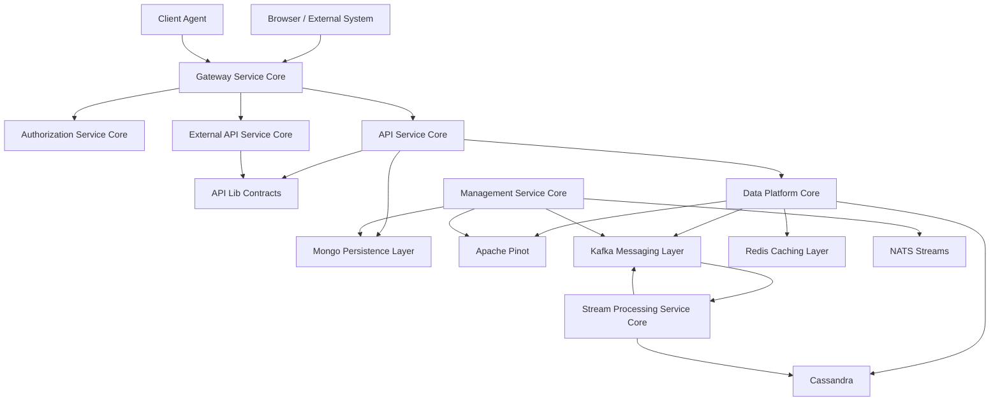

<div align="center">
  <picture>
    <source media="(prefers-color-scheme: dark)" srcset="https://shdrojejslhgnojzkzak.supabase.co/storage/v1/object/public/public/doc-orchestrator/logos/1771384787765-92lldo-logo-openframe-full-dark-bg.png">
    <source media="(prefers-color-scheme: light)" srcset="https://shdrojejslhgnojzkzak.supabase.co/storage/v1/object/public/public/doc-orchestrator/logos/1771384795200-4l8vh-logo-openframe-full-light-bg.png">
    
  </picture>
</div>

<p align="center">
  <a href="LICENSE.md"></a>
</p>

# OpenFrame OSS Libraries

**The complete backend foundation for AI-powered MSP platforms.** OpenFrame OSS Libraries provides all shared libraries and service cores needed to build scalable, multi-tenant, event-driven IT management infrastructure that powers the OpenFrame ecosystem.

[](https://www.youtube.com/watch?v=a45pzxtg27k)

## 🚀 What is OpenFrame OSS Lib?

OpenFrame OSS Libraries is the **core backend runtime stack** that enables organizations to build production-ready MSP platforms with modern architecture patterns. It serves as the foundation for [OpenFrame](https://openframe.ai) – Flamingo's unified platform that replaces expensive proprietary software with open-source alternatives enhanced by intelligent automation.

**Key Capabilities:**
- **Multi-tenant architecture** supporting thousands of MSP organizations
- **Event-driven processing** with real-time data enrichment and normalization  
- **AI-ready infrastructure** for intelligent automation and insights
- **Enterprise-grade security** with OAuth2/OIDC compliance
- **Scalable data platform** combining MongoDB, Cassandra, Redis, and Apache Pinot

## ✨ Features

### 🏗️ **Modular Service-Core Architecture**
Built as a collection of focused service modules, each handling specific responsibilities like authentication, data persistence, event processing, and external integrations.

### 🔐 **Enterprise Security**
- Multi-tenant OAuth2 Authorization Server with per-tenant key pairs
- JWT-based authentication with secure token management
- API key management for external integrations
- Role-based access control (RBAC) with fine-grained permissions
- Reactive edge gateway with advanced security controls

### 📊 **Unified Data Platform**  
- **MongoDB** for operational data storage and real-time state
- **Apache Pinot** for real-time analytics and OLAP queries
- **Cassandra** for audit log storage and time-series data
- **Redis** for caching, session management, and distributed locking

### ⚡ **Event-Driven Architecture**
- **Kafka messaging backbone** for reliable event processing
- **NATS streams** for real-time agent communication
- **Debezium CDC** for data synchronization across systems
- **Stream processing engine** for data enrichment and normalization

### 🤖 **Client Agent Orchestration**
- Agent registration and lifecycle management
- Tool integration with popular MSP platforms
- Real-time heartbeat monitoring and health checks
- Automated deployment and version management

### 🌐 **Comprehensive API Layer**
- **REST APIs** for administrative operations and CRUD workflows
- **GraphQL APIs** for efficient data querying and real-time updates
- **External APIs** for third-party integrations and webhooks
- **WebSocket support** for real-time communication

## 🏛️ Architecture Overview

OpenFrame OSS Lib implements a layered, event-driven, multi-tenant architecture designed for horizontal scalability:



### **Architectural Characteristics**
- ✅ **Multi-tenant by design** – Complete tenant isolation at all layers
- ✅ **OAuth2 + OIDC compliant** – Enterprise identity and access management  
- ✅ **Reactive edge gateway** – High-throughput request routing
- ✅ **Event-driven processing** – Kafka + Debezium for reliable data flows
- ✅ **Real-time enrichment** – Stream processing for intelligent data transformation
- ✅ **Analytical storage** – Pinot + Cassandra for reporting and insights
- ✅ **Distributed coordination** – Redis-backed locking and caching

## 🏗️ Core Modules

### **API & Contracts**
| Module | Purpose |
|--------|---------|
| **api-lib-contracts-and-services** | Shared DTOs, filters, mappers, and reusable services |
| **api-service-core-controllers-and-graphql** | REST + GraphQL API orchestration layer |

### **Security & Identity**  
| Module | Purpose |
|--------|---------|
| **authorization-service-core** | Multi-tenant OAuth2/OIDC Authorization Server |
| **security-core-and-oauth-bff** | JWT infrastructure + OAuth BFF authentication flow |
| **gateway-service-core** | Reactive edge gateway with JWT + API key validation |

### **Data & Infrastructure**
| Module | Purpose |  
|--------|---------|
| **mongo-persistence-layer** | MongoDB document models + repositories |
| **data-platform-core** | Cassandra + Pinot configuration + analytics repositories |
| **kafka-messaging-layer** | Multi-tenant Kafka infrastructure and CDC models |
| **redis-caching-layer** | Redis caching + tenant-aware key management |

### **Processing & Integration**
| Module | Purpose |
|--------|---------|  
| **stream-processing-service-core** | CDC ingestion, data enrichment, and normalization |
| **management-service-core** | Connector automation, Pinot deployment, scheduled operations |
| **client-agent-service-core** | Agent registration, lifecycle management, NATS listeners |
| **external-api-service-core** | Stable REST API layer for external system integration |

## 🚀 Quick Start

Get OpenFrame OSS Libraries running in 5 minutes:

### Prerequisites
- **Java 21+** (OpenJDK recommended)
- **Maven 3.6+** for dependency management  
- **Docker & Docker Compose** for infrastructure services
- **8GB RAM minimum** (16GB recommended)

### Installation

```bash
# 1. Clone the repository
git clone https://github.com/flamingo-stack/openframe-oss-lib.git
cd openframe-oss-lib

# 2. Start infrastructure services with Docker
docker-compose up -d

# 3. Build all modules
mvn clean install -DskipTests

# 4. Run the main API service
cd openframe-api-service-core
mvn spring-boot:run
```

### Verification

```bash
# Test the health endpoint
curl http://localhost:8080/health

# Explore GraphQL schema
open http://localhost:8080/graphiql

# Check OAuth2 configuration
curl http://localhost:8080/.well-known/openid-configuration
```

**🎉 Success!** You now have a running OpenFrame OSS backend with:
- MongoDB (port 27017) - Primary database
- Redis (port 6379) - Caching and sessions
- Kafka (port 9092) - Event streaming  
- API Service (port 8080) - Main application API

## 🛠️ Technology Stack

| Component | Technology | Purpose |
|-----------|------------|---------|
| **Runtime** | Java 21 | Modern language features, performance |
| **Framework** | Spring Boot 3.3.0 | Application framework, dependency injection |
| **Security** | Spring Authorization Server 1.3.1 | OAuth2/OIDC implementation |
| **Database** | MongoDB, Cassandra, Redis, Pinot | Multi-modal data storage |
| **Messaging** | Apache Kafka, NATS | Event streaming, real-time communication |
| **API** | Netflix DGS 9.0.3 | GraphQL implementation |
| **Build** | Maven 3.x | Dependency management, multi-module builds |

## 📚 Documentation

📚 See the **[Documentation](./docs/README.md)** for comprehensive guides including:

- **[Getting Started](./docs/README.md#getting-started)** - Installation, setup, and first steps
- **[Development](./docs/README.md#development)** - Local development setup and workflows  
- **[Reference](./docs/README.md#reference)** - Technical architecture and API documentation
- **[Contributing](./CONTRIBUTING.md)** - Guidelines for contributing to the project

### External Resources

The **OpenFrame CLI** tool for self-hosting deployment is maintained separately:
- **Repository**: [flamingo-stack/openframe-cli](https://github.com/flamingo-stack/openframe-cli)
- **Documentation**: [CLI Documentation](https://github.com/flamingo-stack/openframe-cli/blob/main/docs/README.md)

## 🎯 Who Should Use This?

### **MSP Platform Developers**
Build and customize OpenFrame-powered MSP solutions with comprehensive backend services, APIs, and event-driven architecture.

### **Enterprise IT Teams**  
Deploy secure, scalable IT management infrastructure with modern authentication, multi-tenancy, and real-time analytics.

### **Integration Partners**
Connect existing tools and workflows using standardized REST/GraphQL APIs and event-driven interfaces.

### **Open Source Contributors**
Contribute to the evolution of open-source MSP tooling and AI-driven automation infrastructure.

## 🌟 Key Benefits

- **⚡ Fast Development** - Pre-built service cores eliminate months of foundation work
- **🔒 Enterprise Security** - Production-ready OAuth2/OIDC with multi-tenant isolation
- **📈 Horizontally Scalable** - Event-driven architecture scales to handle millions of events
- **🔌 Integration Ready** - Standard APIs and webhooks for seamless tool integration
- **🤖 AI-Optimized** - Data platform designed for machine learning and automation
- **💰 Cost-Effective** - Replace expensive proprietary solutions with open-source alternatives

## 🤝 Community & Support

- **💬 Slack Community**: [OpenMSP Community](https://join.slack.com/t/openmsp/shared_invite/zt-36bl7mx0h-3~U2nFH6nqHqoTPXMaHEHA) - Primary communication channel
- **🐛 Issues**: [GitHub Issues](https://github.com/flamingo-stack/openframe-oss-lib/issues) - Bug reports and feature requests  
- **📖 Website**: [OpenFrame Documentation](https://www.flamingo.run/openframe) - Official documentation
- **🎥 Demos**: [OpenFrame YouTube Channel](https://www.youtube.com/@openframe) - Product demos and tutorials

## 📺 Learn More

[](https://www.youtube.com/watch?v=bINdW0CQbvY)

## 📄 License

This project is licensed under the [Flamingo AI Unified License v1.0](LICENSE.md).

---
<div align="center">
  Built with 💛 by the <a href="https://www.flamingo.run/about"><b>Flamingo</b></a> team
</div>