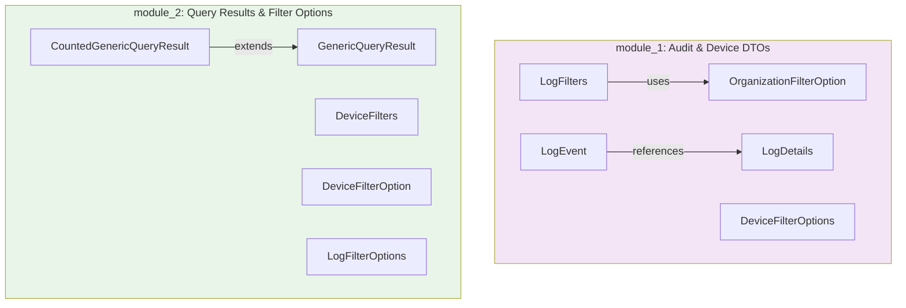

<div align="center">
  <picture>
    <source media="(prefers-color-scheme: dark)" srcset="https://raw.githubusercontent.com/flamingo-stack/openframe-oss-tenant/main/docs/assets/logo-openframe-full-dark-bg.png">
    <source media="(prefers-color-scheme: light)" srcset="https://raw.githubusercontent.com/flamingo-stack/openframe-oss-tenant/main/docs/assets/logo-openframe-full-light-bg.png">
    
  </picture>
</div>

<p align="center">
  <a href="LICENSE.md"></a>
</p>

# OpenFrame OSS Library

A foundational Java library providing essential data transfer objects (DTOs), filter options, and query result structures for the OpenFrame API ecosystem. This library serves as the backbone for OpenFrame API data modeling, enabling robust audit logging, device management, and flexible querying across OpenFrame platform services.

## ✨ Features

### 🔍 **Comprehensive Audit Logging**
- **LogEvent & LogDetails** - Rich audit trail representation with metadata capture
- **Flexible Filtering** - Advanced search capabilities across tool types, severities, and organizations  
- **Event Tracking** - Complete audit history with user, device, and organizational context

### 📱 **Device Management**
- **Device Filter Options** - Status, type, OS, organization, and tag-based filtering
- **Inventory Queries** - Streamlined device discovery and management
- **Organizational Grouping** - Multi-tenant device organization support

### 📊 **Generic Query Results**
- **Paginated Responses** - Cursor-based pagination for efficient data retrieval
- **Counted Results** - Total count information for UI pagination
- **Type-Safe Generics** - Reusable across different data types

### 🏗️ **Modular Architecture**
- **Clean Separation** - Distinct modules for audit/device DTOs and query results
- **Compositional Design** - DTOs designed for flexible combination and extension
- **Reusable Components** - Shared across OpenFrame platform services

## 🚀 Quick Start

### Prerequisites

- **Java**: JDK 8+ (JDK 11 or 17 LTS recommended)
- **Build Tools**: Maven 3.6+ or Gradle 6.0+
- **IDE**: IntelliJ IDEA, Eclipse, or VS Code with Java extensions

### Installation

Add the library to your project:

**Maven:**
```xml
<dependency>
    <groupId>com.openframe</groupId>
    <artifactId>openframe-oss-lib</artifactId>
    <version>1.0.0</version>
</dependency>
```

**Gradle:**
```gradle
implementation 'com.openframe:openframe-oss-lib:1.0.0'
```

### Basic Usage

```java
// Create audit log event
LogEvent logEvent = LogEvent.builder()
    .toolType("security-scanner")
    .severity("HIGH")
    .organizationId("org-123")
    .deviceId("device-456")
    .build();

// Create device filters
DeviceFilters deviceFilters = DeviceFilters.builder()
    .status("ACTIVE")
    .organizationId("org-123")
    .build();

// Handle paginated results
GenericQueryResult<LogEvent> results = queryService.searchLogs(logFilters);
for (LogEvent event : results.getResults()) {
    // Process audit events
}
```

## 📊 Architecture Overview

The library is organized into two main modules with clear responsibilities:



## 🎯 Target Audience

This library is designed for:

- **Backend Developers** building OpenFrame platform services
- **API Developers** creating audit logging and device management endpoints
- **DevOps Teams** implementing monitoring and compliance solutions
- **System Integrators** connecting with OpenFrame ecosystem APIs

## 📚 Documentation

📚 See the [Documentation](./docs/README.md) for comprehensive guides including:

- **[Getting Started](./docs/getting-started/introduction.md)** - Introduction and setup
- **[Architecture Overview](./docs/reference/architecture/overview.md)** - Technical deep dive
- **[Development Guide](./docs/development/README.md)** - Contributing and development
- **[API Reference](./docs/reference/architecture/)** - Detailed component documentation

## 🤝 Contributing

We welcome contributions! Please see our [Contributing Guidelines](./CONTRIBUTING.md) for details on:

- Code style and standards
- Development workflow
- Pull request process
- Testing requirements

## 📄 License

Licensed under the Flamingo AI Unified License v1.0. See [LICENSE.md](./LICENSE.md) for details.

---
<div align="center">
  Built with 💛 by the <a href="https://www.flamingo.run/about"><b>Flamingo</b></a> team
</div>