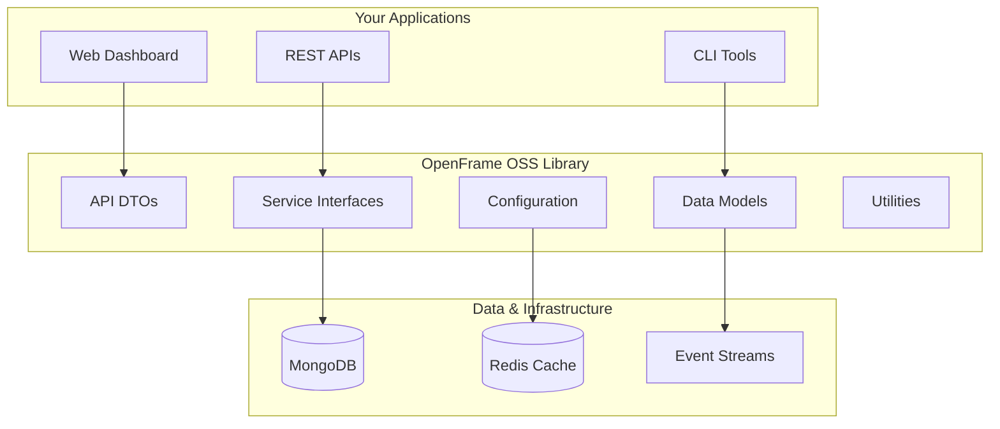
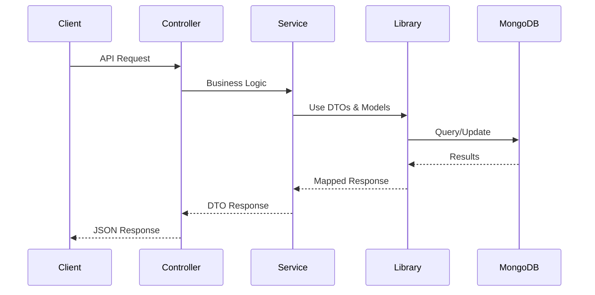

<div align="center">
  <picture>
    <source media="(prefers-color-scheme: dark)" srcset="https://raw.githubusercontent.com/flamingo-stack/openframe-oss-tenant/main/docs/assets/logo-openframe-full-dark-bg.png">
    <source media="(prefers-color-scheme: light)" srcset="https://raw.githubusercontent.com/flamingo-stack/openframe-oss-tenant/main/docs/assets/logo-openframe-full-light-bg.png">
    
  </picture>
</div>

<p align="center">
  <a href="LICENSE.md"></a>
</p>

# OpenFrame OSS Library

The foundational library for secure, scalable device and organization management platforms. OpenFrame OSS Library provides standardized data models, API DTOs, and service interfaces that power the entire OpenFrame ecosystem, enabling organizations to build robust, multi-tenant device management solutions.

[](https://www.youtube.com/watch?v=bINdW0CQbvY)

## ✨ Features

### 🏢 Multi-Tenant Organization Management
- Complete organization structure with contact management
- User invitation and role-based access control
- SSO configuration support with OAuth 2.0 and OIDC
- Tenant isolation and security

### 💻 Comprehensive Device Management
- Device inventory and tracking across multiple types (Desktop, Laptop, Server)
- Health monitoring and compliance tracking
- Integration with popular MDM tools (Fleet, Tactical RMM, MeshCentral)
- Real-time device status and alerts

### 📊 Event & Audit System
- Centralized event logging and tracking
- Comprehensive audit trail capabilities
- Flexible filtering and cursor-based pagination
- Real-time event processing with Kafka streams

### 🔧 Extensible Tool Integration
- Plugin architecture for tool connections
- API key and credential management
- Tool agent installation and management
- Support for external RMM integrations

### 🔐 Enterprise Security
- JWT-based authentication with refresh tokens
- OAuth 2.0 and OIDC provider support
- API key management with rate limiting
- Multi-tenant data isolation

### 📚 Developer Experience
- Standardized DTOs for consistent API responses
- Service interfaces for business logic abstraction
- MongoDB data models with optimized queries
- Comprehensive documentation and examples

## 🚀 Quick Start

### Prerequisites
- Java 21 or higher
- Maven 3.6+
- MongoDB 7.0+
- Redis 7.0+ (optional, for caching)

### 1. Add Dependency

```gradle
dependencies {
    implementation 'com.openframe:openframe-oss-lib:latest'
    implementation 'org.springframework.boot:spring-boot-starter-data-mongodb'
    implementation 'org.springframework.boot:spring-boot-starter-security'
}
```

### 2. Configure Application

```yaml
# application.yml
spring:
  data:
    mongodb:
      uri: mongodb://localhost:27017/openframe
      
openframe:
  security:
    jwt:
      secret: your-jwt-secret
    oauth:
      enabled: true
```

### 3. Use in Your Service

```java
@Service
public class DeviceManagementService {
    
    @Autowired
    private DeviceRepository deviceRepository;
    
    public PageResponse<DeviceResponse> getDevices(DeviceFilter filter) {
        // Use OpenFrame DTOs and pagination
        return deviceRepository.findDevicesWithFilter(filter);
    }
}
```

### 4. Run Your Application

```bash
./gradlew bootRun
```

Your OpenFrame-powered application is now running! 🎉

## 🏗️ Architecture Overview



## 📚 Core Modules

| Module | Purpose | Key Components |
|--------|---------|----------------|
| **API DTOs** | Standardized data transfer | `DeviceResponse`, `OrganizationRequest`, `EventFilter` |
| **Service Interfaces** | Business logic contracts | `DeviceService`, `OrganizationService`, `EventService` |
| **Data Models** | MongoDB entities | Device, Organization, Event, Tool documents |
| **Security Core** | Authentication & authorization | JWT handlers, OAuth providers, tenant isolation |
| **Core Utilities** | Shared functionality | Pagination, validation, encryption, slug generation |

## 🔄 Data Flow



## 🛠️ Use Cases

### MSP/IT Service Providers
Build centralized device management dashboards with multi-client support, automated monitoring, and compliance reporting.

### Enterprise Organizations  
Deploy secure, scalable device management infrastructure with SSO integration, audit trails, and policy enforcement.

### Software Vendors
Integrate device management capabilities into existing products using standardized APIs and data models.

### Platform Developers
Create custom device management solutions with battle-tested components and patterns.

## 🎯 What You Can Build

- **Device Management Platforms** - Inventory, monitoring, and compliance
- **IT Service Dashboards** - Multi-tenant MSP solutions  
- **Security Monitoring** - Device security and compliance tracking
- **Integration Platforms** - Connect RMM tools and monitoring systems
- **Analytics Dashboards** - Device usage and health analytics
- **Mobile Device Management** - Enterprise mobility solutions

## 📖 Documentation

📚 See the [Documentation](./docs/README.md) for comprehensive guides including:

- **[Getting Started](./docs/getting-started/introduction.md)** - Introduction and quick setup
- **[Development Guide](./docs/development/README.md)** - Architecture and development patterns  
- **[API Reference](./docs/reference/architecture/overview.md)** - Complete API documentation
- **[Examples](./examples)** - Real-world usage examples

## 🤝 Contributing

We welcome contributions! Please see our [Contributing Guidelines](./CONTRIBUTING.md) for details on:

- Code standards and style guide
- Pull request process
- Development setup
- Testing requirements

## 🆘 Support

- 📖 **Documentation**: [Complete guides and API reference](./docs/README.md)
- 💬 **Community**: [OpenMSP Slack](https://join.slack.com/t/openmsp/shared_invite/zt-36bl7mx0h-3~U2nFH6nqHqoTPXMaHEHA) - Get help and connect with developers
- 🚀 **Platform**: [OpenFrame.ai](https://openframe.ai) - Product information and platform access
- 🏢 **About Flamingo**: [Flamingo.run](https://flamingo.run) - Learn about our mission and team

> **Note**: We manage all discussions and support through our **OpenMSP Slack community**. GitHub Issues and Discussions are not actively monitored.

## 🚀 OpenFrame Ecosystem

OpenFrame OSS Library is part of the comprehensive OpenFrame platform:

- **[OpenFrame Platform](https://openframe.ai)** - Unified MSP management platform
- **[OpenFrame Gateway](https://github.com/flamingo-stack/openframe-gateway)** - API gateway and routing
- **[OpenFrame Auth](https://github.com/flamingo-stack/openframe-auth)** - Authentication and authorization
- **[OpenFrame Dashboard](https://github.com/flamingo-stack/openframe-dashboard)** - Web management interface

## 📄 License

Licensed under the [Flamingo AI Unified License v1.0](./LICENSE.md) - see the license file for details.

---

<div align="center">
  Built with 💛 by the <a href="https://www.flamingo.run/about"><b>Flamingo</b></a> team
</div>