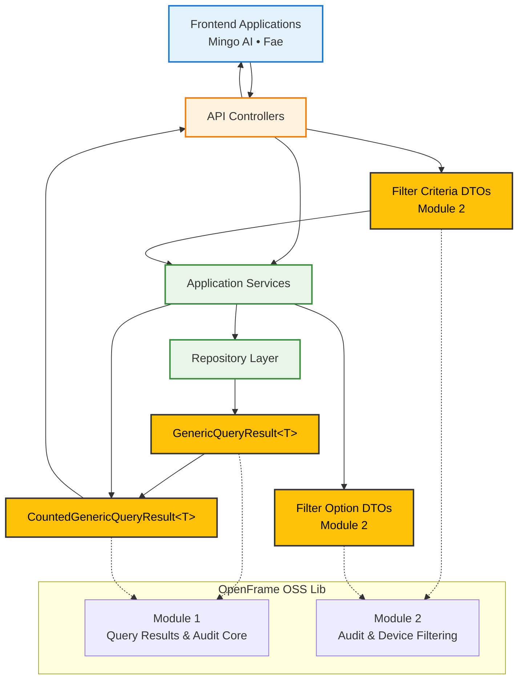
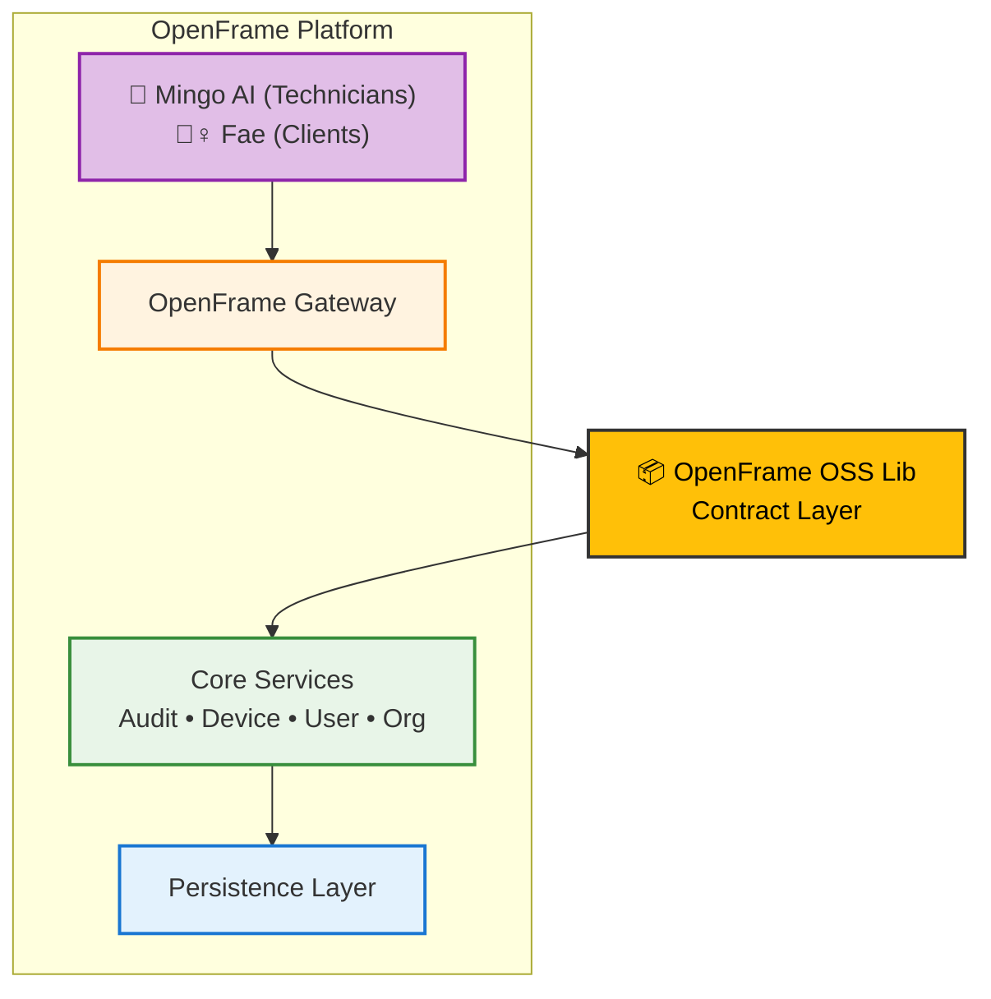

<div align="center">
  <picture>
    <source media="(prefers-color-scheme: dark)" srcset="https://shdrojejslhgnojzkzak.supabase.co/storage/v1/object/public/public/doc-orchestrator/logos/1771384787765-92lldo-logo-openframe-full-dark-bg.png">
    <source media="(prefers-color-scheme: light)" srcset="https://shdrojejslhgnojzkzak.supabase.co/storage/v1/object/public/public/doc-orchestrator/logos/1771384795200-4l8vh-logo-openframe-full-light-bg.png">
    
  </picture>
</div>

<p align="center">
  <a href="LICENSE.md"></a>
</p>

# OpenFrame OSS Lib

The foundational **API DTO library** for the OpenFrame platform - an AI-powered MSP platform that replaces expensive proprietary software with open-source alternatives enhanced by intelligent automation.

OpenFrame OSS Lib provides the **strongly typed, reusable contract layer** that standardizes communication between API controllers, service layers, persistence layers, and frontend clients across the entire OpenFrame ecosystem.

[](https://www.youtube.com/watch?v=BQAjDB4ED2Y)

## Features

- **🔧 Type Safety** - Strongly typed DTOs with Lombok annotations for compile-time validation
- **🔄 Generic Abstractions** - Reusable pagination and query result patterns across all endpoints
- **🎯 Count-Aware Filtering** - Enhanced pagination with filtered totals for large datasets
- **📊 Comprehensive Audit Logging** - Summary and detailed audit log representations
- **🔍 Dynamic Filtering** - Faceted search and UI-driven filtering for audit logs and device inventory
- **🏢 Multi-Tenant Support** - Organization-scoped filtering and tenant isolation
- **📋 Contract-First Design** - API-first approach independent of implementation details
- **⚡ Performance Optimized** - Lightweight DTOs designed for efficient serialization

## Quick Start

Get up and running in just 5 minutes:

```bash
# Clone the repository
git clone https://github.com/openframe/openframe-oss-lib.git
cd openframe-oss-lib

# Build and install
mvn clean compile test install
```

### Basic Usage

```java
// Generic paginated results
GenericQueryResult<LogEvent> auditResults = GenericQueryResult.<LogEvent>builder()
    .items(logEvents)
    .pageInfo(pageInfo)
    .build();

// Count-aware filtered results
CountedGenericQueryResult<LogEvent> filteredResults = 
    CountedGenericQueryResult.<LogEvent>builder()
        .items(logEvents)
        .filteredCount(totalMatchingFilter)
        .pageInfo(pageInfo)
        .build();

// Structured filtering
LogFilterCriteria criteria = LogFilterCriteria.builder()
    .startDate(LocalDate.now().minusDays(30))
    .eventTypes(List.of("LOGIN", "EXPORT"))
    .organizationIds(List.of("org-123"))
    .build();
```

## Technology Stack

- **Java 8+** - Core language and runtime
- **Maven** - Build and dependency management
- **Lombok** - Annotation processing for boilerplate reduction
- **Jackson** - JSON serialization/deserialization
- **JUnit** - Testing framework
- **SLF4J** - Logging abstraction

## Architecture

OpenFrame OSS Lib sits at the contract boundary between clients and backend services:


```mermaid
flowchart TD
    Frontend["Frontend Applications<br/>Mingo AI • Fae"] --> API["API Controllers"]
    API --> Service["Application Services"]  
    Service --> Repository["Repository Layer"]
    
    Repository --> QueryResult["GenericQueryResult&lt;T&gt;"]
    QueryResult --> CountedResult["CountedGenericQueryResult&lt;T&gt;"]
    
    API --> FilterCriteria["Filter Criteria DTOs<br/>Module 2"]
    Service --> FilterOptions["Filter Option DTOs<br/>Module 2"]
    
    FilterCriteria --> Service
    Service --> CountedResult
    CountedResult --> API
    API --> Frontend
    
    subgraph "OpenFrame OSS Lib"
        Module1["Module 1<br/>Query Results & Audit Core"]
        Module2["Module 2<br/>Audit & Device Filtering"]
    end
    
    QueryResult -.-> Module1
    CountedResult -.-> Module1
    FilterCriteria -.-> Module2
    FilterOptions -.-> Module2
    
    classDef frontend fill:#e3f2fd,stroke:#1976d2,stroke-width:2px
    classDef api fill:#fff3e0,stroke:#f57c00,stroke-width:2px
    classDef dto fill:#FFC008,stroke:#333,stroke-width:2px,color:#000
    classDef service fill:#e8f5e8,stroke:#388e3c,stroke-width:2px
    
    class Frontend frontend
    class API api
    class QueryResult,CountedResult,FilterCriteria,FilterOptions dto
    class Service,Repository service
```

### Core Modules

**Module 1 - Query Results & Audit Core:**
- `GenericQueryResult<T>` - Standardized paginated response wrapper
- `CountedGenericQueryResult<T>` - Count-aware filtered results
- `LogEvent` & `LogDetails` - Audit log representations
- `LogFilterCriteria` - Structured audit filtering

**Module 2 - Advanced Filtering:**
- **Audit Filtering** - `LogFilters`, `OrganizationFilterOption`
- **Device Filtering** - `DeviceFilterCriteria`, `DeviceFilters`, `DeviceFilterOption`

## Repository Structure

```text
openframe-oss-lib/
├── pom.xml                                    # Maven configuration
├── openframe-api-lib/
│   └── src/main/java/com/openframe/api/dto/
│       ├── GenericQueryResult.java            # Module 1: Generic pagination
│       ├── CountedGenericQueryResult.java     # Module 1: Filtered pagination  
│       ├── audit/
│       │   ├── LogEvent.java                  # Module 1: Audit summaries
│       │   ├── LogDetails.java               # Module 1: Detailed logs
│       │   ├── LogFilterCriteria.java        # Module 1: Audit filtering
│       │   ├── LogFilters.java               # Module 2: Audit filter options
│       │   └── OrganizationFilterOption.java # Module 2: Org filter options
│       └── device/
│           ├── DeviceFilterCriteria.java     # Module 2: Device filter input
│           ├── DeviceFilters.java            # Module 2: Device filter options
│           └── DeviceFilterOption.java       # Module 2: Device faceted filters
```

## Design Principles

### 1. Contract-First DTO Layer
Defines shared contracts independent of database models, framework implementations, or business logic.

### 2. Generic & Reusable Abstractions
- `GenericQueryResult<T>` avoids duplication across endpoints
- Strong typing ensures consistent API behavior
- DTO separation prevents domain leakage

### 3. Separation of Criteria and Options
- **Filter Criteria** - Input DTOs for client requests
- **Filter Options** - Output DTOs for dynamic UI generation and faceted search

### 4. Multi-Tenant Awareness
Organization scoping ensures tenant isolation across audit and device domains via `OrganizationFilterOption` and organization-based criteria fields.

## How It Powers OpenFrame


```mermaid
flowchart TB
    subgraph "OpenFrame Platform"
        UI["🤖 Mingo AI (Technicians)<br/>🧚‍♀️ Fae (Clients)"] 
        Gateway["OpenFrame Gateway"]
        Services["Core Services<br/>Audit • Device • User • Org"]
        Database["Persistence Layer"]
    end
    
    UI --> Gateway
    Gateway --> OSSLIB["📦 OpenFrame OSS Lib<br/>Contract Layer"]
    OSSLIB --> Services
    Services --> Database
    
    classDef ai fill:#e1bee7,stroke:#8e24aa,stroke-width:2px
    classDef gateway fill:#fff3e0,stroke:#f57c00,stroke-width:2px  
    classDef lib fill:#FFC008,stroke:#333,stroke-width:2px,color:#000
    classDef services fill:#e8f5e8,stroke:#388e3c,stroke-width:2px
    classDef data fill:#e3f2fd,stroke:#1976d2,stroke-width:2px
    
    class UI ai
    class Gateway gateway
    class OSSLIB lib
    class Services services
    class Database data
```

OpenFrame OSS Lib acts as the **shared API contract foundation** ensuring:
- ✅ Predictable response structures across all services
- ✅ Strong typing and compile-time validation
- ✅ Clean separation of concerns between layers
- ✅ Scalable filtering patterns for complex queries
- ✅ Consistent pagination and result wrapping

## Getting Started

### Prerequisites
- Java 8 or higher
- Maven 3.6 or higher

### Installation

Add to your project's `pom.xml`:

```xml
<dependency>
    <groupId>com.openframe.api</groupId>
    <artifactId>openframe-api-lib</artifactId>
    <version>1.0-SNAPSHOT</version>
</dependency>
```

### Example Usage

```java
@RestController
@RequestMapping("/api/audit")
public class AuditController {
    
    @PostMapping("/logs")
    public CountedGenericQueryResult<LogEvent> getAuditLogs(
        @RequestBody LogFilterCriteria criteria) {
        
        // Service applies business logic and returns standardized response
        List<LogEvent> events = auditService.findFilteredLogs(criteria);
        int totalCount = auditService.countFilteredLogs(criteria);
        
        return CountedGenericQueryResult.<LogEvent>builder()
            .items(events)
            .filteredCount(totalCount)
            .pageInfo(buildPageInfo(criteria))
            .build();
    }
}
```

Response format:
```json
{
  "items": [...],           
  "pageInfo": {
    "page": 1,
    "size": 20,
    "totalPages": 15
  },        
  "filteredCount": 1247     
}
```

## Documentation

📚 See the [Documentation](./docs/README.md) for comprehensive guides:

- **Getting Started** - Quick setup and first steps
- **Reference Documentation** - Detailed API and architecture docs  
- **Development Guide** - Contributing and development workflow

## Community & Support

- 💬 **Community**: Join our [OpenMSP Slack](https://join.slack.com/t/openmsp/shared_invite/zt-36bl7mx0h-3~U2nFH6nqHqoTPXMaHEHA) for discussions and support
- 🌐 **Platform**: Learn more about [OpenFrame](https://openframe.ai)
- 🏢 **Company**: Powered by [Flamingo](https://flamingo.run) - AI-driven MSP solutions

## Contributing

We welcome contributions! See [CONTRIBUTING.md](CONTRIBUTING.md) for guidelines on:

- Code style and conventions
- Branch naming and commit messages
- Pull request process
- Review checklist

## License

This project is licensed under the Flamingo AI Unified License v1.0. See [LICENSE.md](LICENSE.md) for details.

---

<div align="center">
  Built with 💛 by the <a href="https://www.flamingo.run/about"><b>Flamingo</b></a> team
</div>