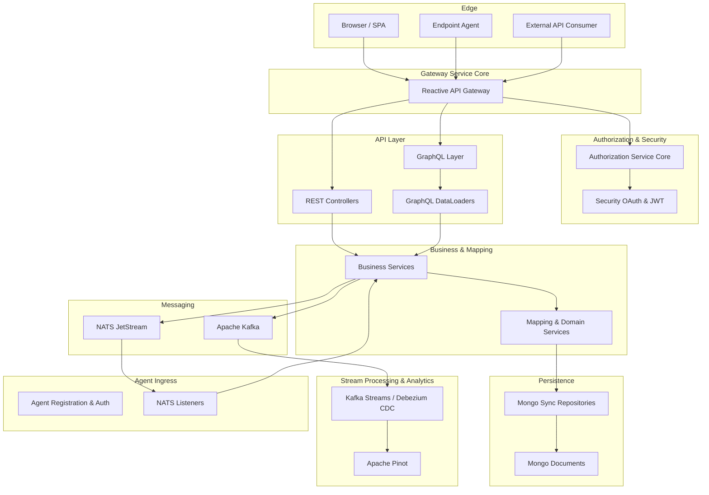

<div align="center">
  <picture>
    <source media="(prefers-color-scheme: dark)" srcset="https://shdrojejslhgnojzkzak.supabase.co/storage/v1/object/public/public/doc-orchestrator/logos/1771384787765-92lldo-logo-openframe-full-dark-bg.png">
    <source media="(prefers-color-scheme: light)" srcset="https://shdrojejslhgnojzkzak.supabase.co/storage/v1/object/public/public/doc-orchestrator/logos/1771384795200-4l8vh-logo-openframe-full-light-bg.png">
    
  </picture>
</div>

<p align="center">
  <a href="LICENSE.md"></a>
</p>

# openframe-oss-lib

**`openframe-oss-lib`** is the modular backend foundation of the [OpenFrame platform](https://openframe.ai) — the unified AI-driven MSP platform by [Flamingo](https://flamingo.run). It is a production-ready, multi-tenant, event-driven, analytics-enabled backend library that powers IT support operations at scale.

Built on **Spring Boot 3** and **Java 21**, this repository ships as a set of 30+ reusable library modules that compose together to form a fully functional MSP backend platform supporting both OSS single-tenant deployments and SaaS multi-tenant environments.

---

[](https://www.youtube.com/watch?v=er-z6IUnAps)

---

## Features

- **Multi-Tenant Architecture** — Every entity is tenant-scoped at every layer (JWT claims, MongoDB queries, gateway routing)
- **REST + GraphQL API** — Relay-compliant GraphQL with cursor-based pagination and N+1-safe DataLoaders, plus a full REST surface
- **OAuth2 / OIDC Authorization Server** — Multi-tenant JWT issuers, per-tenant RSA signing keys, PKCE enforcement, and dynamic Google/Microsoft SSO support
- **Reactive API Gateway** — Spring Cloud Gateway with JWT validation, API key auth, WebSocket proxying, rate limiting, and upstream tool routing
- **Hybrid Event-Driven Messaging** — Kafka for durable ordered streaming; NATS JetStream for real-time low-latency agent communication
- **High-Performance Analytics** — Apache Pinot integration for sub-second time-series log and device metric queries with faceted filtering
- **MongoDB Operational Persistence** — Tenant-aware document model with cursor pagination, aggregations, and Debezium CDC
- **Agent Ingress & Command Execution** — Endpoint agent registration, OAuth token issuance, heartbeat tracking, and NATS-based command dispatch
- **Tool Integration SDKs** — Strongly-typed SDK adapters for Tactical RMM and Fleet MDM
- **Operational Management** — Distributed schedulers (ShedLock/Redis), Mongock data migrations, and system bootstrapping
- **Extensible by Design** — Processor interface pattern for lifecycle hooks (agent registration, invitations, SSO, tool saves)
- **Defense-in-Depth Security** — Multi-layered security: rate limiting, multi-issuer JWT, RBAC, field-level AES encryption, BCrypt password hashing

---

## Architecture


```mermaid
flowchart TD
    subgraph Edge["Edge"]
        Browser["Browser / SPA"]
        Agent["Endpoint Agent"]
        External["External API Consumer"]
    end

    subgraph GatewayLayer["Gateway Service Core"]
        Gateway["Reactive API Gateway"]
    end

    subgraph SecurityLayer["Authorization & Security"]
        AuthServer["Authorization Service Core"]
        SecurityCore["Security OAuth & JWT"]
    end

    subgraph ApiLayer["API Layer"]
        Rest["REST Controllers"]
        GraphQL["GraphQL Layer"]
        DataLoaders["GraphQL DataLoaders"]
    end

    subgraph DomainLayer["Business & Mapping"]
        Services["Business Services"]
        Mapping["Mapping & Domain Services"]
    end

    subgraph PersistenceLayer["Persistence"]
        MongoSync["Mongo Sync Repositories"]
        MongoDocs["Mongo Documents"]
    end

    subgraph MessagingLayer["Messaging"]
        Kafka["Apache Kafka"]
        Nats["NATS JetStream"]
    end

    subgraph StreamLayer["Stream Processing & Analytics"]
        StreamCore["Kafka Streams / Debezium CDC"]
        Pinot["Apache Pinot"]
    end

    subgraph AgentIngress["Agent Ingress"]
        AgentAPI["Agent Registration & Auth"]
        AgentListeners["NATS Listeners"]
    end

    Browser --> Gateway
    Agent --> Gateway
    External --> Gateway

    Gateway --> AuthServer
    Gateway --> Rest
    Gateway --> GraphQL
    AuthServer --> SecurityCore

    Rest --> Services
    GraphQL --> DataLoaders
    DataLoaders --> Services

    Services --> Mapping
    Mapping --> MongoSync
    MongoSync --> MongoDocs

    Services --> Kafka
    Services --> Nats

    Kafka --> StreamCore
    StreamCore --> Pinot

    Nats --> AgentListeners
    AgentListeners --> Services
```

---

## Technology Stack

| Technology | Version | Role |
|------------|---------|------|
| **Java** | 21 | Primary language (Virtual Threads, Records, Sealed Classes) |
| **Spring Boot** | 3.3.0 | Application framework |
| **Spring Cloud Gateway** | 2023.0.3 | Reactive API gateway |
| **Spring Authorization Server** | 1.3.1 | OAuth2/OIDC authorization server |
| **Spring Data MongoDB** | 4.2.0 | MongoDB persistence |
| **Netflix DGS** | 9.0.3 | GraphQL framework |
| **Apache Kafka** | via Spring Cloud | Durable event streaming |
| **NATS** | 0.6.2+3.5 | Real-time agent messaging |
| **Apache Pinot** | 1.2.0 | Analytics query engine |
| **Testcontainers** | 1.21.4 | Integration test infrastructure |
| **Lombok** | 1.18.30 | Code generation |
| **JJWT** | 0.11.5 | JWT utilities |
| **gRPC** | 1.58.0 | Internal service communication |

---

## Quick Start

### Prerequisites

- **Java 21** (OpenJDK or Eclipse Temurin)
- **Apache Maven 3.9+**
- **Docker 24+** (for integration tests)
- **GitHub Personal Access Token** with `read:packages` scope

### 1. Configure GitHub Packages

Add your credentials to `~/.m2/settings.xml`:

```xml
<settings>
  <servers>
    <server>
      <id>github</id>
      <username>YOUR_GITHUB_USERNAME</username>
      <password>YOUR_GITHUB_PAT</password>
    </server>
  </servers>
</settings>
```

### 2. Clone and Build

```bash
git clone https://github.com/flamingo-stack/openframe-oss-lib.git
cd openframe-oss-lib

# Build all 30+ modules (skip tests for speed)
mvn install -DskipTests
```

### 3. Use in Your Service

Add individual modules or the BOM to your Spring Boot service:

```xml
<!-- Use the BOM for consistent versioning -->
<dependencyManagement>
  <dependencies>
    <dependency>
      <groupId>com.openframe.oss</groupId>
      <artifactId>openframe-oss-lib</artifactId>
      <version>6.0.10</version>
      <type>pom</type>
      <scope>import</scope>
    </dependency>
  </dependencies>
</dependencyManagement>

<!-- Then add specific modules -->
<dependency>
  <groupId>com.openframe.oss</groupId>
  <artifactId>openframe-api-service-core</artifactId>
</dependency>
```

### 4. Run Unit Tests

```bash
mvn test
```

### 5. Run Integration Tests (requires Docker)

```bash
mvn verify -pl openframe-data-mongo-sync
```

---

## Module Overview

| Module | Description |
|--------|-------------|
| `openframe-core` | Core utilities (pagination, constants, slug) |
| `openframe-exception` | Shared exception hierarchy and error codes |
| `openframe-security-core` | JWT encoder/decoder, PKCE utilities |
| `openframe-security-oauth` | OAuth BFF controller and token cookies |
| `openframe-api-lib` | Shared DTO contracts and domain services |
| `openframe-api-service-core` | REST + GraphQL API service core |
| `openframe-authorization-service-core` | OAuth2/OIDC Authorization Server |
| `openframe-gateway-service-core` | Reactive API Gateway with rate limiting |
| `openframe-client-core` | Agent registration and ingress |
| `openframe-management-service-core` | Management services and schedulers |
| `openframe-data-mongo-common` | MongoDB domain documents |
| `openframe-data-mongo-sync` | MongoDB sync repositories |
| `openframe-data-redis` | Redis cache and rate-limit support |
| `openframe-data-kafka` | Kafka producers and configuration |
| `openframe-data-nats` | NATS messaging publishers |
| `openframe-data-pinot` | Apache Pinot query repositories |
| `openframe-stream-service-core` | Kafka Streams and Debezium CDC processing |
| `openframe-external-api-service-core` | External REST API for third-party consumers |
| `sdk/tacticalrmm` | Tactical RMM SDK |
| `sdk/fleetmdm` | Fleet MDM SDK |

---

## Community & Support

> **All discussions happen on OpenMSP Slack** — we do not use GitHub Issues or GitHub Discussions.

- 💬 **Join Slack**: [https://www.openmsp.ai/](https://www.openmsp.ai/)
- 🔗 **Direct Invite**: [https://join.slack.com/t/openmsp/shared_invite/zt-36bl7mx0h-3~U2nFH6nqHqoTPXMaHEHA](https://join.slack.com/t/openmsp/shared_invite/zt-36bl7mx0h-3~U2nFH6nqHqoTPXMaHEHA)
- 🌐 **Flamingo Platform**: [https://flamingo.run](https://flamingo.run)
- 🔧 **OpenFrame**: [https://openframe.ai](https://openframe.ai)

---

## Documentation

📚 See the [Documentation](./docs/README.md) for comprehensive guides including architecture reference, getting started tutorials, and development workflows.

---

<div align="center">
  Built with 💛 by the <a href="https://www.flamingo.run/about"><b>Flamingo</b></a> team
</div>
