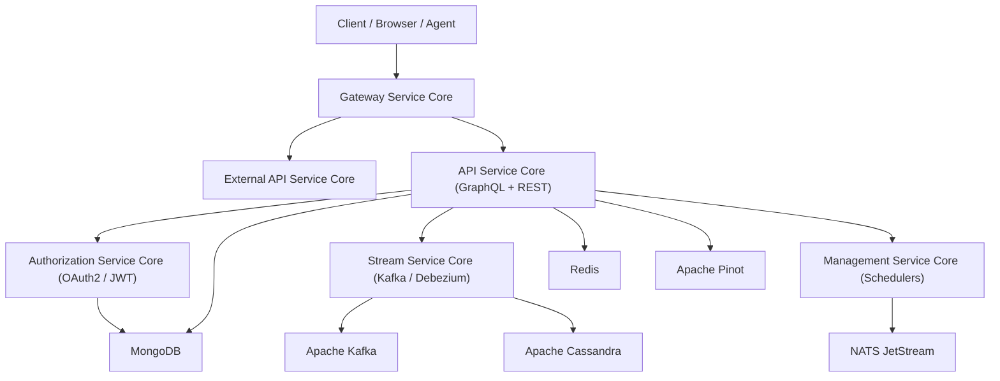

<div align="center">
  <picture>
    <source media="(prefers-color-scheme: dark)" srcset="https://shdrojejslhgnojzkzak.supabase.co/storage/v1/object/public/public/doc-orchestrator/logos/1771384787765-92lldo-logo-openframe-full-dark-bg.png">
    <source media="(prefers-color-scheme: light)" srcset="https://shdrojejslhgnojzkzak.supabase.co/storage/v1/object/public/public/doc-orchestrator/logos/1771384795200-4l8vh-logo-openframe-full-light-bg.png">
    
  </picture>
</div>

<p align="center">
  <a href="LICENSE.md"></a>
</p>

# openframe-oss-lib

**openframe-oss-lib** is the foundational backend library powering the [OpenFrame](https://openframe.ai) platform — the AI-driven, open-source MSP infrastructure stack built by [Flamingo](https://flamingo.run).

This repository provides the **shared Spring Boot libraries** that every OpenFrame service is built upon: multi-tenant authentication, API layers (REST + GraphQL), reactive gateway routing, event streaming, real-time messaging, polyglot persistence, and distributed management workflows.

[](https://www.youtube.com/watch?v=er-z6IUnAps)

---

## Features

- **Multi-Tenant by Default** — Every module implements strict tenant isolation: per-tenant RSA key pairs, tenant-scoped cache keys, tenant-scoped scheduler locks, and tenant ID embedded in every JWT
- **Multi-Tenant OAuth2 Authorization Server** — Per-tenant RSA key pairs, JWT issuance, PKCE support, dynamic client registration, SSO integration (Google, Microsoft), and invitation-based onboarding
- **Relay-Compliant GraphQL + REST APIs** — Netflix DGS GraphQL with DataLoaders for N+1 prevention alongside versioned REST controllers; cursor-based pagination throughout
- **Reactive Edge Gateway** — Spring Cloud Gateway + WebFlux + Netty; multi-issuer JWT validation, API key rate limiting, WebSocket proxying, and tool upstream resolution
- **Event Ingestion & Streaming** — Kafka / Debezium CDC processing pipeline with tool-specific deserialization, event enrichment, unified event type normalization, and Kafka Streams enrichment
- **Real-Time Messaging** — NATS JetStream publish/subscribe for device and tool notifications; persist-first notification strategy with read-state tracking
- **Polyglot Persistence** — MongoDB (sync + reactive), Redis (tenant-aware caching), Apache Pinot (analytics), Apache Cassandra (log storage)
- **Distributed Schedulers** — ShedLock + Redis for cluster-safe distributed job scheduling; offline device detection, API key stats sync, MDM fleet setup
- **External REST API** — API key–authenticated integration surface for third-party tools with OpenAPI documentation
- **Tool SDKs** — First-class Java clients for Fleet MDM and MeshCentral
- **Modular Maven Structure** — 30+ independent modules; include only what your service needs
- **Spring Boot 3.3 / Java 21** — Modern LTS Java with Spring Security OAuth2 and virtual thread readiness

---

## Architecture


```mermaid
flowchart TD
    Client["Client / Browser / Agent"] --> Gateway["Gateway Service Core"]
    Gateway --> ExternalAPI["External API Service Core"]
    Gateway --> ApiCore["API Service Core (GraphQL + REST)"]

    ApiCore --> Authz["Authorization Service Core (OAuth2 / JWT)"]
    ApiCore --> Stream["Stream Service Core (Kafka / Debezium)"]
    ApiCore --> Management["Management Service Core (Schedulers)"]

    Authz --> Mongo["MongoDB"]
    ApiCore --> Mongo
    ApiCore --> Redis["Redis"]
    ApiCore --> Pinot["Apache Pinot"]
    Stream --> Kafka["Apache Kafka"]
    Stream --> Cassandra["Apache Cassandra"]
    Management --> NATS["NATS JetStream"]
```

---

## Technology Stack

| Layer | Technology |
|-------|-----------|
| Language | Java 21 |
| Framework | Spring Boot 3.3 |
| Build Tool | Apache Maven 3.9+ |
| Auth | Spring Authorization Server, Spring Security OAuth2 |
| API | Netflix DGS (GraphQL), Spring MVC (REST) |
| Gateway | Spring Cloud Gateway + WebFlux + Netty |
| Persistence | MongoDB (sync + reactive), Redis, Cassandra, Apache Pinot |
| Messaging | Apache Kafka / Debezium CDC, NATS JetStream |
| Testing | JUnit 5, Testcontainers, RestAssured |
| Distributed Locking | ShedLock + Redis |
| Multi-tenancy | ThreadLocal tenant context, per-tenant RSA keys |

---

## Quick Start

### Prerequisites

- Java 21 JDK ([Eclipse Temurin 21](https://adoptium.net/) recommended)
- Apache Maven 3.9+
- Docker 24.x (for integration tests)
- GitHub Personal Access Token (PAT) with `read:packages` scope

### 1. Clone the Repository

```bash
git clone https://github.com/flamingo-stack/openframe-oss-lib.git
cd openframe-oss-lib
```

### 2. Configure GitHub Packages

Add your GitHub credentials to `~/.m2/settings.xml`:

```xml
<settings>
  <servers>
    <server>
      <id>github</id>
      <username>YOUR_GITHUB_USERNAME</username>
      <password>YOUR_GITHUB_PAT</password>
    </server>
  </servers>
</settings>
```

### 3. Build the Library

```bash
mvn install -DskipTests
```

### 4. Add a Module as a Dependency

```xml
<dependencyManagement>
  <dependencies>
    <dependency>
      <groupId>com.openframe.oss</groupId>
      <artifactId>openframe-oss-lib</artifactId>
      <version>5.79.3</version>
      <type>pom</type>
      <scope>import</scope>
    </dependency>
  </dependencies>
</dependencyManagement>

<dependencies>
  <dependency>
    <groupId>com.openframe.oss</groupId>
    <artifactId>openframe-api-service-core</artifactId>
  </dependency>
</dependencies>
```

### 5. Run Tests

```bash
# Unit tests for a specific module
mvn test -pl openframe-core

# Integration tests (requires Docker)
mvn verify -pl openframe-data-mongo-sync
```

---

## Module Overview

| Module | Description |
|--------|-------------|
| `openframe-core` | Core utilities, pagination, validation |
| `openframe-exception` | Standard exception hierarchy |
| `openframe-core-crypto` | Encryption utilities |
| `openframe-security-core` | JWT, PKCE, cookie service |
| `openframe-security-oauth` | OAuth2 BFF layer |
| `openframe-authorization-service-core` | Multi-tenant OAuth2 authorization server |
| `openframe-api-lib` | API contracts, filter DTOs, cursor pagination |
| `openframe-api-service-core` | REST + GraphQL API service layer |
| `openframe-gateway-service-core` | Reactive gateway, routing, security |
| `openframe-data-mongo-common` | MongoDB domain documents |
| `openframe-data-mongo-sync` | Synchronous MongoDB repositories |
| `openframe-data-mongo-reactive` | Reactive MongoDB repositories |
| `openframe-data-redis` | Redis tenant-aware cache |
| `openframe-data-kafka` | Kafka multi-tenant configuration |
| `openframe-data-nats` | NATS real-time messaging |
| `openframe-data-cassandra` | Cassandra log storage |
| `openframe-data-pinot` | Apache Pinot analytics queries |
| `openframe-management-service-core` | Distributed schedulers, startup initializers |
| `openframe-stream-service-core` | Kafka streams, Debezium event enrichment |
| `openframe-external-api-service-core` | External REST API for integrations |
| `sdk/fleetmdm` | Fleet MDM Java SDK |
| `clients/openframe-client` | Rust cross-platform agent (`openframe-agent-lib`) — see [clients/README.md](clients/README.md) |

---

## Documentation

📚 See the [Documentation](./docs/README.md) for comprehensive guides covering architecture, setup, development workflows, and reference documentation.

---

## Community

All discussions, questions, and support happen on the **[OpenMSP Slack Community](https://join.slack.com/t/openmsp/shared_invite/zt-36bl7mx0h-3~U2nFH6nqHqoTPXMaHEHA)**. We do not use GitHub Issues or GitHub Discussions.

- 🌐 **OpenFrame Platform:** [https://openframe.ai](https://openframe.ai)
- 💬 **OpenMSP Slack:** [https://www.openmsp.ai/](https://www.openmsp.ai/)
- 🦩 **Flamingo:** [https://flamingo.run](https://flamingo.run)

[](https://www.youtube.com/watch?v=PexpoNdZtUk)

---

<div align="center">
  Built with 💛 by the <a href="https://www.flamingo.run/about"><b>Flamingo</b></a> team
</div>
