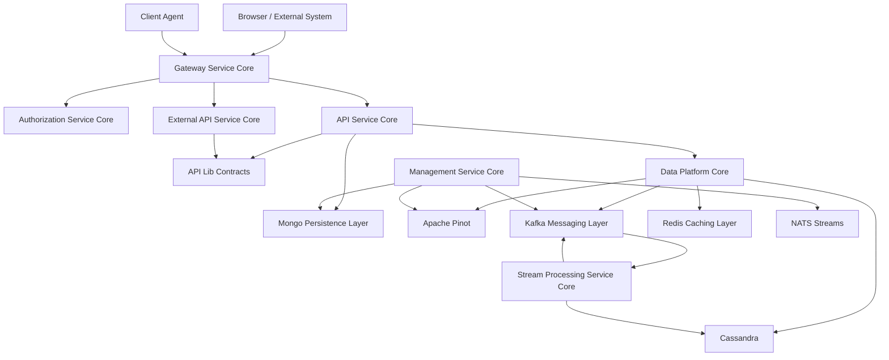

<div align="center">
  <picture>
    <source media="(prefers-color-scheme: dark)" srcset="https://shdrojejslhgnojzkzak.supabase.co/storage/v1/object/public/public/doc-orchestrator/logos/1771384787765-92lldo-logo-openframe-full-dark-bg.png">
    <source media="(prefers-color-scheme: light)" srcset="https://shdrojejslhgnojzkzak.supabase.co/storage/v1/object/public/public/doc-orchestrator/logos/1771384795200-4l8vh-logo-openframe-full-light-bg.png">
    
  </picture>
</div>

<p align="center">
  <a href="LICENSE.md"></a>
</p>

# OpenFrame OSS Libraries

**The complete backend foundation and shared frontend design system for AI-powered MSP platforms.** OpenFrame OSS Libraries provides all shared libraries, service cores, and the unified UI Kit needed to build scalable, multi-tenant, event-driven IT management infrastructure that powers the OpenFrame ecosystem.

[](https://www.youtube.com/watch?v=a45pzxtg27k)

---

## Table of Contents

- [What is OpenFrame OSS Lib?](#-what-is-openframe-oss-lib)
- [Repository Structure](#-repository-structure)
- [Quick Start](#-quick-start)
- [Coding Rules & Conventions](#-coding-rules--conventions)
  - [General Rules (All Code)](#general-rules-all-code)
  - [Java Backend Rules](#java-backend-rules)
  - [Frontend (TypeScript/React) Rules](#frontend-typescriptreact-rules)
- [Component Development Guide](#-component-development-guide)
- [Naming Conventions](#-naming-conventions)
- [Linting & Formatting](#-linting--formatting)
- [Testing Requirements](#-testing-requirements)
- [Git Workflow & Branch Strategy](#-git-workflow--branch-strategy)
- [Pull Request Requirements](#-pull-request-requirements)
- [Contribution Workflow](#-contribution-workflow)
- [Architecture Overview](#-architecture-overview)
- [Technology Stack](#-technology-stack)
- [Community & Support](#-community--support)
- [License](#-license)

---

## What is OpenFrame OSS Lib?

OpenFrame OSS Libraries is the **core runtime stack** that enables organizations to build production-ready MSP platforms with modern architecture patterns. It serves as the foundation for [OpenFrame](https://openframe.ai) -- Flamingo's unified platform that replaces expensive proprietary software with open-source alternatives enhanced by intelligent automation.

**Key Capabilities:**
- **Multi-tenant architecture** supporting thousands of MSP organizations
- **Event-driven processing** with real-time data enrichment and normalization
- **AI-ready infrastructure** for intelligent automation and insights
- **Enterprise-grade security** with OAuth2/OIDC compliance
- **Scalable data platform** combining MongoDB, Cassandra, Redis, and Apache Pinot
- **Shared UI design system** for consistent interfaces across all platforms

---

## Repository Structure

This is a **monorepo** containing both Java backend modules and a Node.js frontend design system:

```
openframe-oss-lib/
├── .github/                          # CI/CD workflows and PR templates
│   ├── workflows/
│   │   ├── test.yml                  # PR testing (Java + Node)
│   │   ├── release.yml               # Release pipeline
│   │   ├── changes.yml               # Change detection
│   │   └── matrix.yml                # Test matrix generation
│   └── PULL_REQUEST_TEMPLATE.md
│
├── openframe-frontend-core/          # Shared UI Kit (TypeScript/React)
│   ├── src/
│   │   ├── components/               # React components
│   │   │   ├── ui/                   # Base UI (Button, Card, Input, Modal...)
│   │   │   ├── features/             # Complex business components
│   │   │   ├── icons/                # Icon components
│   │   │   ├── navigation/           # Header, sidebar, sticky nav
│   │   │   └── toast/                # Toast notification system
│   │   ├── hooks/                    # Custom React hooks
│   │   │   ├── ui/                   # UI hooks (useDebounce, useMediaQuery)
│   │   │   ├── api/                  # Data fetching hooks
│   │   │   └── platform/             # Platform configuration hooks
│   │   ├── styles/                   # ODS design tokens and CSS
│   │   ├── utils/                    # Utility functions (cn, platform-config)
│   │   └── types/                    # TypeScript type definitions
│   ├── biome.json                    # Biome linter & formatter config
│   ├── tailwind.config.ts            # Tailwind + ODS typography plugin
│   ├── tsconfig.json                 # TypeScript configuration (strict)
│   └── package.json                  # NPM package config
│
├── openframe-api-lib/                # Shared DTOs, filters, mappers (Java)
├── openframe-core/                   # Core domain models (Java)
├── openframe-security-core/          # JWT + OAuth BFF (Java)
├── openframe-authorization-service-core/  # OAuth2/OIDC server (Java)
├── openframe-data-mongo/             # MongoDB persistence (Java)
├── openframe-data-redis/             # Redis caching (Java)
├── openframe-data-kafka/             # Kafka messaging (Java)
├── openframe-data-cassandra/         # Cassandra storage (Java)
├── openframe-data-pinot/             # Apache Pinot analytics (Java)
├── openframe-data-nats/              # NATS streams (Java)
├── openframe-gateway-service-core/   # Reactive edge gateway (Java)
├── openframe-stream-service-core/    # Stream processing (Java)
├── openframe-management-service-core/# Connector automation (Java)
├── sdk/                              # External integration SDKs
│   ├── fleetmdm/
│   └── tacticalrmm/
├── docs/                             # Documentation
├── CONTRIBUTING.md                   # Contribution guidelines
├── SECURITY.md                       # Security policy
├── pom.xml                           # Maven parent POM
└── renovate.json                     # Automated dependency updates
```

---

## Quick Start

### Java Backend

**Prerequisites:** Java 21+, Maven 3.6+, Docker & Docker Compose, 8GB RAM minimum

```bash
git clone https://github.com/flamingo-stack/openframe-oss-lib.git
cd openframe-oss-lib

docker-compose up -d          # Start infrastructure services
mvn clean install -DskipTests # Build all modules
```

### Frontend UI Kit

**Prerequisites:** Node.js 22+, npm

```bash
cd openframe-frontend-core
npm install

npm run type-check   # TypeScript validation
npm run test         # Run tests
npm run storybook    # Component explorer on port 6006
npm run build        # Production build
```

---

## Coding Rules & Conventions

### General Rules (All Code)

1. **Zero warnings policy** -- treat warnings as errors in CI
2. **No hardcoded secrets** -- use environment variables or secret managers
3. **Write tests for all new code** -- no PRs without corresponding tests
4. **Keep PRs focused** -- one logical change per PR; avoid mixing refactors with features
5. **Document public APIs** -- JavaDoc for Java, JSDoc for TypeScript
6. **No commented-out code** -- delete it; git history preserves old code
7. **Prefer composition over inheritance**
8. **Fail fast** -- validate at boundaries, trust internal code

### Java Backend Rules

#### Code Style
- Follow the **Google Java Style Guide** with OpenFrame-specific additions
- Use **Lombok** annotations: `@RequiredArgsConstructor`, `@Slf4j`, `@Builder`
- Prefer constructor injection via `@RequiredArgsConstructor` over `@Autowired`
- Use `@Validated` on controllers, `@Valid` on request bodies

#### Security (Critical)
- **All database queries MUST include tenant isolation** -- filter by `tenantId`
- Never expose internal IDs or stack traces in error responses
- Use parameterized queries exclusively (no string concatenation)
- Log at `debug` level for tenant context, never log sensitive data
- See [CONTRIBUTING.md](./CONTRIBUTING.md) for detailed security requirements

#### Patterns
```java
// Standard controller structure
@RestController
@RequestMapping("/api/resources")
@RequiredArgsConstructor
@Validated
@Slf4j
public class ResourceController {
    private final ResourceService resourceService;

    @GetMapping("/{id}")
    public Resource get(
        @PathVariable String id,
        @AuthenticationPrincipal AuthPrincipal principal
    ) {
        return resourceService.findByTenantIdAndId(
            principal.getTenantId(), id
        ).orElseThrow(() -> new ResourceNotFoundException(id));
    }
}
```

### Frontend (TypeScript/React) Rules

#### TypeScript
- **Strict mode enabled** -- no `any` types without justification
- **Zero TypeScript errors** -- the build must pass `npm run type-check`
- Use `interface` for component props, `type` for unions and utility types
- Always export prop interfaces alongside components
- Use path alias `@/*` for all internal imports (never relative `../../../`)

#### React
- **All hooks must be called unconditionally** at the top of components (enforced by Biome)
- Use `React.forwardRef` for components that accept refs
- Set `displayName` on all `forwardRef` components
- Use named exports exclusively -- no default exports
- Mark client components with `'use client'` directive
- Prefer `useCallback` and `useMemo` for expensive computations
- Clean up effects: always return cleanup functions from `useEffect`

```tsx
// Correct hook ordering
export function MyComponent({ filter }: MyComponentProps) {
  // 1. ALL hooks first, unconditionally
  const router = useRouter();
  const [state, setState] = useState(false);
  const data = useQuery({ queryKey: ['data', filter], queryFn: fetchData });

  // 2. THEN conditional returns
  if (!data) return null;

  // 3. Then render
  return <div>{data.title}</div>;
}
```

#### Styling
- **Never use hardcoded hex colors** -- enforced by a custom Biome plugin (`no-hex-colors.grit`)
- Always use ODS design tokens: `bg-ods-bg`, `text-ods-text-primary`, `border-ods-border`, etc.
- Use the `cn()` utility for conditional class merging (clsx + tailwind-merge)
- Use **Class Variance Authority (CVA)** for component variants
- Mobile-first responsive design with Tailwind breakpoints (`md:`, `lg:`)

```tsx
// Correct: ODS tokens
<div className="bg-ods-bg text-ods-text-primary border-ods-border" />

// Wrong: hardcoded colors
<div className="bg-[#1a1a1a] text-[#ffffff] border-[#333]" />
```

#### Z-Index Hierarchy
Follow the established stacking order across all components:

| Layer | Z-Index | Usage |
|-------|---------|-------|
| Tooltips | `z-[2147483647]` | Radix tooltips (max safe integer) |
| Toasts | `z-[9999]` | Toast notifications |
| Modals | `z-[1300]` | Custom Modal component |
| Dropdowns | `z-[9999]` | Dropdown menus |
| Header | `z-[50]` | Fixed navigation header |
| Sidebar overlay | `z-[40]` | Sliding sidebar background |
| Sidebar panel | `z-[45]` | Sliding sidebar content |

---

## Component Development Guide

### Creating a New UI Component

1. **Create the file** in the appropriate directory:
   - Base component -> `src/components/ui/my-component.tsx`
   - Feature component -> `src/components/features/my-component.tsx`
   - Icon -> `src/components/icons/my-icon.tsx`

2. **Follow the standard component pattern:**

```tsx
'use client';

import * as React from 'react';
import { type VariantProps, cva } from 'class-variance-authority';
import { cn } from '@/utils/cn';

// 1. Define variants with CVA
const myComponentVariants = cva(
  // Base classes
  'inline-flex items-center rounded-md transition-colors',
  {
    variants: {
      variant: {
        primary: 'bg-ods-accent text-ods-text-on-accent hover:bg-ods-accent-hover',
        secondary: 'bg-ods-bg-secondary text-ods-text-primary hover:bg-ods-bg-hover',
      },
      size: {
        sm: 'h-8 px-3 text-sm',
        default: 'h-10 px-4 text-base',
        lg: 'h-12 px-6 text-lg',
      },
    },
    defaultVariants: {
      variant: 'primary',
      size: 'default',
    },
  },
);

// 2. Define props interface (always export)
export interface MyComponentProps
  extends React.HTMLAttributes<HTMLDivElement>,
    VariantProps<typeof myComponentVariants> {
  /** Description of what this prop does */
  label: string;
  /** Optional icon element */
  icon?: React.ReactNode;
}

// 3. Use forwardRef for DOM access
const MyComponent = React.forwardRef<HTMLDivElement, MyComponentProps>(
  ({ variant, size, className, label, icon, ...props }, ref) => {
    return (
      <div
        ref={ref}
        className={cn(myComponentVariants({ variant, size }), className)}
        {...props}
      >
        {icon}
        <span>{label}</span>
      </div>
    );
  },
);
MyComponent.displayName = 'MyComponent';

// 4. Export component, variants, and types
export { MyComponent, myComponentVariants };
```

3. **Add the export** to the appropriate index file:

```tsx
// src/components/ui/index.ts
export * from './my-component';
```

4. **Write a Storybook story:**

```tsx
// src/stories/MyComponent.stories.tsx
import type { Meta, StoryObj } from '@storybook/nextjs-vite';
import { MyComponent } from '../components/ui/my-component';

const meta = {
  title: 'UI/MyComponent',
  component: MyComponent,
  argTypes: {
    variant: { control: 'select', options: ['primary', 'secondary'] },
    size: { control: 'select', options: ['sm', 'default', 'lg'] },
  },
} satisfies Meta<typeof MyComponent>;

export default meta;
type Story = StoryObj<typeof meta>;

export const Primary: Story = {
  args: { label: 'Hello', variant: 'primary' },
};
```

### Component Checklist

- [ ] Uses ODS design tokens (no hardcoded colors)
- [ ] Accepts `className` prop for customization
- [ ] Uses `cn()` for class merging
- [ ] Has TypeScript props interface exported
- [ ] Uses `forwardRef` if it renders a DOM element
- [ ] Has `displayName` set
- [ ] Is responsive (mobile-first)
- [ ] Has a Storybook story
- [ ] Exported from the appropriate index file
- [ ] Follows accessibility best practices (ARIA labels, keyboard nav)

---

## Naming Conventions

### File Naming

| Type | Convention | Example |
|------|------------|---------|
| Components | `kebab-case.tsx` | `date-time-picker.tsx` |
| Hooks | `use-kebab-case.ts` | `use-debounce.ts` |
| Utilities | `kebab-case.ts` | `platform-config.tsx` |
| Types | `kebab-case.ts` | `access-code-cohorts.ts` |
| Stories | `PascalCase.stories.tsx` | `Button.stories.tsx` |
| Tests | `kebab-case.test.ts(x)` | `button.test.tsx` |
| Java classes | `PascalCase.java` | `OrganizationService.java` |

### Code Naming (Enforced by Biome)

| Element | Convention | Example |
|---------|------------|---------|
| Variables | `camelCase`, `PascalCase`, or `CONSTANT_CASE` | `userName`, `MaxRetries`, `API_URL` |
| Functions | `camelCase` or `PascalCase` | `getUser()`, `MyComponent()` |
| React components | `PascalCase` | `NavigationSidebar` |
| Hooks | `camelCase` starting with `use` | `useDebounce` |
| Interfaces | `PascalCase` | `ButtonProps` |
| Type aliases | `PascalCase` | `PlatformName` |
| Enums | `PascalCase` | `ViewMode` |
| Enum members | `PascalCase` | `ViewMode.Desktop` |
| Constants | `CONSTANT_CASE` or `camelCase` | `MAX_PAGE_SIZE`, `defaultTimeout` |
| Object keys | `camelCase`, `PascalCase`, `snake_case`, or `CONSTANT_CASE` | Flexible for API compat |
| Classes (Java) | `PascalCase` | `OrganizationService` |
| Methods (Java) | `camelCase` | `findByTenant()` |
| Packages (Java) | `lowercase` | `com.openframe.api` |

### Branch Naming

```
feature/short-description     # New features
bugfix/short-description      # Bug fixes
docs/short-description        # Documentation only
refactor/short-description    # Code refactoring
chore/short-description       # Build, deps, CI changes
```

---

## Linting & Formatting

### Frontend (Biome 2.4.4)

Biome is the primary linter and formatter for all TypeScript/React code.

**Key settings:**
- Line width: **120 characters**
- Indent: **2 spaces**
- Line endings: **LF**
- Semicolons: **always**
- Quote style: **single quotes** (JS), **double quotes** (JSX)
- Trailing commas: **all**
- Arrow parens: **as needed** (`x => x` not `(x) => x`)
- Import organization: **automatic** (via `organizeImports`)

**Enforced linter rules:**

| Rule | Level | Purpose |
|------|-------|---------|
| `useHookAtTopLevel` | error | React hooks must be called unconditionally |
| `noUnusedVariables` | error | No dead code |
| `noUndeclaredDependencies` | error | All imports must be declared in package.json |
| `useNamingConvention` | error | Enforces naming standards (see table above) |
| `useConst` | error | Use `const` when variable is never reassigned |
| `noParameterAssign` | error | Don't reassign function parameters |
| `useExhaustiveDependencies` | warn | Hook dependency arrays must be complete |
| `noUselessConstructor` | error | Remove empty constructors |
| `useLiteralKeys` | error | Use `obj.key` not `obj['key']` |
| `noRedeclare` | error | No duplicate declarations |
| `no-hex-colors` (plugin) | error | No hardcoded hex colors -- use ODS tokens |

**Running the linter:**

```bash
cd openframe-frontend-core

npm run lint           # Check for issues
npm run lint:fix       # Auto-fix issues
npm run format         # Format all files
npm run format:check   # Check formatting without changing files
```

### Java Backend

- Follow **Google Java Style Guide**
- Checkstyle and SpotBugs run in CI
- Maven enforcer plugin validates dependency rules

---

## Testing Requirements

### Frontend

- **Framework:** Vitest with jsdom environment
- **Coverage:** v8 provider
- **Location:** Co-located `*.test.ts(x)` files or `__tests__/` directories

```bash
npm run test           # Watch mode
npm run test:run       # Single run (CI)
npm run test:coverage  # With coverage report
```

**What to test:**
- Component rendering with different prop combinations
- User interactions (clicks, keyboard events)
- Hook behavior and state transitions
- Utility function edge cases

### Java Backend

- **Minimum coverage:** 80% line, 75% branch
- **Unit tests:** `@ExtendWith(MockitoExtension.class)` with Given/When/Then pattern
- **Integration tests:** `@SpringBootTest` for full request/response cycles
- **Security tests:** Mandatory for any multi-tenant changes -- verify tenant isolation

```bash
mvn clean verify                    # All tests
mvn test -Dgroups=unit              # Unit only
mvn test -Dgroups=integration       # Integration only
mvn clean verify -Pcoverage         # With coverage
```

### CI Pipeline

Tests run automatically on all PRs to `main`:
- **Java:** Build + test (only when Java files change)
- **Node:** Type check + test + build (only when frontend files change)
- Change detection prevents unnecessary CI runs

---

## Git Workflow & Branch Strategy

### Commit Message Format

Follow **Conventional Commits**:

```
type(scope): description

# Types: feat, fix, docs, style, refactor, test, chore
# Scope: module or area (optional)
# Description: imperative mood, present tense, lowercase

# Examples:
feat(auth): add Google SSO support
fix(security): resolve tenant isolation in organization API
docs(api): update GraphQL schema documentation
refactor(service): extract common pagination logic
test(integration): add organization controller tests
chore(deps): upgrade Spring Boot to 3.3.1
```

### Branch Flow

```
main (protected)
 ├── feature/add-search-filters   <- PR required
 ├── bugfix/fix-tenant-isolation   <- PR required
 ├── docs/update-api-docs          <- PR required
 └── refactor/extract-service      <- PR required
```

- `main` is the default branch and is **protected**
- All changes go through pull requests
- Branches are deleted after merge
- Renovate bot handles automated dependency updates

---

## Pull Request Requirements

### Before Opening a PR

```bash
# Frontend
cd openframe-frontend-core
npm run lint           # No linting errors
npm run type-check     # No TypeScript errors
npm run test:run       # All tests pass
npm run build          # Build succeeds

# Java
mvn clean verify       # Compile + tests pass
```

### PR Title Format

Follow Conventional Commits in the PR title:

```
feat(auth): implement Google SSO integration
fix(security): resolve tenant data leakage in API endpoints
docs(development): add testing guidelines
chore(deps): update dependency X to v2.0
```

### PR Description Template

Every PR must include:

```markdown
## Description
Brief description of what this PR accomplishes.

## Improvements
- Step-by-step list of changes made
- Each change on its own line

## Type of Change
- [ ] Bug fix
- [ ] New feature
- [ ] Breaking change
- [ ] Documentation update
- [ ] Refactoring

## Testing
- [ ] Unit tests added/updated
- [ ] Integration tests added/updated
- [ ] Manual testing completed
- [ ] All existing tests pass

## Security Considerations (if applicable)
- [ ] Tenant isolation maintained
- [ ] Input validation implemented
- [ ] No sensitive data in logs or errors

## Checklist
- [ ] Code follows project style guidelines
- [ ] Self-review completed
- [ ] Linter and formatter pass
- [ ] Documentation updated where needed
```

### Review Process

- At least **1 approval** required before merge
- CI must pass (type-check, tests, build)
- Address all review comments before requesting re-review
- Reviewers check: code quality, security, test coverage, naming conventions

---

## Contribution Workflow

### First-Time Contributors

1. **Fork** the repository on GitHub
2. **Clone** your fork:
   ```bash
   git clone https://github.com/YOUR_USERNAME/openframe-oss-lib.git
   cd openframe-oss-lib
   git remote add upstream https://github.com/flamingo-stack/openframe-oss-lib.git
   ```
3. **Join** the [OpenMSP Slack](https://join.slack.com/t/openmsp/shared_invite/zt-36bl7mx0h-3~U2nFH6nqHqoTPXMaHEHA) community
4. **Find an issue** labeled `good first issue` or `help wanted`
5. **Create a branch**, make your changes, push, and open a PR

### Ongoing Contribution

```bash
# Stay in sync with upstream
git fetch upstream
git rebase upstream/main

# Create feature branch
git checkout -b feature/my-change

# Make changes, commit with conventional commits
git add -p
git commit -m "feat(ui): add tooltip delay prop"

# Push and create PR
git push origin feature/my-change
```

### What Makes a Good Contribution

- **Focused** -- one logical change per PR
- **Tested** -- includes tests for new/changed behavior
- **Documented** -- public APIs have JSDoc/JavaDoc
- **Backwards compatible** -- or clearly marked as a breaking change
- **Follows conventions** -- passes linter, matches project patterns

### Path to Maintainer

Regular contributors can become maintainers by:
1. Demonstrating consistent, high-quality contributions
2. Showing deep understanding of the codebase and architecture
3. Helping other contributors and community members
4. Participating in architectural discussions

---

## Architecture Overview


```mermaid
flowchart TD
    Client["Browser / External System"] --> Gateway["Gateway Service Core"]
    Agent["Client Agent"] --> Gateway

    Gateway --> Auth["Authorization Service Core"]
    Gateway --> Api["API Service Core"]
    Gateway --> External["External API Service Core"]

    Api --> Contracts["API Lib Contracts"]
    External --> Contracts

    Api --> Mongo["Mongo Persistence Layer"]
    Api --> DataCore["Data Platform Core"]

    DataCore --> Cassandra["Cassandra"]
    DataCore --> Pinot["Apache Pinot"]
    DataCore --> Kafka["Kafka Messaging Layer"]
    DataCore --> Redis["Redis Caching Layer"]

    Kafka --> Stream["Stream Processing Service Core"]
    Stream --> Cassandra
    Stream --> Kafka

    Management["Management Service Core"] --> Kafka
    Management --> Pinot
    Management --> Mongo
    Management --> NATS["NATS Streams"]
```

**Architectural Characteristics:**
- Multi-tenant by design with complete tenant isolation at all layers
- OAuth2 + OIDC compliant enterprise identity management
- Event-driven processing with Kafka + Debezium
- Real-time analytics with Pinot + Cassandra
- Shared UI Kit (`openframe-frontend-core`) for consistent design across all platforms

---

## Technology Stack

### Backend (Java)

| Component | Technology | Version |
|-----------|------------|---------|
| Runtime | Java | 21 |
| Framework | Spring Boot | 3.3.0 |
| Security | Spring Authorization Server | 1.3.1 |
| Database | MongoDB, Cassandra, Redis, Pinot | - |
| Messaging | Apache Kafka, NATS | - |
| API | Netflix DGS (GraphQL) | 9.0.3 |
| Build | Maven | 3.x |

### Frontend (TypeScript)

| Component | Technology | Version |
|-----------|------------|---------|
| Language | TypeScript | 5.8 |
| Framework | React | 18/19 |
| Meta-framework | Next.js | 15-16 |
| Styling | Tailwind CSS | 3.4 |
| Linting | Biome | 2.4.4 |
| Components | Radix UI | Latest |
| Variants | Class Variance Authority | Latest |
| Testing | Vitest | 4.x |
| Stories | Storybook | 10.x |
| Build | tsup | Latest |

---

## Community & Support

- **Slack**: [OpenMSP Community](https://join.slack.com/t/openmsp/shared_invite/zt-36bl7mx0h-3~U2nFH6nqHqoTPXMaHEHA) -- primary communication channel
- **Issues**: [GitHub Issues](https://github.com/flamingo-stack/openframe-oss-lib/issues) -- bug reports and feature requests
- **Website**: [OpenFrame Documentation](https://www.flamingo.run/openframe)
- **Demos**: [OpenFrame YouTube Channel](https://www.youtube.com/@openframe)

---

## Additional Resources

- **[CONTRIBUTING.md](./CONTRIBUTING.md)** -- Detailed contribution guidelines with Java-specific patterns
- **[SECURITY.md](./SECURITY.md)** -- Vulnerability reporting and security policy
- **[Frontend UI Kit README](./openframe-frontend-core/README.md)** -- Package-specific usage and API docs
- **[Documentation](./docs/README.md)** -- Architecture guides, API references, and tutorials

---

## License

This project is licensed under the [Flamingo AI Unified License v1.0](LICENSE.md).

---
<div align="center">
  Built with :yellow_heart: by the <a href="https://www.flamingo.run/about"><b>Flamingo</b></a> team
</div>
