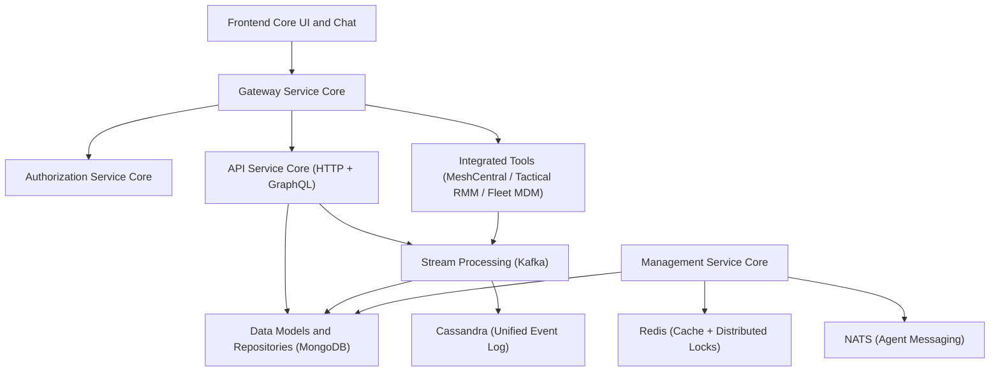

<div align="center">
  <picture>
    <source media="(prefers-color-scheme: dark)" srcset="https://shdrojejslhgnojzkzak.supabase.co/storage/v1/object/public/public/doc-orchestrator/logos/1771384787765-92lldo-logo-openframe-full-dark-bg.png">
    <source media="(prefers-color-scheme: light)" srcset="https://shdrojejslhgnojzkzak.supabase.co/storage/v1/object/public/public/doc-orchestrator/logos/1771384795200-4l8vh-logo-openframe-full-light-bg.png">
    
  </picture>
</div>

<p align="center">
  <a href="LICENSE.md"></a>
</p>

# OpenFrame OSS Lib

**`openframe-oss-lib`** is the modular backbone of [OpenFrame](https://openframe.ai) — Flamingo's AI-powered MSP platform that replaces expensive proprietary software with open-source alternatives enhanced by intelligent automation.

This library provides the shared, composable building blocks that power the entire OpenFrame stack: from multi-tenant identity and OAuth2 authorization, to reactive APIs, event-driven stream processing, and an embeddable AI chat engine.

> This repository does **not** ship a standalone application — it provides libraries and service-core modules that are embedded into deployable OpenFrame-compatible services.

---

[](https://www.youtube.com/watch?v=BQAjDB4ED2Y)

---

[](https://www.youtube.com/watch?v=er-z6IUnAps)

---

## ✨ Key Features

| Feature | Description |
|---------|-------------|
| **Multi-Tenant Identity** | OAuth2 Authorization Server with per-tenant RSA key pairs and OIDC support |
| **Reactive API Layer** | REST + GraphQL (Netflix DGS) with Relay-style pagination and DataLoader batching |
| **Gateway & WebSocket Routing** | Spring Cloud Gateway with JWT validation, rate limiting, and tool proxying |
| **MongoDB Data Layer** | Reactive + sync repositories, cursor pagination, multi-tenant scoping |
| **Kafka Stream Processing** | Debezium CDC ingestion, event normalization, and Kafka Streams enrichment |
| **Management & Operations** | Distributed schedulers, migration support (Mongock), NATS initialization |
| **Frontend UI & AI Chat** | Embeddable React AI assistant (Guide + Mingo modes), Kanban, Notifications |
| **Integrated Tool SDKs** | Native SDKs for MeshCentral, Tactical RMM, and Fleet MDM |
| **Shared API Contracts** | Centralized DTOs, filters, and pagination primitives for all services |

---

## 🏗️ Architecture

The platform is structured as an event-driven, reactive microservice stack with strict multi-tenant isolation:


```mermaid
flowchart TD
    Frontend["Frontend Core UI and Chat"]
    Gateway["Gateway Service Core"]
    Auth["Authorization Service Core"]
    API["API Service Core (HTTP + GraphQL)"]
    Management["Management Service Core"]
    Data["Data Models and Repositories (MongoDB)"]
    Stream["Stream Processing (Kafka)"]
    Cassandra["Cassandra (Unified Event Log)"]
    Tools["Integrated Tools (MeshCentral / Tactical RMM / Fleet MDM)"]
    Redis["Redis (Cache + Distributed Locks)"]
    NATS["NATS (Agent Messaging)"]

    Frontend --> Gateway
    Gateway --> Auth
    Gateway --> API
    Gateway --> Tools
    API --> Data
    API --> Stream
    Stream --> Cassandra
    Stream --> Data
    Management --> Data
    Management --> Redis
    Management --> NATS
    Tools --> Stream
```

### Service Modules

| Module | Role |
|--------|------|
| `openframe-gateway-service-core` | Reactive edge — JWT validation, rate limiting, WebSocket proxying, tool routing |
| `openframe-authorization-service-core` | Multi-tenant OAuth2/OIDC — JWT issuance, SSO (Google/Microsoft) |
| `openframe-api-service-core` | REST + GraphQL (Netflix DGS) — DataLoader batching, Relay pagination |
| `openframe-api-lib` | Shared DTOs, filter criteria, pagination primitives |
| `openframe-data-mongo-common` | MongoDB document models and base repositories |
| `openframe-data-mongo-sync` | Synchronous MongoDB repositories with custom cursor pagination |
| `openframe-data-mongo-reactive` | Reactive MongoDB repositories for auth flows |
| `openframe-data-redis` | API key stats, rate limiting, ShedLock distributed locking |
| `openframe-data-kafka` | Kafka producers with retry and recovery |
| `openframe-data-nats` | NATS pub/sub, agent notifications, command dispatch |
| `openframe-stream-service-core` | Debezium CDC ingestion, event normalization, Kafka Streams |
| `openframe-management-service-core` | Cluster coordination, tool lifecycle, schedulers, migrations |
| `openframe-client-core` | Device registration, authentication, tool installation |
| `openframe-security-core` | JWT primitives, `AuthPrincipal`, cookie service |
| `openframe-frontend-core` | React component library, AI chat engine (Guide + Mingo modes) |

---

## 🚀 Quick Start

### Prerequisites

| Tool | Version |
|------|---------|
| **Java (JDK)** | 21+ |
| **Apache Maven** | 3.8+ |
| **Git** | 2.x+ |
| **Docker** | 24.x+ |
| **Node.js** | 18+ (for frontend-core only) |

### 1. Clone the Repository

```bash
git clone https://github.com/flamingo-stack/openframe-oss-lib.git
cd openframe-oss-lib
```

### 2. Configure GitHub Packages Access

Add your GitHub credentials to `~/.m2/settings.xml`:

```xml
<settings>
  <servers>
    <server>
      <id>github</id>
      <username>YOUR_GITHUB_USERNAME</username>
      <password>YOUR_GITHUB_TOKEN</password>
    </server>
  </servers>
</settings>
```

Generate a GitHub Personal Access Token (PAT) with `read:packages` scope from [GitHub Settings → Developer Settings](https://github.com/settings/tokens).

### 3. Build All Modules

```bash
# Build all modules (skip tests for speed)
mvn install -DskipTests
```

### 4. Use a Module as a Dependency

```xml
<dependency>
    <groupId>com.openframe.oss</groupId>
    <artifactId>openframe-core</artifactId>
    <version>6.0.10</version>
</dependency>
```

Or inherit the parent POM for aligned dependency management:

```xml
<parent>
    <groupId>com.openframe.oss</groupId>
    <artifactId>openframe-oss-lib</artifactId>
    <version>6.0.10</version>
</parent>
```

### 5. Run Tests

```bash
# Unit tests (no Docker required)
mvn test -pl openframe-core

# Integration tests (requires Docker)
mvn verify -pl openframe-data-mongo-sync
```

---

## 🧰 Technology Stack

### Backend

| Technology | Version | Role |
|-----------|---------|------|
| **Java** | 21 | Primary language |
| **Spring Boot** | 3.3.0 | Application framework |
| **Spring Cloud** | 2023.0.3 | Cloud-native patterns |
| **Netflix DGS** | 9.0.3 | GraphQL framework |
| **MongoDB** | Reactive + Sync | Primary data store |
| **Apache Kafka** | 3.x | Event streaming |
| **NATS** | 0.6.2+3.5 | Lightweight messaging |
| **Redis** | Spring Data Redis | Caching + distributed locks |
| **Apache Cassandra** | – | Event log storage |
| **Apache Pinot** | 1.2.0 | Analytics |
| **Lombok** | 1.18.30 | Boilerplate reduction |
| **Testcontainers** | 1.21.4 | Integration testing |

### Frontend (`openframe-frontend-core`)

| Technology | Role |
|-----------|------|
| **React** | UI component library |
| **TypeScript** | Type-safe UI development |
| **Tailwind CSS** | Utility-first styling |
| **NATS WebSocket** | Real-time chat transport |
| **SSE** | Guide mode AI chat transport |
| **Storybook** | Component development and documentation |
| **Vitest** | Unit testing |

---

## 📚 Documentation

📖 See the [Documentation](./docs/README.md) for comprehensive guides including:

- [Getting Started](./docs/getting-started/introduction.md) — Introduction and platform overview
- [Prerequisites](./docs/getting-started/prerequisites.md) — Environment setup
- [Quick Start](./docs/getting-started/quick-start.md) — Up and running in 5 minutes
- [First Steps](./docs/getting-started/first-steps.md) — Key things to explore
- [Architecture Overview](./docs/development/architecture/README.md) — System design and data flows
- [Contributing Guidelines](./docs/development/contributing/guidelines.md) — How to contribute

---

## 🤝 Community

All discussions, questions, and feature requests are managed on the **OpenMSP Slack** community.

[](https://join.slack.com/t/openmsp/shared_invite/zt-36bl7mx0h-3~U2nFH6nqHqoTPXMaHEHA)

- **Questions**: `#dev-questions` channel
- **Feature Requests**: `#roadmap` channel
- **Bug Reports**: `#bugs` channel

> We do **not** use GitHub Issues or GitHub Discussions. Everything is managed on [OpenMSP Slack](https://www.openmsp.ai/).

---

## 🔗 Links

- [OpenFrame Platform](https://openframe.ai)
- [Flamingo](https://flamingo.run)
- [OpenMSP Community](https://www.openmsp.ai/)

---

<div align="center">
  Built with 💛 by the <a href="https://www.flamingo.run/about"><b>Flamingo</b></a> team
</div>
