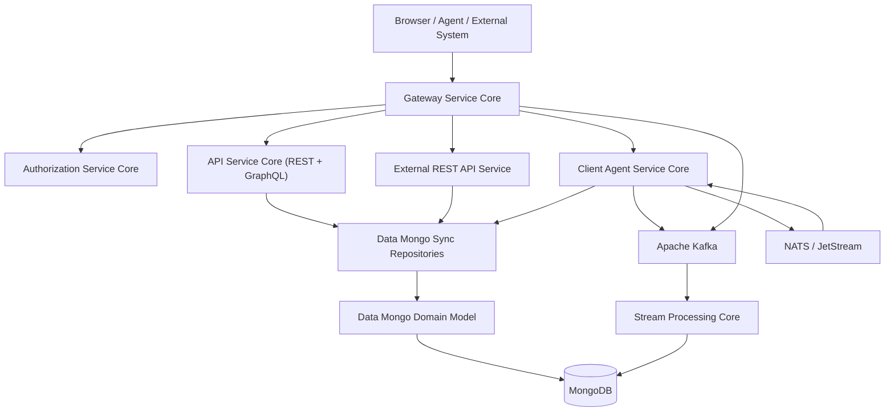

<div align="center">
  <picture>
    <source media="(prefers-color-scheme: dark)" srcset="https://shdrojejslhgnojzkzak.supabase.co/storage/v1/object/public/public/doc-orchestrator/logos/1771371901777-lc3cse-logo-openframe-full-dark-bg.png">
    <source media="(prefers-color-scheme: light)" srcset="https://shdrojejslhgnojzkzak.supabase.co/storage/v1/object/public/public/doc-orchestrator/logos/1771372526604-k3y1w-logo-openframe-full-light-bg.png">
    
  </picture>
</div>

<p align="center">
  <a href="LICENSE.md"></a>
</p>

# OpenFrame OSS Lib

**OpenFrame OSS Lib** is the core backend shared library collection of the [OpenFrame platform](https://openframe.ai) — the AI-driven unified MSP (Managed Service Provider) infrastructure built by [Flamingo](https://flamingo.run).

This monorepo provides the reusable Spring Boot modules that power every OpenFrame service. It delivers multi-tenant authentication, reactive API routing, event-driven stream processing, agent lifecycle management, and more — all packaged as independently versionable Maven artifacts.

> **Note:** This repository contains **shared library modules**, not a standalone deployable service. It is intended for use by [openframe-oss-tenant](https://github.com/flamingo-stack/openframe-oss-tenant) and related OpenFrame services.

---

## Features

- **Multi-Tenant by Design** — Every module respects tenant isolation via `TenantContext`, scoped repositories, and JWT claims
- **OAuth2 / OIDC Authorization Server** — Full Spring Authorization Server implementation with MongoDB persistence, SSO, and invitation-based registration
- **Reactive API Gateway** — Spring Cloud Gateway (WebFlux + Netty) with JWT, API key authentication, rate limiting, and WebSocket proxying
- **GraphQL API Layer** — Netflix DGS-based Relay-compliant API with cursor pagination and DataLoaders for N+1 elimination
- **External REST API** — Versioned `/api/v1/**` endpoints for third-party integrations with OpenAPI documentation
- **Event-Driven Streaming** — Kafka + Kafka Streams for real-time enrichment and state projection from integrated tools
- **Agent Lifecycle Management** — Full agent registration, heartbeat (NATS), RMM script scheduling, execution watchdog, and Kafka publishing
- **MongoDB Domain Model** — Rich document model covering devices, organizations, scripts, tickets, notifications, and more
- **Frontend Component Library** — React/TypeScript component library for the OpenFrame UI (Storybook included)
- **Rust Device Agent** — Cross-platform agent client (`clients/openframe-client`) built on the Tokio async runtime

---

## Architecture

OpenFrame OSS Lib follows a layered, multi-tenant, event-driven architecture:


```mermaid
flowchart TD
    Client["Browser / Agent / External System"] --> Gateway["Gateway Service Core"]

    Gateway --> Authz["Authorization Service Core"]
    Gateway --> Api["API Service Core (REST + GraphQL)"]
    Gateway --> ExternalApi["External REST API Service"]
    Gateway --> ClientAgent["Client Agent Service Core"]

    Api --> Repos["Data Mongo Sync Repositories"]
    ExternalApi --> Repos
    ClientAgent --> Repos

    Repos --> Domain["Data Mongo Domain Model"]
    Domain --> Mongo[("MongoDB")]

    ClientAgent --> Kafka["Apache Kafka"]
    Gateway --> Kafka
    Kafka --> Stream["Stream Processing Core"]
    Stream --> Mongo

    ClientAgent --> NATS["NATS / JetStream"]
    NATS --> ClientAgent
```

### Module Summary

| Layer | Module | Purpose |
|---|---|---|
| **Edge** | `openframe-gateway-service-core` | Reactive JWT/API-key gateway |
| **Identity** | `openframe-authorization-service-core` | OAuth2 + OIDC authorization server |
| **API** | `openframe-api-service-core` | Internal GraphQL + REST API |
| **External API** | `openframe-external-api-service-core` | Public REST API surface |
| **Agent** | `openframe-client-core` | Agent registration + RMM |
| **Domain** | `openframe-data-mongo-common` | MongoDB document model |
| **Repositories** | `openframe-data-mongo-sync` | Sync MongoDB repositories |
| **Streaming** | `openframe-stream-service-core` | Kafka event processing |

---

## Quick Start

### Prerequisites

- **JDK 21** (`java -version`)
- **Maven 3.9+** (`mvn -version`)
- **Docker 24+** (for integration tests)
- **Node.js 18+** (for frontend modules — optional)
- **Rust stable** (for agent client — optional)

### Clone and Build

```bash
# Clone the repository
git clone https://github.com/flamingo-stack/openframe-oss-lib.git
cd openframe-oss-lib

# Build all modules (skip tests for speed)
mvn clean install -DskipTests

# Verify the build succeeded
mvn dependency:resolve -DincludeArtifactIds=openframe-core
```

### Use a Module in Your Project

After installing locally, add a dependency to your Spring Boot service's `pom.xml`:

```xml
<!-- Core data layer -->
<dependency>
    <groupId>com.openframe.oss</groupId>
    <artifactId>openframe-data-mongo-sync</artifactId>
    <version>999-SNAPSHOT</version>
</dependency>

<!-- API service infrastructure -->
<dependency>
    <groupId>com.openframe.oss</groupId>
    <artifactId>openframe-api-service-core</artifactId>
    <version>999-SNAPSHOT</version>
</dependency>

<!-- Gateway module -->
<dependency>
    <groupId>com.openframe.oss</groupId>
    <artifactId>openframe-gateway-service-core</artifactId>
    <version>999-SNAPSHOT</version>
</dependency>
```

### Build a Specific Module

```bash
# Build only one module and its upstream dependencies
mvn clean install -pl openframe-data-mongo-sync -am -DskipTests
```

### Build the Frontend Library (Optional)

```bash
cd openframe-frontend-core
npm install
npm run build
```

### Build the Rust Agent Client (Optional)

```bash
cd clients/openframe-client
cargo build --release
# Binary: target/release/openframe-client
```

---

## Technology Stack

| Layer | Technology |
|---|---|
| Java framework | Spring Boot 3.3, Spring Cloud 2023 |
| Authorization | Spring Authorization Server 1.3.1 |
| API (GraphQL) | Netflix DGS 9.0.3 |
| Gateway | Spring Cloud Gateway (WebFlux + Netty) |
| Messaging | NATS / JetStream, Apache Kafka, Kafka Streams |
| Database | MongoDB, Redis |
| Testing | JUnit 5, Testcontainers 1.21.4, Mockito |
| Frontend | React, TypeScript, Tailwind CSS, Storybook |
| Agent | Rust (stable), Tokio async runtime |
| Build | Maven 3.9+, Node.js 18+, Cargo |

---

## Repository Structure

```text
openframe-oss-lib/
├── openframe-exception/              # Exception hierarchy
├── openframe-core/                   # Core utilities and validation
├── openframe-core-crypto/            # Encryption service
├── openframe-security-core/          # JWT security config
├── openframe-security-oauth/         # OAuth BFF service
├── openframe-authorization-service-core/  # OAuth2/OIDC server
├── openframe-gateway-service-core/   # Reactive API gateway
├── openframe-api-service-core/       # Internal GraphQL + REST API
├── openframe-api-lib/                # API contracts & DTO library
├── openframe-external-api-service-core/  # External REST API
├── openframe-client-core/            # Agent service core
├── openframe-data-mongo-common/      # MongoDB domain documents
├── openframe-data-mongo-sync/        # Synchronous repositories
├── openframe-data-mongo-reactive/    # Reactive repositories
├── openframe-data-redis/             # Redis caching
├── openframe-data-kafka/             # Kafka producer utilities
├── openframe-data-nats/              # NATS messaging
├── openframe-stream-service-core/    # Kafka Streams processing
├── openframe-notification-mail/      # Email notifications
├── openframe-notification-push/      # Push notifications
├── openframe-frontend-core/          # React/TypeScript UI library
├── clients/openframe-client/         # Rust agent client
└── sdk/fleetmdm/                     # Fleet MDM SDK
```

---

## GitHub Package Registry

Published artifacts are available from GitHub Packages. Configure your Maven `~/.m2/settings.xml`:

```xml
<servers>
  <server>
    <id>github</id>
    <username>YOUR_GITHUB_USERNAME</username>
    <password>YOUR_GITHUB_TOKEN</password>
  </server>
</servers>
```

> Replace `YOUR_GITHUB_TOKEN` with a GitHub Personal Access Token with the `read:packages` scope.

---

## Related Projects

| Project | Description |
|---|---|
| [openframe-oss-tenant](https://github.com/flamingo-stack/openframe-oss-tenant) | Main OpenFrame platform application |
| [openframe-cli](https://github.com/flamingo-stack/openframe-cli) | CLI tool for self-hosted deployment |
| [Flamingo](https://flamingo.run) | Commercial MSP platform powered by OpenFrame |
| [OpenFrame](https://openframe.ai) | Unified AI-driven MSP platform |

---

## Documentation

📚 See the [Documentation](./docs/README.md) for comprehensive guides including getting started tutorials, development setup, architecture reference, and security best practices.

---

## Community & Support

OpenFrame is developed in the open. Questions, ideas, and contributions are welcome on the **OpenMSP Slack community**:

https://join.slack.com/t/openmsp/shared_invite/zt-36bl7mx0h-3~U2nFH6nqHqoTPXMaHEHA

> We do not use GitHub Issues or GitHub Discussions — all coordination happens on Slack.

---

## Contributing

Contributions are welcome! Please read the [Contributing Guidelines](./CONTRIBUTING.md) before submitting a pull request. Discuss your idea on Slack first for non-trivial changes.

---

<div align="center">
  Built with 💛 by the <a href="https://www.flamingo.run/about"><b>Flamingo</b></a> team
</div>
