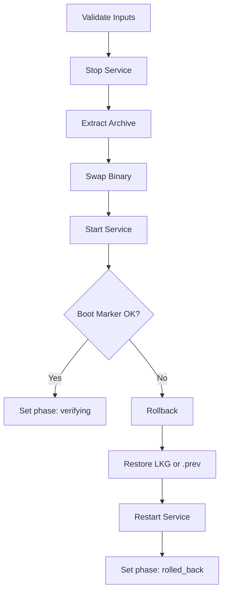

<!-- source-hash: 1f7e9d7a9380f779372e212f30806f18 -->
Defines an embedded PowerShell script used by the OpenFrame agent's self-update mechanism on Windows, exposed as a Rust string constant.

## Key Components

- **`UPDATE_SCRIPT_WINDOWS`** — A `&str` constant containing a complete PowerShell script that orchestrates stop-swap-start binary replacement for a Windows service, including rollback logic and boot verification.

The embedded script accepts the following parameters:

| Parameter | Purpose |
|---|---|
| `$ArchivePath` | Path to the downloaded `.zip` update archive |
| `$ServiceName` | Windows service name to stop/start |
| `$TargetExe` | Full path to the agent executable |
| `$UpdateStatePath` | JSON state file for phase tracking |
| `$TargetVersion` | Expected version string for boot verification |
| `$BootMarkerPath` | File written by the new binary on successful boot |
| `$LkgPath` | Last-known-good binary for rollback |
| `$TranscriptPath` | Optional PowerShell transcript log path |
| `$BootMarkerWaitSecs` | Timeout for boot marker check (default: 90s) |
| `$RollbackOnly` | Switch to trigger rollback without an update |

## Usage Example

```rust
use std::fs;

// Write the script to a temp file and invoke it via PowerShell
let script_path = std::env::temp_dir().join("openframe_update.ps1");
fs::write(&script_path, windows::UPDATE_SCRIPT_WINDOWS)?;

std::process::Command::new("powershell")
    .args([
        "-ExecutionPolicy", "Bypass",
        "-File", script_path.to_str().unwrap(),
        "-ArchivePath", archive_path,
        "-ServiceName", "openframe-agent",
        "-TargetExe", target_exe,
        "-TargetVersion", &new_version,
    ])
    .spawn()?;
```

## Update Flow



The script uses `$SwapReached` to gate rollback — if the failure occurs before the binary swap, the original executable is untouched and the service is simply restarted.