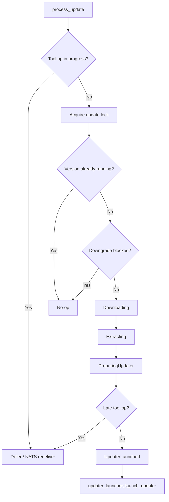

<!-- source-hash: 28eab7c36f0b41ccb203372d04782124 -->
Orchestrates the full lifecycle of an OpenFrame client self-update: version validation, downgrade protection, binary download/extraction, archive staging, and updater process launch.

## Key Components

- **`OpenFrameClientUpdateService`** — Main service struct; holds injected sub-services and an `Arc<Mutex<bool>>` guard to prevent concurrent updates.
- **`process_update(message)`** — Public entry point. Defers if a tool operation is in progress, acquires the update lock, delegates to `process_update_internal`, and always releases the lock.
- **`process_update_internal(message)`** — Validates semver format, enforces no-downgrade policy against the last-known-good anchor, persists `UpdateState`, sets `ClientUpdateStatus::Updating`, and calls `execute_update`.
- **`execute_update(message, update_state)`** — Resolves an OS-specific download config, downloads and extracts the binary, stages a temp ZIP archive, builds `UpdaterParams`, checks for late-arriving tool operations, and calls `updater_launcher::launch_updater`.

## Usage Example

```rust
let svc = OpenFrameClientUpdateService::new(
    client_info_service,
    github_download_service,
    update_state_service,
    last_known_good_service,
    tool_run_manager,
);

let message = OpenFrameClientUpdateMessage {
    version: "1.4.2".to_string(),
    download_configurations: vec![/* OS-specific configs */],
};

svc.process_update(message).await?;
```

## Update Phase Sequence

