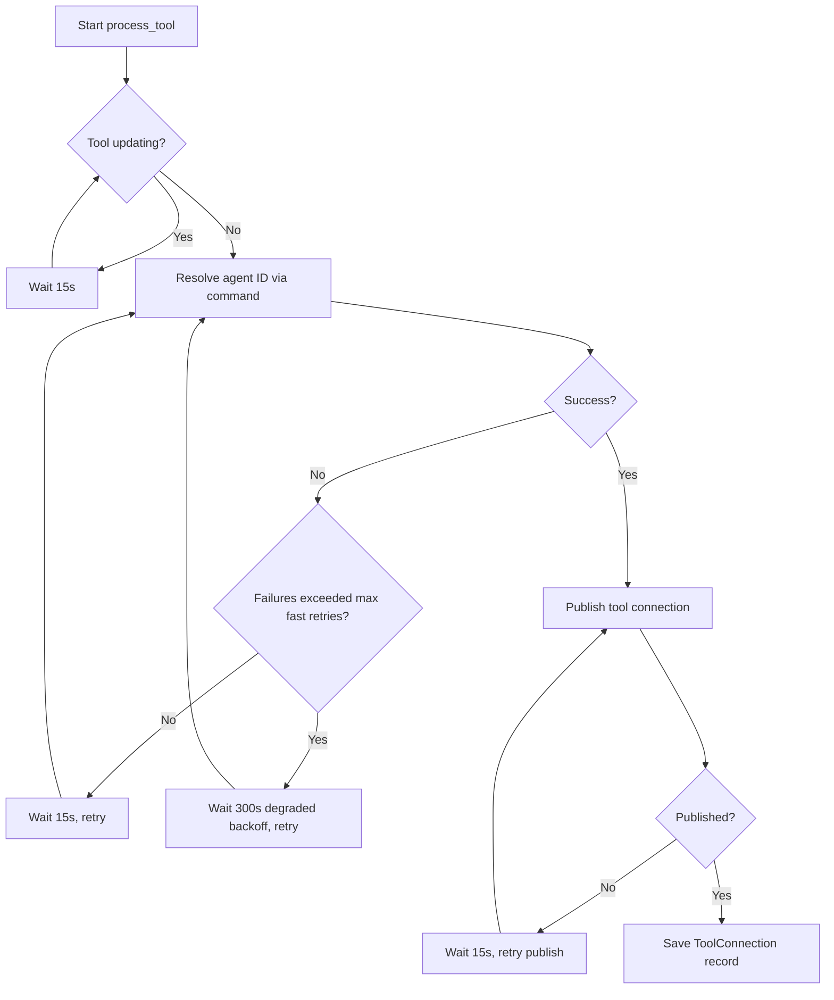

<!-- source-hash: a52207766df75f2018d9dc29a8e77cff -->
Manages the lifecycle of tool connection processing for installed tools, coordinating agent ID resolution, connection publishing, and retry logic with backoff strategies.

## Key Components

### `ToolConnectionProcessingManager` (struct)
The central manager that orchestrates tool connection setup. Holds shared state via `Arc<RwLock<HashSet<String>>>` to track which tools are currently being processed, preventing duplicate processing.

### Key Methods

| Method | Description |
|---|---|
| `new(...)` | Constructs the manager with all required service dependencies |
| `run()` | Processes connections for all installed tools on startup |
| `run_new_tool(installed_tool)` | Triggers connection processing for a newly installed tool |
| `try_mark_running(tool_id)` | Acquires a processing lock for a tool; returns `false` if already running |
| `clear_running_tool(tool_id)` | Releases the processing lock after completion or failure |
| `process_tool(tool)` | Spawns an async task that resolves the agent ID and publishes the tool connection |

### Constants

| Constant | Value | Purpose |
|---|---|---|
| `RETRY_DELAY_SECONDS` | `15` | Standard delay between retry attempts |
| `AGENT_ID_MAX_FAST_RETRIES` | `5` | Max consecutive fast failures before degraded backoff |
| `AGENT_ID_DEGRADED_BACKOFF_SECONDS` | `300` | Backoff delay once resolution is treated as degraded |

## Usage Example

```rust
let manager = ToolConnectionProcessingManager::new(
    installed_tools_service,
    params_processor,
    tool_connection_publisher,
    config_service,
    tool_connection_service,
    tool_run_manager,
);

// Process all existing tools on startup
manager.run().await?;

// Handle a newly installed tool at runtime
manager.run_new_tool(installed_tool).await?;

// Release a tool's processing lock externally if needed
manager.clear_running_tool("my-tool-id").await;
```

## Retry & Backoff Behavior

The `process_tool` loop implements a two-tier retry strategy:



The manager defers processing when a tool is mid-update (`ToolRunManager.is_updating`), and escalates to a 5-minute backoff after `AGENT_ID_MAX_FAST_RETRIES` consecutive agent ID resolution failures to prevent tight retry loops on persistently unhealthy agents.