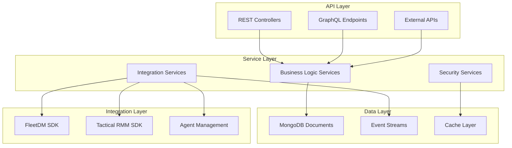

# OpenFrame OSS Library Documentation

Welcome to the comprehensive documentation for OpenFrame OSS Library - the foundational library for building secure, scalable device and organization management platforms.

## 📚 Table of Contents

### Getting Started
Start here if you're new to OpenFrame OSS Library:

- **[Introduction](./getting-started/introduction.md)** - What is OpenFrame OSS Library and why use it?
- **[Prerequisites](./getting-started/prerequisites.md)** - System requirements and tools you need
- **[Quick Start](./getting-started/quick-start.md)** - Get running in 5 minutes
- **[First Steps](./getting-started/first-steps.md)** - Your first OpenFrame integration

### Development
For contributors and developers working with the library:

- **[Development Overview](./development/README.md)** - Complete development guide index
- **[Environment Setup](./development/setup/environment.md)** - Configure your development environment
- **[Local Development](./development/setup/local-development.md)** - Running OpenFrame services locally
- **[Architecture Overview](./development/architecture/overview.md)** - System architecture and design patterns
- **[Testing Guide](./development/testing/overview.md)** - Testing strategies and best practices
- **[Contributing Guidelines](./development/contributing/guidelines.md)** - How to contribute to the project

### Reference Documentation
Technical reference for all components and modules:

- **[Architecture Overview](./reference/architecture/overview.md)** - High-level technical architecture

#### API & Service Components
- **[API Library DTOs](./reference/architecture/api_lib_dto.md)** - Data transfer objects and shared types
- **[API Services](./reference/architecture/api_service_core_controller.md)** - REST API controllers and endpoints
- **[External API Services](./reference/architecture/external_api_service_core_controller.md)** - External-facing API interfaces

#### Data & Persistence
- **[MongoDB Documents](./reference/architecture/data_mongo_document_device.md)** - Database models and schemas
- **[Data Repositories](./reference/architecture/data_mongo_repository_event.md)** - Data access layer patterns
- **[Event Streaming](./reference/architecture/stream_service_core_service.md)** - Kafka-based event processing

#### Security & Authentication
- **[Security Core](./reference/architecture/security_core_jwt.md)** - JWT and authentication infrastructure
- **[OAuth Integration](./reference/architecture/security_oauth_service.md)** - OAuth2 and OIDC providers
- **[Authorization Services](./reference/architecture/authorization_service_core_service_auth_strategy.md)** - Access control and permissions

#### Integration & SDKs
- **[FleetDM SDK](./reference/architecture/sdk_fleetmdm_model.md)** - FleetDM integration components
- **[Tactical RMM SDK](./reference/architecture/sdk_tacticalrmm_model.md)** - Tactical RMM integration components
- **[Client Core](./reference/architecture/client_core_controller.md)** - Agent and client management

#### Core Utilities
- **[Core DTOs](./reference/architecture/core_dto.md)** - Shared data structures and pagination
- **[Validation Framework](./reference/architecture/core_validation.md)** - Input validation and constraints
- **[Utility Functions](./reference/architecture/core_util.md)** - Helper functions and tools

### Diagrams
Visual documentation and architecture diagrams:

- **[System Architecture Diagrams](./diagrams/)** - Mermaid diagrams showing system relationships

## 🚀 Quick Navigation

| I want to... | Go to... |
|--------------|----------|
| **Get started quickly** | [Quick Start Guide](./getting-started/quick-start.md) |
| **Understand the architecture** | [Architecture Overview](./reference/architecture/overview.md) |
| **Set up my development environment** | [Environment Setup](./development/setup/environment.md) |
| **Learn about DTOs and APIs** | [API Library Documentation](./reference/architecture/api_lib_dto.md) |
| **Integrate with external tools** | [Integration SDKs](./reference/architecture/sdk_fleetmdm_model.md) |
| **Contribute to the project** | [Contributing Guidelines](./development/contributing/guidelines.md) |
| **Find specific module documentation** | [Reference Architecture Index](./reference/architecture/) |

## 📖 Documentation Structure

### 🎯 For New Users
1. Start with **[Introduction](./getting-started/introduction.md)** to understand what OpenFrame OSS Library offers
2. Check **[Prerequisites](./getting-started/prerequisites.md)** to ensure your environment is ready
3. Follow the **[Quick Start](./getting-started/quick-start.md)** guide to get up and running
4. Explore **[First Steps](./getting-started/first-steps.md)** for practical examples

### 🛠️ For Developers
1. Read the **[Development Overview](./development/README.md)** for a comprehensive development guide
2. Set up your environment using **[Environment Setup](./development/setup/environment.md)**
3. Understand the **[Architecture Overview](./development/architecture/overview.md)**
4. Review **[Testing Guidelines](./development/testing/overview.md)** before making changes

### 📚 For Advanced Users
1. Dive into **[Reference Documentation](./reference/architecture/overview.md)** for detailed technical specs
2. Explore specific modules in the **[Reference Architecture](./reference/architecture/)** section
3. View **[System Diagrams](./diagrams/)** for visual architecture understanding

## 🏗️ OpenFrame OSS Library Architecture

## 🔧 Core Modules Overview

| Module | Description | Documentation |
|--------|-------------|---------------|
| **api-lib** | Core DTOs and service interfaces | [API Library Docs](./reference/architecture/api_lib_dto.md) |
| **security-core** | Authentication and authorization | [Security Docs](./reference/architecture/security_core_jwt.md) |
| **data-mongo** | MongoDB models and repositories | [Data Layer Docs](./reference/architecture/data_mongo_document_device.md) |
| **client-core** | Agent and client management | [Client Docs](./reference/architecture/client_core_controller.md) |
| **sdk/fleetmdm** | FleetDM integration SDK | [FleetDM SDK Docs](./reference/architecture/sdk_fleetmdm_model.md) |
| **sdk/tacticalrmm** | Tactical RMM integration SDK | [Tactical RMM SDK Docs](./reference/architecture/sdk_tacticalrmm_model.md) |

## 🎓 Learning Path

### Beginner Path (New to OpenFrame)
1. **[Introduction](./getting-started/introduction.md)** - Understand the platform
2. **[Quick Start](./getting-started/quick-start.md)** - Build your first integration  
3. **[First Steps](./getting-started/first-steps.md)** - Explore core features

### Intermediate Path (Building Applications)
1. **[Architecture Overview](./reference/architecture/overview.md)** - Understand the system design
2. **[API Documentation](./reference/architecture/api_lib_dto.md)** - Learn the API patterns
3. **[Integration Guides](./reference/architecture/sdk_fleetmdm_model.md)** - Connect external tools

### Advanced Path (Contributing & Extending)
1. **[Development Setup](./development/setup/environment.md)** - Prepare your environment
2. **[Contributing Guidelines](./development/contributing/guidelines.md)** - Learn the contribution process
3. **[Testing Guide](./development/testing/overview.md)** - Ensure quality standards

## 📋 Common Use Cases

### Device Management Platform
Build comprehensive device inventory and monitoring systems:
- **Start**: [Device Models Documentation](./reference/architecture/data_mongo_document_device.md)
- **APIs**: [Device API Controllers](./reference/architecture/api_service_core_controller.md)
- **Integration**: [FleetDM SDK](./reference/architecture/sdk_fleetmdm_model.md)

### Multi-Tenant SaaS Application
Create secure, scalable multi-tenant applications:
- **Architecture**: [Multi-Tenant Security](./reference/architecture/authorization_service_core_service_auth_strategy.md)
- **Data Isolation**: [Organization Models](./reference/architecture/data_mongo_document_organization.md)
- **Authentication**: [JWT Security](./reference/architecture/security_core_jwt.md)

### Event-Driven Monitoring System
Build real-time event processing and alerting:
- **Events**: [Event Models](./reference/architecture/data_mongo_document_event.md)
- **Streaming**: [Event Streaming Services](./reference/architecture/stream_service_core_service.md)
- **APIs**: [Event APIs](./reference/architecture/external_api_service_core_dto_event.md)

## 📊 Documentation Metrics

- **Total Modules Documented**: 100+
- **API Endpoints Covered**: 50+
- **Integration SDKs**: 2 (FleetDM, Tactical RMM)
- **Security Components**: JWT, OAuth2, RBAC
- **Database Models**: 10+ core entities

## 🔍 Search Tips

- Use browser search (Ctrl/Cmd + F) to find specific terms
- Check the **[Reference Architecture](./reference/architecture/)** for detailed technical specs
- Look for code examples in **[Getting Started](./getting-started/)** guides
- Find visual diagrams in the **[Diagrams](./diagrams/)** section

## 📖 Quick Links

- **[Project README](../README.md)** - Main project overview and quick start
- **[Contributing Guide](../CONTRIBUTING.md)** - How to contribute to OpenFrame
- **[License Information](../LICENSE.md)** - Flamingo AI Unified License v1.0
- **[GitHub Repository](https://github.com/flamingo-stack/openframe-oss-lib)** - Source code and issues

## 🆘 Support & Community

- **🐛 Report Issues**: [GitHub Issues](https://github.com/flamingo-stack/openframe-oss-lib/issues)
- **💬 Ask Questions**: [GitHub Discussions](https://github.com/flamingo-stack/openframe-oss-lib/discussions)
- **📧 Enterprise Support**: [Contact Us](mailto:enterprise@openframe.ai)
- **🌐 Website**: [OpenFrame.ai](https://openframe.ai)

## 🔄 Documentation Updates

This documentation is actively maintained and updated with each release. Last updated: **Version 1.0.0**

For the most current information, always check the latest version on GitHub.

---

*Documentation generated by [OpenFrame Doc Orchestrator](https://github.com/flamingo-stack/openframe-oss-tenant)*

**Ready to get started?** 🚀 Begin with our **[Introduction Guide](./getting-started/introduction.md)** or jump straight into the **[Quick Start](./getting-started/quick-start.md)**!