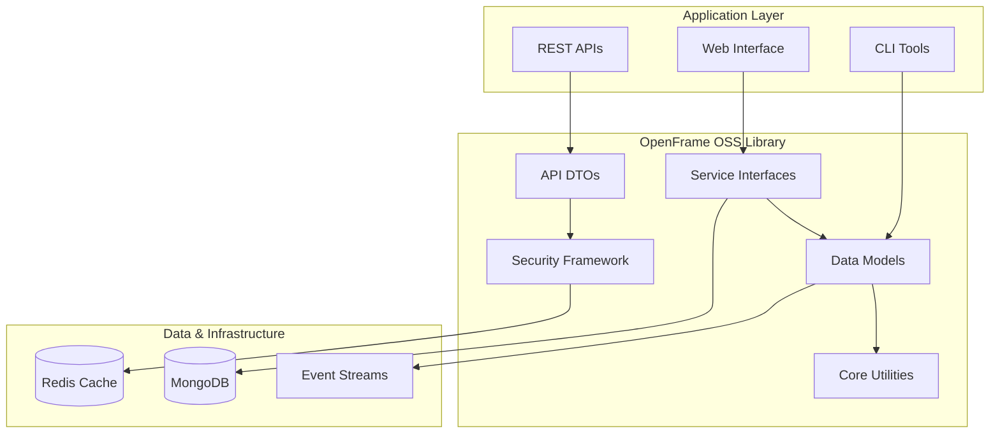

# OpenFrame OSS Library Documentation

Welcome to the comprehensive documentation for **OpenFrame OSS Library** - the foundational library for secure, scalable device and organization management platforms.

OpenFrame OSS Library provides standardized data models, API DTOs, and service interfaces that power the entire OpenFrame ecosystem, enabling organizations to build robust, multi-tenant device management solutions.

## 🚀 Quick Navigation

### New to OpenFrame?
Start here to understand the platform and get up and running quickly:

- **[Introduction](./getting-started/introduction.md)** - What is OpenFrame OSS Library?
- **[Prerequisites](./getting-started/prerequisites.md)** - What you need before starting
- **[Quick Start](./getting-started/quick-start.md)** - Get running in 5 minutes
- **[First Steps](./getting-started/first-steps.md)** - What to do after installation

### Building with OpenFrame?
Essential guides for developers and integrators:

- **[Development Overview](./development/README.md)** - Complete development guide
- **[Environment Setup](./development/setup/environment.md)** - Configure your development environment
- **[Local Development](./development/setup/local-development.md)** - Run OpenFrame locally
- **[Architecture Overview](./development/architecture/overview.md)** - Understand the system design

### Contributing to OpenFrame?
Guidelines for contributors and maintainers:

- **[Contributing Guidelines](./development/contributing/guidelines.md)** - How to contribute to OpenFrame
- **[Testing Guide](./development/testing/overview.md)** - Testing strategies and best practices

## 📚 Table of Contents

### Getting Started
Start your journey with OpenFrame OSS Library:

| Document | Description |
|----------|-------------|
| **[Introduction](./getting-started/introduction.md)** | Overview of OpenFrame OSS Library, key features, and target audience |
| **[Prerequisites](./getting-started/prerequisites.md)** | System requirements, dependencies, and setup preparation |
| **[Quick Start](./getting-started/quick-start.md)** | Step-by-step guide to get your first OpenFrame application running |
| **[First Steps](./getting-started/first-steps.md)** | Next steps after installation and initial exploration |

### Development
Comprehensive guides for developers building with OpenFrame:

| Document | Description |
|----------|-------------|
| **[Development Overview](./development/README.md)** | Main development guide with workflow and principles |
| **[Environment Setup](./development/setup/environment.md)** | IDE configuration, tools, and development environment |
| **[Local Development](./development/setup/local-development.md)** | Running OpenFrame locally with hot reload and debugging |
| **[Architecture Overview](./development/architecture/overview.md)** | System architecture, design patterns, and technical overview |
| **[Testing Overview](./development/testing/overview.md)** | Testing strategy, tools, and best practices |
| **[Contributing Guidelines](./development/contributing/guidelines.md)** | How to contribute code, documentation, and improvements |

### Reference
Technical reference documentation and API specifications:

| Document | Description |
|----------|-------------|
| **[Architecture Overview](./reference/architecture/overview.md)** | Detailed technical architecture and module documentation |
| **[API Library DTOs](./reference/architecture/api_lib_dto.md)** | API data transfer objects and shared models |
| **[Data Models](./reference/architecture/data_mongo_document_device.md)** | MongoDB document models and database design |
| **[Security Framework](./reference/architecture/security_core_jwt.md)** | Authentication, authorization, and security implementation |
| **[Service Interfaces](./reference/architecture/api_service_core_service.md)** | Business logic service interfaces and contracts |

### Diagrams
Visual documentation and architectural diagrams:

| Document | Description |
|----------|-------------|
| **[Architecture Diagrams](./diagrams/README.md)** | Mermaid diagrams showing system architecture and data flow |
| **[System Overview](./diagrams/system-overview.mmd)** | High-level system architecture visualization |
| **[Data Flow](./diagrams/data-flow.mmd)** | Request/response flow through OpenFrame components |

## 🎯 Documentation by Use Case

### For MSP/IT Service Providers
Building multi-tenant device management platforms:
- **[Getting Started Guide](./getting-started/introduction.md)** - Understand multi-tenant architecture
- **[Organization Management](./reference/architecture/api_lib_dto_organization.md)** - Multi-client organization structure
- **[Device Management](./reference/architecture/api_lib_dto_device.md)** - Device inventory and monitoring

### For Enterprise Organizations
Deploying secure device management infrastructure:
- **[Security Framework](./reference/architecture/security_core_jwt.md)** - Enterprise authentication and authorization
- **[Event & Audit System](./reference/architecture/api_lib_dto_event.md)** - Compliance and audit trails
- **[Integration Guide](./reference/architecture/api_lib_dto_tool.md)** - Connect existing tools and systems

### For Software Vendors
Integrating device management into products:
- **[API Reference](./reference/architecture/overview.md)** - Complete API documentation
- **[SDK Documentation](./reference/architecture/sdk_tacticalrmm.md)** - Integration SDKs and examples
- **[Development Guide](./development/README.md)** - Development patterns and best practices

### For Platform Developers
Building custom device management solutions:
- **[Architecture Overview](./development/architecture/overview.md)** - System design and patterns
- **[Data Models](./reference/architecture/data_mongo_document_device.md)** - Database design and optimization
- **[Testing Guide](./development/testing/overview.md)** - Testing strategies for platform development

## 🏗️ Core Architecture

OpenFrame OSS Library follows a modular, layered architecture:

## 📊 Key Features Overview

### Multi-Tenant Organization Management
- **[Organization DTOs](./reference/architecture/api_lib_dto_organization.md)** - Data structures for multi-tenant organizations
- **[Contact Management](./reference/architecture/data_mongo_document_organization.md)** - Contact and relationship management
- **[User Invitations](./reference/architecture/api_service_core_dto_invitation.md)** - User invitation and onboarding

### Device Management & Monitoring
- **[Device DTOs](./reference/architecture/api_lib_dto_device.md)** - Device filtering, tagging, and querying
- **[Device Models](./reference/architecture/data_mongo_document_device.md)** - MongoDB models for devices and alerts
- **[Tool Integration](./reference/architecture/api_lib_dto_tool.md)** - RMM tool connections and management

### Security & Authentication
- **[JWT Framework](./reference/architecture/security_core_jwt.md)** - JWT-based authentication
- **[OAuth Integration](./reference/architecture/security_oauth_service.md)** - OAuth 2.0 and OIDC support
- **[Tenant Security](./reference/architecture/gateway_service_core_security_tenant.md)** - Multi-tenant data isolation

### Event Processing & Audit
- **[Event DTOs](./reference/architecture/api_lib_dto_event.md)** - Event filtering and querying
- **[Event Models](./reference/architecture/data_mongo_document_event.md)** - Core and external event tracking
- **[Audit Logging](./reference/architecture/api_lib_dto_audit.md)** - Comprehensive audit trails

## 🔧 Development Resources

### Code Examples
- **[Service Implementation](./development/setup/local-development.md)** - Example service implementations
- **[API Usage](./getting-started/quick-start.md)** - Basic API usage examples
- **[Integration Patterns](./development/architecture/overview.md)** - Common integration patterns

### Testing & Quality
- **[Test Examples](./development/testing/overview.md)** - Unit and integration test examples
- **[Quality Standards](./development/contributing/guidelines.md)** - Code quality requirements
- **[CI/CD Pipeline](./development/setup/environment.md)** - Continuous integration setup

### Configuration & Deployment
- **[Environment Setup](./development/setup/environment.md)** - Development environment configuration
- **[Production Deployment](./development/setup/local-development.md)** - Production deployment guidelines
- **[Performance Optimization](./development/architecture/overview.md)** - Performance best practices

## 📖 Quick Links

### Project Resources
- **[Main README](../README.md)** - Project overview and quick start
- **[Contributing Guide](../CONTRIBUTING.md)** - How to contribute to OpenFrame
- **[License](../LICENSE.md)** - Flamingo AI Unified License v1.0

### External Links
- **[OpenFrame Platform](https://openframe.ai)** - Official product information
- **[Flamingo Company](https://flamingo.run)** - About Flamingo and our mission
- **[OpenMSP Community](https://join.slack.com/t/openmsp/shared_invite/zt-36bl7mx0h-3~U2nFH6nqHqoTPXMaHEHA)** - Join our Slack community for support

### GitHub Repositories
- **[OpenFrame Gateway](https://github.com/flamingo-stack/openframe-gateway)** - API gateway and routing
- **[OpenFrame Auth](https://github.com/flamingo-stack/openframe-auth)** - Authentication service
- **[OpenFrame Dashboard](https://github.com/flamingo-stack/openframe-dashboard)** - Web management interface

## 🆘 Getting Help

### Community Support
All discussions and support happen through our **OpenMSP Slack community**:

- 💬 **[Join OpenMSP Slack](https://join.slack.com/t/openmsp/shared_invite/zt-36bl7mx0h-3~U2nFH6nqHqoTPXMaHEHA)** - Real-time help and discussions
- 🎯 **#openframe-dev** - Development questions and technical discussions
- 🚀 **#openframe-general** - General questions and platform updates
- 🐛 **#openframe-bugs** - Bug reports and issue tracking

> **Note**: GitHub Issues and Discussions are not actively monitored. Please use our Slack community for all support and discussions.

### Documentation Updates

Found an error or want to improve the documentation?

1. **[Join our Slack community](https://join.slack.com/t/openmsp/shared_invite/zt-36bl7mx0h-3~U2nFH6nqHqoTPXMaHEHA)** for discussion
2. **[Review contributing guidelines](./development/contributing/guidelines.md)** for documentation standards
3. **Submit a pull request** with your improvements

## 🎉 What's Next?

### For Newcomers
1. **[Read the Introduction](./getting-started/introduction.md)** - Understand what OpenFrame OSS Library is
2. **[Check Prerequisites](./getting-started/prerequisites.md)** - Ensure you have everything needed
3. **[Follow Quick Start](./getting-started/quick-start.md)** - Build your first application

### For Developers
1. **[Set up your environment](./development/setup/environment.md)** - Configure your development setup
2. **[Explore the architecture](./development/architecture/overview.md)** - Understand the system design
3. **[Start building](./development/setup/local-development.md)** - Begin developing with OpenFrame

### For Contributors
1. **[Read contributing guidelines](./development/contributing/guidelines.md)** - Learn our contribution process
2. **[Join the community](https://join.slack.com/t/openmsp/shared_invite/zt-36bl7mx0h-3~U2nFH6nqHqoTPXMaHEHA)** - Connect with other contributors
3. **[Start contributing](./development/README.md)** - Make your first contribution

---

*Documentation generated by [OpenFrame Doc Orchestrator](https://github.com/flamingo-stack/openframe-oss-tenant)*

  Built with 💛 by the <a href="https://www.flamingo.run/about"><b>Flamingo</b></a> team

