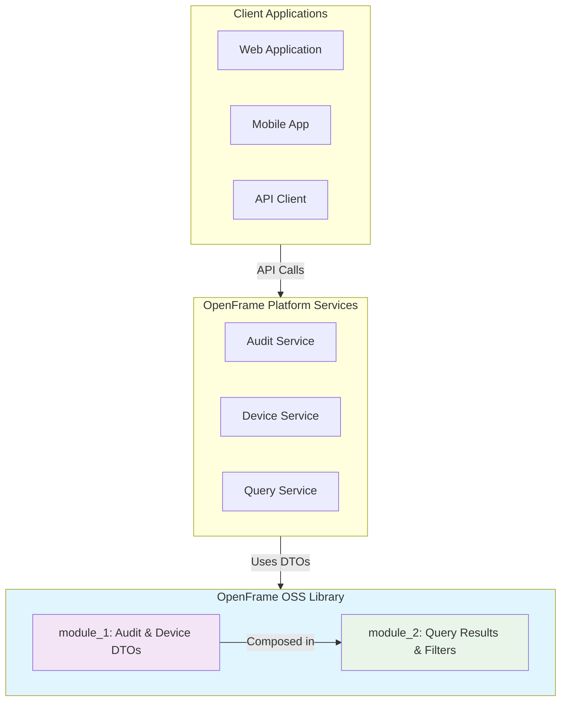

# OpenFrame OSS Library Documentation

Welcome to the comprehensive documentation for the OpenFrame OSS Library - a foundational Java library providing essential data transfer objects (DTOs), filter options, and query result structures for the OpenFrame API ecosystem.

## 📚 Table of Contents

### Getting Started
Start here if you're new to the OpenFrame OSS Library:
- [Introduction](./getting-started/introduction.md) - What is the OpenFrame OSS Library?
- [Prerequisites](./getting-started/prerequisites.md) - System requirements and setup
- [Quick Start](./getting-started/quick-start.md) - Get running in 5 minutes
- [First Steps](./getting-started/first-steps.md) - Explore key features and common patterns

### Development
For contributors and developers working with the library:
- [Development Overview](./development/README.md) - Complete development documentation index
- [Environment Setup](./development/setup/environment.md) - Configure your development environment
- [Local Development](./development/setup/local-development.md) - Clone, build, and run locally
- [Architecture Overview](./development/architecture/overview.md) - High-level system design and relationships
- [Testing Overview](./development/testing/overview.md) - Test structure, execution, and best practices
- [Contributing Guidelines](./development/contributing/guidelines.md) - Code style, PR process, and review standards

### Reference
Technical reference documentation for all components:
- [Architecture Overview](./reference/architecture/overview.md) - Complete technical architecture and module breakdown
- [Module 1: Audit & Device DTOs](./reference/architecture/module_1.md) - Core DTOs for audit logging and device filtering
- [Module 2: Query Results & Filters](./reference/architecture/module_2.md) - Generic and domain-specific query result wrappers

#### Core Components
**Module 1 - Audit & Device DTOs:**
- [LogEvent](./reference/architecture/LogEvent.md) - Basic audit event representation
- [LogDetails](./reference/architecture/LogDetails.md) - Extended audit event with detailed information
- [LogFilters](./reference/architecture/LogFilters.md) - Audit log filtering criteria
- [OrganizationFilterOption](./reference/architecture/OrganizationFilterOption.md) - Organization-based filtering options
- [DeviceFilterOptions](./reference/architecture/DeviceFilterOptions.md) - Device filter criteria and options

**Module 2 - Query Results & Filter Options:**
- [GenericQueryResult](./reference/architecture/GenericQueryResult.md) - Generic paginated query results
- [CountedGenericQueryResult](./reference/architecture/CountedGenericQueryResult.md) - Query results with total count information
- [DeviceFilters](./reference/architecture/DeviceFilters.md) - Device filter aggregations and combinations
- [DeviceFilterOption](./reference/architecture/DeviceFilterOption.md) - Single device filter option
- [LogFilterOptions](./reference/architecture/LogFilterOptions.md) - Audit log filter options and settings

### Diagrams
Visual documentation and architecture diagrams:
- [Architecture Diagrams](./diagrams/architecture/README.md) - Mermaid diagrams showing component relationships and data flow

## 🎯 Documentation Sections by Use Case

### For New Users
If you're just getting started with the OpenFrame OSS Library:
1. **[Introduction](./getting-started/introduction.md)** - Understand what the library does and who it's for
2. **[Prerequisites](./getting-started/prerequisites.md)** - Ensure your environment is ready
3. **[Quick Start](./getting-started/quick-start.md)** - Get up and running with basic examples
4. **[First Steps](./getting-started/first-steps.md)** - Explore common usage patterns

### For Integration Developers
If you're integrating the library into your OpenFrame services:
1. **[Architecture Overview](./reference/architecture/overview.md)** - Understand the system design
2. **[Module Documentation](./reference/architecture/module_1.md)** - Deep dive into specific components
3. **[API Reference](./reference/architecture/)** - Detailed component documentation

### For Contributors
If you're contributing to the library development:
1. **[Development Setup](./development/setup/environment.md)** - Get your development environment ready
2. **[Architecture Overview](./development/architecture/overview.md)** - Understand the development architecture
3. **[Contributing Guidelines](./development/contributing/guidelines.md)** - Follow our development process
4. **[Testing Guide](./development/testing/overview.md)** - Ensure quality through testing

## 🏗️ Library Architecture Overview

The OpenFrame OSS Library is organized into two main modules:

### Key Features

| Feature Category | Components | Purpose |
|-----------------|------------|---------|
| **Audit Logging** | LogEvent, LogDetails, LogFilters | Comprehensive audit trail representation and filtering |
| **Device Management** | DeviceFilterOptions, DeviceFilters | Device inventory queries and management |
| **Query Results** | GenericQueryResult, CountedGenericQueryResult | Paginated API responses with type safety |
| **Filter Options** | Various filter DTOs | Flexible querying and filtering capabilities |

## 📖 Quick Links

### Essential Resources
- [Project README](../README.md) - Main project overview and quick start
- [Contributing Guide](../CONTRIBUTING.md) - How to contribute to the project
- [License](../LICENSE.md) - Licensing information and terms

### External Resources
- [OpenFrame Platform](https://www.openframe.ai) - Learn about the broader OpenFrame ecosystem
- [Flamingo Team](https://www.flamingo.run/about) - Meet the team behind OpenFrame

## 🚀 Quick Navigation by Topic

### Getting Started Topics
- **Installation & Setup** → [Prerequisites](./getting-started/prerequisites.md) → [Quick Start](./getting-started/quick-start.md)
- **Learning the Library** → [Introduction](./getting-started/introduction.md) → [First Steps](./getting-started/first-steps.md)
- **Architecture Understanding** → [Overview](./reference/architecture/overview.md) → [Module Details](./reference/architecture/module_1.md)

### Development Topics  
- **Environment Setup** → [Environment](./development/setup/environment.md) → [Local Development](./development/setup/local-development.md)
- **Contributing Code** → [Guidelines](./development/contributing/guidelines.md) → [Testing](./development/testing/overview.md)
- **System Design** → [Architecture](./development/architecture/overview.md) → [Diagrams](./diagrams/architecture/README.md)

### Reference Topics
- **Component Details** → [Module 1](./reference/architecture/module_1.md) → [Module 2](./reference/architecture/module_2.md)
- **API Reference** → [Individual Components](./reference/architecture/) → [Usage Examples](./getting-started/first-steps.md)

## 📊 Documentation Statistics

| Section | Files | Coverage |
|---------|-------|----------|
| **Getting Started** | 4 files | Complete user onboarding |
| **Development** | 6 files | Full contributor workflow |
| **Reference** | 13 files | Complete API documentation |
| **Diagrams** | Multiple | Visual architecture guides |

## 🔍 Search and Discovery

### By Component Type
- **DTOs**: LogEvent, LogDetails, DeviceFilterOptions, etc.
- **Filters**: LogFilters, DeviceFilters, various filter options
- **Results**: GenericQueryResult, CountedGenericQueryResult
- **Utilities**: Shared components and helper classes

### By Use Case
- **Audit Logging**: LogEvent → LogDetails → LogFilters → LogFilterOptions
- **Device Management**: DeviceFilterOptions → DeviceFilters → DeviceFilterOption
- **API Responses**: GenericQueryResult → CountedGenericQueryResult
- **Data Filtering**: All filter-related components

## 💡 Tips for Using This Documentation

1. **Start with Introduction** if you're new to the library
2. **Use Quick Start** for immediate hands-on experience  
3. **Reference Architecture** for understanding system design
4. **Check Examples** in First Steps for practical patterns
5. **Follow Development Guide** if contributing code
6. **Browse Component Reference** for detailed API information

## 🆘 Getting Help

Can't find what you're looking for? Here are your options:

1. **Search this documentation** using your browser's search (Ctrl/Cmd + F)
2. **Check the main README** for high-level information
3. **Browse component reference** for detailed API docs
4. **Review examples** in getting-started guides
5. **Check GitHub Issues** for known problems and solutions
6. **Start a GitHub Discussion** for questions and community help

---

*Documentation generated by [OpenFrame Doc Orchestrator](https://github.com/flamingo-stack/openframe-oss-tenant)*

---

**Ready to get started?** Begin with our [Introduction Guide](./getting-started/introduction.md) to learn what the OpenFrame OSS Library can do for your project.