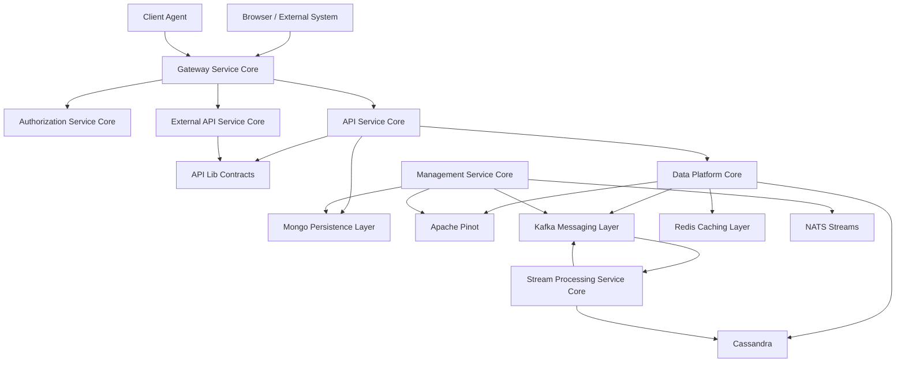

# OpenFrame OSS Libraries Documentation

Welcome to the comprehensive documentation for **OpenFrame OSS Libraries** – the core backend foundation for AI-powered MSP platforms. This documentation provides everything you need to understand, deploy, develop, and extend the OpenFrame ecosystem.

## 📚 Table of Contents

### Getting Started

New to OpenFrame OSS Libraries? Start here to get up and running quickly:

- **[Introduction](./getting-started/introduction.md)** - What is OpenFrame OSS Lib and why use it?
- **[Prerequisites](./getting-started/prerequisites.md)** - System requirements and development tools
- **[Quick Start](./getting-started/quick-start.md)** - Get running in 5 minutes with Docker
- **[First Steps](./getting-started/first-steps.md)** - Explore key features and capabilities

### Development

Everything you need for local development and contribution:

- **[Setup Guide](./development/setup/local-development.md)** - Complete development environment configuration
- **[Environment Configuration](./development/setup/environment.md)** - Environment variables and service setup
- **[Architecture Overview](./development/architecture/README.md)** - System design and architectural patterns
- **[Contributing Guidelines](./development/contributing/guidelines.md)** - How to contribute code, documentation, and tests
- **[Testing Guide](./development/testing/README.md)** - Testing strategies, coverage requirements, and best practices  
- **[Security Guidelines](./development/security/README.md)** - Security requirements and multi-tenant best practices

### Reference Documentation

Technical reference for all OpenFrame OSS Libraries components:

#### Core Services
- **[API Service Core](./reference/architecture/api-service-core-controllers-and-graphql/api-service-core-controllers-and-graphql.md)** - REST + GraphQL API orchestration
- **[API Lib Contracts](./reference/architecture/api-lib-contracts-and-services/api-lib-contracts-and-services.md)** - Shared DTOs, filters, and services

#### Security & Identity  
- **[Authorization Service Core](./reference/architecture/authorization-service-core/authorization-service-core.md)** - Multi-tenant OAuth2/OIDC server
- **[Security Core](./reference/architecture/security-core-and-oauth-bff/security-core-and-oauth-bff.md)** - JWT infrastructure and OAuth BFF
- **[Gateway Service Core](./reference/architecture/gateway-service-core/gateway-service-core.md)** - Reactive edge gateway

#### Data & Infrastructure
- **[Mongo Persistence Layer](./reference/architecture/mongo-persistence-layer/mongo-persistence-layer.md)** - MongoDB models and repositories  
- **[Data Platform Core](./reference/architecture/data-platform-core/data-platform-core.md)** - Cassandra + Pinot analytics platform
- **[Kafka Messaging Layer](./reference/architecture/kafka-messaging-layer/kafka-messaging-layer.md)** - Event streaming infrastructure
- **[Redis Caching Layer](./reference/architecture/redis-caching-layer/redis-caching-layer.md)** - Caching and session management

#### Processing & Integration
- **[Stream Processing Service Core](./reference/architecture/stream-processing-service-core/stream-processing-service-core.md)** - CDC ingestion and data enrichment
- **[Management Service Core](./reference/architecture/management-service-core/management-service-core.md)** - Automation and scheduled operations
- **[Client Agent Service Core](./reference/architecture/client-agent-service-core/client-agent-service-core.md)** - Agent lifecycle management
- **[External API Service Core](./reference/architecture/external-api-service-core/external-api-service-core.md)** - External system integrations

### Architecture Diagrams

Visual documentation of system components and data flows:

#### Service Architecture Diagrams
View detailed Mermaid diagrams for each service component:
- **Service Interactions** - How services communicate and depend on each other
- **Data Flow Diagrams** - Event processing and data transformation pipelines  
- **Security Flows** - Authentication, authorization, and tenant isolation
- **Integration Patterns** - Agent communication and external API workflows

*Architecture diagrams are located in `./diagrams/architecture/` and can be viewed in any Mermaid-compatible viewer.*

### CLI Tools

The OpenFrame CLI for deployment and management is maintained separately:

- **Repository**: [flamingo-stack/openframe-cli](https://github.com/flamingo-stack/openframe-cli)
- **Documentation**: [CLI Documentation](https://github.com/flamingo-stack/openframe-cli/blob/main/docs/README.md)

**Note**: CLI tools are **NOT** located in this repository. Always refer to the external repository for installation, configuration, and usage instructions.

## 🏗️ System Architecture Overview  

OpenFrame OSS Libraries implements a **layered, event-driven, multi-tenant architecture** designed for horizontal scalability and AI-ready data processing:

### Key Architectural Principles

1. **Multi-tenant by Design** - Complete tenant isolation at all layers
2. **Event-Driven Processing** - Kafka-powered asynchronous workflows  
3. **Reactive Edge** - WebFlux-based gateway for high throughput
4. **Analytics-Optimized** - Separate operational and analytical storage
5. **Modular Service Cores** - Domain-focused, independently deployable modules
6. **Security-First** - OAuth2/OIDC with comprehensive access controls

## 🚀 Quick Navigation

### For New Users
1. **[Introduction](./getting-started/introduction.md)** → **[Prerequisites](./getting-started/prerequisites.md)** → **[Quick Start](./getting-started/quick-start.md)**

### For Developers  
1. **[Development Setup](./development/setup/local-development.md)** → **[Architecture](./development/architecture/README.md)** → **[Contributing](./development/contributing/guidelines.md)**

### For System Architects
1. **[Architecture Overview](./development/architecture/README.md)** → **[Reference Docs](./reference/architecture/README.md)** → **[Diagrams](./diagrams/architecture/README.md)**

### For Integrators
1. **[API Service Core](./reference/architecture/api-service-core-controllers-and-graphql/api-service-core-controllers-and-graphql.md)** → **[External API Service](./reference/architecture/external-api-service-core/external-api-service-core.md)** → **[Agent Service](./reference/architecture/client-agent-service-core/client-agent-service-core.md)**

## 📖 External Resources

### OpenFrame Platform
- **[OpenFrame Website](https://openframe.ai)** - Product information and demos
- **[Flamingo Company](https://flamingo.run)** - About the team behind OpenFrame

### OpenFrame OSS Tenant  
- **Repository**: [flamingo-stack/openframe-oss-tenant](https://github.com/flamingo-stack/openframe-oss-tenant)
- **Documentation**: [Platform Documentation](https://github.com/flamingo-stack/openframe-oss-tenant/blob/main/docs/README.md)

### Community
- **[OpenMSP Slack](https://join.slack.com/t/openmsp/shared_invite/zt-36bl7mx0h-3~U2nFH6nqHqoTPXMaHEHA)** - Primary community channel
- **[GitHub Issues](https://github.com/flamingo-stack/openframe-oss-lib/issues)** - Bug reports and feature requests
- **[GitHub Discussions](https://github.com/flamingo-stack/openframe-oss-lib/discussions)** - Architecture discussions and RFCs

## 🔧 Technology Stack Summary

| Layer | Technologies | Purpose |
|-------|-------------|---------|
| **Runtime** | Java 21, Spring Boot 3.3 | Application framework and modern language features |
| **Security** | Spring Authorization Server, JWT | OAuth2/OIDC multi-tenant authentication |
| **API** | Netflix DGS, Spring WebFlux | GraphQL and reactive REST APIs |  
| **Data** | MongoDB, Cassandra, Pinot, Redis | Multi-modal storage for operations and analytics |
| **Messaging** | Apache Kafka, NATS | Event streaming and real-time communication |
| **Build** | Maven 3.x | Multi-module dependency management |

## 🎯 Documentation Goals

This documentation aims to:

- **Enable Rapid Development** - Get developers productive quickly with clear setup guides
- **Ensure Security Best Practices** - Comprehensive security guidelines for multi-tenant applications  
- **Support Scalable Architecture** - Design patterns for horizontal scaling and performance
- **Facilitate Integration** - Clear API documentation and integration examples
- **Promote Community Contribution** - Guidelines for contributing code, documentation, and ideas

## 📞 Need Help?

- **💬 Community Support**: [OpenMSP Slack](https://join.slack.com/t/openmsp/shared_invite/zt-36bl7mx0h-3~U2nFH6nqHqoTPXMaHEHA)
- **🐛 Bug Reports**: [GitHub Issues](https://github.com/flamingo-stack/openframe-oss-lib/issues)
- **💡 Feature Requests**: [GitHub Discussions](https://github.com/flamingo-stack/openframe-oss-lib/discussions)
- **📚 More Resources**: [OpenFrame Documentation](https://www.flamingo.run/openframe)

## 🤝 Contributing to Documentation

Found an error or want to improve this documentation?

1. **Small fixes**: Edit directly on GitHub and submit a pull request
2. **Large changes**: Discuss in [OpenMSP Slack #development](https://join.slack.com/t/openmsp/shared_invite/zt-36bl7mx0h-3~U2nFH6nqHqoTPXMaHEHA) first
3. **New sections**: Follow the [Contributing Guidelines](./development/contributing/guidelines.md)

All documentation follows the same review process as code contributions.

---

*Documentation generated by [OpenFrame Doc Orchestrator](https://github.com/flamingo-stack/openframe-oss-tenant) - Building the future of open-source MSP tooling* 🚀