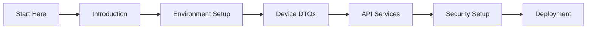
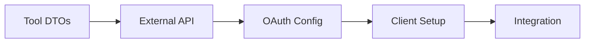
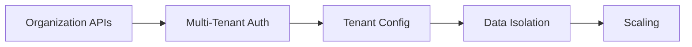

# OpenFrame OSS Library Documentation

Welcome to the comprehensive documentation for OpenFrame OSS Library - the foundational library for building secure, scalable device and organization management platforms.

## 📚 Table of Contents

### Getting Started
Start here if you're new to OpenFrame OSS Library:

- **[Introduction](./getting-started/introduction.md)** - What is OpenFrame OSS Library and why use it?
- **[Prerequisites](./getting-started/prerequisites.md)** - Development environment requirements
- **[Quick Start](./getting-started/quick-start.md)** - Get running in 5 minutes
- **[First Steps](./getting-started/first-steps.md)** - Explore key features and concepts

### Development
Essential guides for developers and contributors:

- **[Development Overview](./development/README.md)** - Development section index and workflow
- **[Environment Setup](./development/setup/environment.md)** - Configure your development environment
- **[Local Development](./development/setup/local-development.md)** - Run and debug the project locally
- **[Architecture Overview](./development/architecture/overview.md)** - Deep dive into system architecture
- **[Testing Guide](./development/testing/overview.md)** - Testing strategies and best practices
- **[Contributing Guidelines](./development/contributing/guidelines.md)** - How to contribute to the project

### Reference
Technical reference documentation for all components:

- **[Architecture Overview](./reference/architecture/overview.md)** - High-level system architecture
- **[API DTOs](./reference/architecture/api_lib_dto.md)** - Data transfer objects and interfaces
- **[Service Interfaces](./reference/architecture/api_lib_service.md)** - Business logic contracts
- **[Data Models](./reference/architecture/data_model.md)** - MongoDB document entities
- **[Security Components](./reference/architecture/security_core_jwt.md)** - Authentication and authorization
- **[Configuration](./reference/architecture/config_core_core.md)** - Configuration management
- **[Core Utilities](./reference/architecture/core_util.md)** - Shared utility functions

### Core Domain Models

#### Device Management
- **[Device DTOs](./reference/architecture/api_lib_dto_device.md)** - Device filtering and response DTOs
- **[Device Models](./reference/architecture/data_mongo_document_device.md)** - MongoDB device entities
- **[Device Services](./reference/architecture/api_service_core_controller.md)** - Device management APIs

#### Organization Management  
- **[Organization DTOs](./reference/architecture/api_lib_dto_organization.md)** - Organization filtering and DTOs
- **[Organization Models](./reference/architecture/data_mongo_document_organization.md)** - MongoDB organization entities
- **[Management Services](./reference/architecture/management_service_core_service.md)** - Organization management

#### Event & Audit System
- **[Event DTOs](./reference/architecture/api_lib_dto_event.md)** - Event filtering and audit DTOs
- **[Event Models](./reference/architecture/data_mongo_document_event.md)** - MongoDB event entities  
- **[Stream Services](./reference/architecture/stream_service_core_service.md)** - Event stream processing

#### Tool Integration
- **[Tool DTOs](./reference/architecture/api_lib_dto_tool.md)** - Tool filtering and connection DTOs
- **[Tool Models](./reference/architecture/data_mongo_document_tool_filter.md)** - MongoDB tool entities
- **[External API Services](./reference/architecture/external_api_service_core_service.md)** - External tool integrations

### Security & Authentication
- **[JWT Security](./reference/architecture/security_core_jwt.md)** - JWT token handling
- **[OAuth Services](./reference/architecture/security_oauth_service.md)** - OAuth 2.0 and OIDC integration
- **[Authorization Services](./reference/architecture/authorization_service_core_service_auth_strategy.md)** - Authentication strategies
- **[Security Configuration](./reference/architecture/security_core_config.md)** - Security setup and configuration

### Frontend Integration
- **[Frontend Types](./reference/architecture/frontend_core_types_platform.md)** - TypeScript type definitions
- **[UI Components](./reference/architecture/frontend_core_components_ui.md)** - Shared UI components
- **[React Hooks](./reference/architecture/frontend_core_hooks_ui.md)** - Custom React hooks

### Microservices Architecture
- **[API Service Core](./reference/architecture/api_service_core_config.md)** - Main API service configuration
- **[Gateway Service](./reference/architecture/gateway_service_core_config.md)** - API gateway and routing
- **[Authorization Service](./reference/architecture/authorization_service_core_config_tenant.md)** - Multi-tenant authorization
- **[Client Services](./reference/architecture/client_core_config.md)** - Client agent configuration

### Data & Infrastructure
- **[MongoDB Configuration](./reference/architecture/data_config.md)** - Database setup and optimization
- **[Kafka Integration](./reference/architecture/data_kafka_config.md)** - Event streaming configuration
- **[Repository Patterns](./reference/architecture/data_mongo_repository_event.md)** - Data access patterns

## 🎯 Quick Navigation

### For New Users
1. **[Introduction](./getting-started/introduction.md)** → **[Prerequisites](./getting-started/prerequisites.md)** → **[Quick Start](./getting-started/quick-start.md)**
2. Watch: [OpenFrame Product Walkthrough](https://www.youtube.com/watch?v=awc-yAnkhIo)
3. Explore: **[First Steps](./getting-started/first-steps.md)**

### For Developers
1. **[Environment Setup](./development/setup/environment.md)** → **[Local Development](./development/setup/local-development.md)**
2. **[Architecture Overview](./development/architecture/overview.md)** → **[Reference Docs](./reference/architecture/overview.md)**
3. **[Testing Guide](./development/testing/overview.md)** → **[Contributing](./development/contributing/guidelines.md)**

### For Integrators
1. **[API DTOs Reference](./reference/architecture/api_lib_dto.md)** → **[Service Interfaces](./reference/architecture/api_lib_service.md)**
2. **[Device Management APIs](./reference/architecture/api_lib_dto_device.md)** → **[Organization APIs](./reference/architecture/api_lib_dto_organization.md)**
3. **[Security Integration](./reference/architecture/security_core_jwt.md)** → **[OAuth Setup](./reference/architecture/security_oauth_service.md)**

### For DevOps/Infrastructure
1. **[Configuration Management](./reference/architecture/config_core_core.md)** → **[Data Configuration](./reference/architecture/data_config.md)**
2. **[MongoDB Setup](./reference/architecture/data_mongo_repository_event.md)** → **[Kafka Streams](./reference/architecture/data_kafka_config.md)**
3. **[Microservices Config](./reference/architecture/api_service_core_config.md)** → **[Gateway Setup](./reference/architecture/gateway_service_core_config.md)**

## 🛠️ Use Case Guides

### Building a Device Management Platform

**Learning Path:**
1. **[Introduction](./getting-started/introduction.md)** - Understanding the platform
2. **[Environment Setup](./development/setup/environment.md)** - Development environment
3. **[Device Management](./reference/architecture/api_lib_dto_device.md)** - Core device APIs
4. **[API Services](./reference/architecture/api_service_core_controller.md)** - Service implementation
5. **[Security Setup](./reference/architecture/security_core_jwt.md)** - Authentication and authorization

### Integrating with External Tools

**Learning Path:**
1. **[Tool DTOs](./reference/architecture/api_lib_dto_tool.md)** - Tool integration interfaces
2. **[External APIs](./reference/architecture/external_api_service_core_service.md)** - External service integration
3. **[OAuth Configuration](./reference/architecture/security_oauth_service.md)** - Authentication setup
4. **[Client Configuration](./reference/architecture/client_core_config.md)** - Client-side setup

### Building Multi-Tenant Applications

**Learning Path:**
1. **[Organization Management](./reference/architecture/api_lib_dto_organization.md)** - Multi-tenant organization APIs
2. **[Authorization Services](./reference/architecture/authorization_service_core_config_tenant.md)** - Tenant-aware authorization
3. **[Configuration Management](./reference/architecture/config_core_core.md)** - Tenant configuration
4. **[Data Models](./reference/architecture/data_mongo_document_organization.md)** - Tenant data isolation

## 📖 Documentation Sections

### 🚀 Getting Started (30 min read)
Perfect for newcomers to understand what OpenFrame OSS Library is and how to get started quickly.

### 🏗️ Development (2-3 hour read)  
Essential for developers who want to contribute to or extend the library with comprehensive architecture and development guides.

### 📚 Reference (Technical documentation)
Complete technical reference for all components, APIs, and configuration options. Use as needed for implementation details.

## 🔗 External Resources

### OpenFrame Ecosystem
- **[OpenFrame Platform](https://openframe.io)** - Complete device management solution
- **[OpenFrame Gateway](https://github.com/flamingo-stack/openframe-gateway)** - API gateway service
- **[OpenFrame Dashboard](https://github.com/flamingo-stack/openframe-dashboard)** - Web interface

### Technology References
- **[Spring Boot Documentation](https://spring.io/projects/spring-boot)** - Application framework
- **[Spring Data MongoDB](https://spring.io/projects/spring-data-mongodb)** - Data access layer
- **[MongoDB Documentation](https://www.mongodb.com/docs/)** - Database documentation
- **[Apache Kafka](https://kafka.apache.org/documentation/)** - Event streaming platform

### Community Resources
- **[GitHub Repository](https://github.com/flamingo-stack/openframe-oss-lib)** - Source code and issues
- **[GitHub Discussions](https://github.com/flamingo-stack/openframe-oss-lib/discussions)** - Community Q&A
- **[YouTube Channel](https://www.youtube.com/@OpenFrame)** - Video tutorials and demos

## 🆘 Getting Help

### Documentation Issues
If you find issues with the documentation:
1. **Search existing issues** on GitHub
2. **Create a documentation issue** with details
3. **Submit a PR** with improvements
4. **Ask in discussions** for clarification

### Technical Support
For technical questions and support:
- **Community Support**: [GitHub Discussions](https://github.com/flamingo-stack/openframe-oss-lib/discussions)
- **Bug Reports**: [GitHub Issues](https://github.com/flamingo-stack/openframe-oss-lib/issues)
- **Feature Requests**: [GitHub Discussions - Ideas](https://github.com/flamingo-stack/openframe-oss-lib/discussions/categories/ideas)
- **Enterprise Support**: [Contact our team](mailto:enterprise@openframe.io)

### Contributing to Documentation
We welcome documentation improvements! See our **[Contributing Guidelines](./development/contributing/guidelines.md)** for details on:
- Writing style and standards
- Review process
- Recognition for contributors

## 📋 Documentation Status

| Section | Status | Last Updated |
|---------|--------|-------------|
| Getting Started | ✅ Complete | Latest |
| Development | ✅ Complete | Latest |
| Reference Architecture | ✅ Complete | Latest |
| API Reference | ✅ Complete | Latest |
| Examples | 🔄 In Progress | - |
| Tutorials | 🔄 In Progress | - |

## 📄 Quick Links

- **[Project README](../README.md)** - Main project overview and quick start
- **[Contributing Guidelines](../CONTRIBUTING.md)** - How to contribute to the project  
- **[License Information](../LICENSE.md)** - Flamingo AI Unified License v1.0
- **[Changelog](../CHANGELOG.md)** - Release notes and version history

---

*Documentation generated and maintained by the [OpenFrame Doc Orchestrator](https://github.com/flamingo-stack/openframe-oss-tenant)*

**Need help?** Start with our **[Introduction Guide](./getting-started/introduction.md)** or ask questions in **[GitHub Discussions](https://github.com/flamingo-stack/openframe-oss-lib/discussions)**.