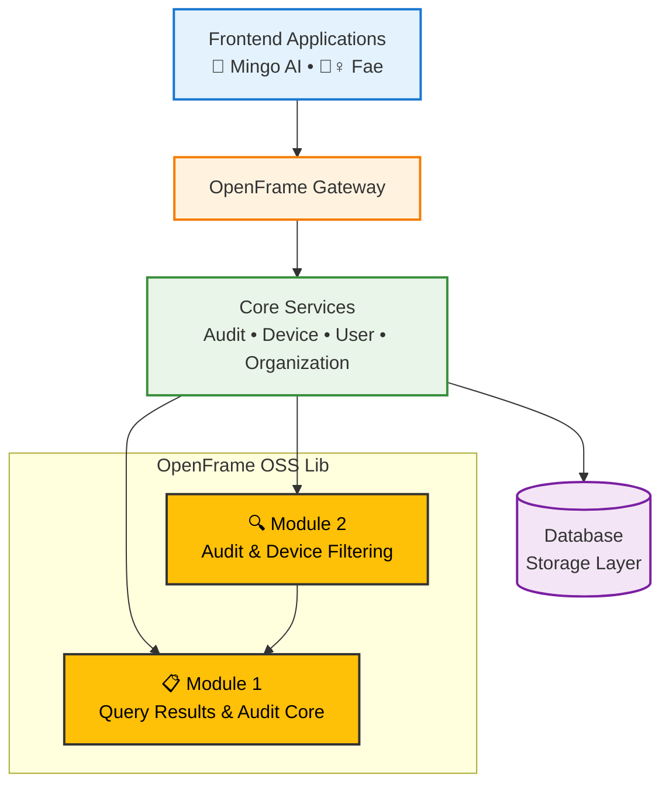

# OpenFrame OSS Lib Documentation

Welcome to the comprehensive documentation for OpenFrame OSS Lib - the foundational API DTO library that powers the OpenFrame platform's contract layer.

## 📚 Table of Contents

### Getting Started

New to OpenFrame OSS Lib? Start here to understand the library and get up and running quickly:

- [Introduction](./getting-started/introduction.md) - Overview and key concepts
- [Prerequisites](./getting-started/prerequisites.md) - System requirements and setup
- [Quick Start](./getting-started/quick-start.md) - 5-minute setup guide
- [First Steps](./getting-started/first-steps.md) - Explore core features and patterns

### Development

Development guides and workflows for contributing to OpenFrame OSS Lib:

- [Development Overview](./development/README.md) - Development environment and workflows
- [Environment Setup](./development/setup/environment.md) - Configure your development environment
- [Local Development](./development/setup/local-development.md) - Local development best practices
- [Testing Guide](./development/testing/README.md) - Testing standards and practices
- [Security Guidelines](./development/security/README.md) - Security practices and requirements
- [Architecture Guide](./development/architecture/README.md) - Development architecture principles
- [Contributing Guidelines](./development/contributing/guidelines.md) - How to contribute effectively

### Reference Documentation

Technical reference documentation for developers integrating with or extending the library:

#### Core Architecture
- [Library Overview](./reference/architecture/README.md) - Complete architectural overview

#### Module Documentation
- [Module 1](./reference/architecture/module_1/module_1.md) - Query Results & Audit Core DTOs
- [Module 2](./reference/architecture/module_2/module_2.md) - Filtering DTOs (Audit & Device)

#### Domain-Specific Documentation
- [Audit Filtering](./reference/architecture/module_2/audit_filtering.md) - Audit log filtering DTOs
- [Device Filtering](./reference/architecture/module_2/device_filtering.md) - Device inventory filtering DTOs

### Architecture Diagrams

Visual documentation showing the library's structure and data flows:

#### Module Diagrams
- [Module 1 Architecture](./diagrams/architecture/module_1.mmd) - Core query and audit DTOs
- [Module 2 Architecture](./diagrams/architecture/module_2.mmd) - Filtering DTOs overview

#### Domain-Specific Diagrams
- [Audit Filtering Flow](./diagrams/architecture/audit_filtering.mmd) - Audit filtering patterns
- [Device Filtering Flow](./diagrams/architecture/device_filtering.mmd) - Device filtering patterns

#### System Architecture
- [Library Overview Diagram](./diagrams/architecture/README.mmd) - High-level system integration

*View Mermaid diagram files (.mmd) in your IDE or with a Mermaid viewer for interactive exploration.*

## 🚀 Quick Navigation

| I Want To... | Go To |
|-------------|--------|
| **Get started quickly** | [Quick Start Guide](./getting-started/quick-start.md) |
| **Understand the architecture** | [Library Overview](./reference/architecture/README.md) |
| **Contribute code** | [Contributing Guidelines](./development/contributing/guidelines.md) |
| **Set up development environment** | [Environment Setup](./development/setup/environment.md) |
| **Learn about DTOs** | [Module 1](./reference/architecture/module_1/module_1.md) & [Module 2](./reference/architecture/module_2/module_2.md) |
| **Implement filtering** | [Audit](./reference/architecture/module_2/audit_filtering.md) & [Device](./reference/architecture/module_2/device_filtering.md) Filtering |
| **Run tests** | [Testing Guide](./development/testing/README.md) |

## 🏗️ Architecture at a Glance

OpenFrame OSS Lib provides the contract layer for the entire OpenFrame platform:

```mermaid
flowchart TD
    Frontend["Frontend Applications<br/>🤖 Mingo AI • 🧚‍♀️ Fae"] --> Gateway["OpenFrame Gateway"]
    Gateway --> Services["Core Services<br/>Audit • Device • User • Organization"]
    
    subgraph "OpenFrame OSS Lib"
        Module1["📋 Module 1<br/>Query Results & Audit Core"]
        Module2["🔍 Module 2<br/>Audit & Device Filtering"]
    end
    
    Services --> Module1
    Services --> Module2
    Module2 --> Module1
    
    Services --> Database[("Database<br/>Storage Layer")]
    
    classDef frontend fill:#e3f2fd,stroke:#1976d2,stroke-width:2px
    classDef gateway fill:#fff3e0,stroke:#f57c00,stroke-width:2px
    classDef lib fill:#FFC008,stroke:#333,stroke-width:2px,color:#000
    classDef services fill:#e8f5e8,stroke:#388e3c,stroke-width:2px
    classDef data fill:#f3e5f5,stroke:#7b1fa2,stroke-width:2px
    
    class Frontend frontend
    class Gateway gateway
    class Module1,Module2 lib
    class Services services
    class Database data
```

### Key Components

- **Module 1**: Generic pagination, query results, and audit log DTOs
- **Module 2**: Advanced filtering capabilities for audit logs and device inventory
- **Contract-First Design**: API-first approach ensuring consistent data structures
- **Multi-Tenant Support**: Organization-scoped filtering and data isolation

## 🔧 Core Features

| Feature | Description | Module |
|---------|-------------|--------|
| **Generic Pagination** | `GenericQueryResult<T>` for consistent paginated responses | Module 1 |
| **Count-Aware Filtering** | `CountedGenericQueryResult<T>` with filtered totals | Module 1 |
| **Audit Logging** | `LogEvent` and `LogDetails` for comprehensive audit trails | Module 1 |
| **Structured Filtering** | `LogFilterCriteria` for complex audit queries | Module 1 |
| **Faceted Search** | Filter options for dynamic UI generation | Module 2 |
| **Multi-Tenant Filtering** | Organization-scoped queries and isolation | Module 2 |

## 🤝 Community & Support

- **💬 Community Discussion**: Join our [OpenMSP Slack](https://join.slack.com/t/openmsp/shared_invite/zt-36bl7mx0h-3~U2nFH6nqHqoTPXMaHEHA)
- **🐛 Bug Reports**: [GitHub Issues](https://github.com/openframe/openframe-oss-lib/issues)
- **🚀 Feature Requests**: [GitHub Discussions](https://github.com/openframe/openframe-oss-lib/discussions)
- **📖 OpenFrame Platform**: [OpenFrame.ai](https://openframe.ai)
- **🏢 Flamingo**: [Flamingo.run](https://flamingo.run)

## 📖 Quick Links

- [**Project README**](../README.md) - Main project overview and quick start
- [**Contributing Guide**](../CONTRIBUTING.md) - How to contribute to the project
- [**License**](../LICENSE.md) - License information and terms

## 🔄 Documentation Updates

This documentation is continuously updated as the library evolves. Key areas of active development:

- **New DTO Patterns**: Enhanced filtering and pagination capabilities
- **Performance Optimizations**: Serialization and memory improvements
- **Integration Examples**: Real-world usage patterns and best practices
- **Testing Strategies**: Comprehensive testing approaches and tools

## ✨ What's New

Latest documentation improvements:
- **Enhanced Architecture Diagrams**: Visual representation of module relationships
- **Comprehensive API Examples**: Real-world integration patterns
- **Development Workflow Guides**: Streamlined contribution process
- **Testing Best Practices**: Updated testing standards and coverage requirements

---

*Documentation generated by [OpenFrame Doc Orchestrator](https://github.com/flamingo-stack/openframe-oss-tenant)*

**Need help?** Start with the [Quick Start Guide](./getting-started/quick-start.md) or join our [community discussion](https://join.slack.com/t/openmsp/shared_invite/zt-36bl7mx0h-3~U2nFH6nqHqoTPXMaHEHA).