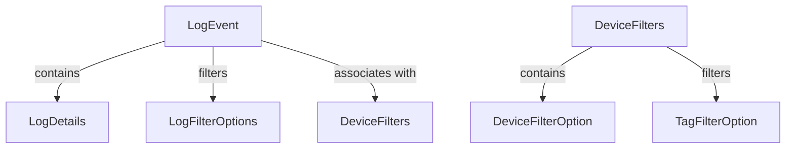

# Module 1 Documentation

## Introduction
The `module_1` module is responsible for handling audit logs and device filters within the OpenFrame API. It provides data transfer objects (DTOs) that facilitate the management and filtering of log events and device information.

## Architecture Overview

### High-Level Functionality of Sub-Modules
- **LogEvent**: Represents an event logged by the system, containing details such as event type, severity, and timestamps. See [LogEvent Documentation](LogEvent.md).
- **LogDetails**: Provides detailed information about a specific log event, including a message and additional details. See [LogDetails Documentation](LogDetails.md).
- **LogFilterOptions**: Contains options for filtering log events based on various criteria such as date range and event types. See [LogFilterOptions Documentation](LogFilterOptions.md).
- **DeviceFilters**: Represents a collection of filters that can be applied to devices, including statuses and types. See [DeviceFilters Documentation](DeviceFilters.md).
- **DeviceFilterOption**: Represents an individual filter option for devices, including its value and label. See [DeviceFilterOption Documentation](DeviceFilterOption.md).
- **LogDetails**: Provides detailed information about a specific log event, including a message and additional details. See [LogDetails Documentation](LogDetails.md).
- **LogFilterOptions**: Contains options for filtering log events based on various criteria such as date range and event types. See [LogFilterOptions Documentation](LogFilterOptions.md).
- **DeviceFilters**: Represents a collection of filters that can be applied to devices, including statuses and types. See [DeviceFilters Documentation](DeviceFilters.md).
- **DeviceFilterOption**: Represents an individual filter option for devices, including its value and label. See [DeviceFilterOption Documentation](DeviceFilterOption.md).

## Conclusion
This module plays a crucial role in managing audit logs and device filtering, providing essential DTOs for the OpenFrame API.