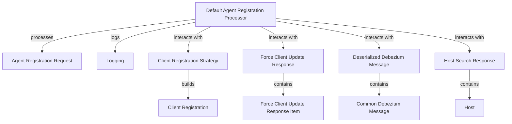

# Module 1 Documentation

## Introduction
The `module_1` is responsible for handling agent registration processes, client update responses, and managing client registration strategies. It serves as a core component in the overall system, facilitating communication between various services and ensuring that agent registrations are processed correctly.

## Architecture Overview

## High-Level Functionality
### 1. DefaultAgentRegistrationProcessor
- **Documentation**: [DefaultAgentRegistrationProcessor](DefaultAgentRegistrationProcessor.md)
- **Purpose**: Implements the `AgentRegistrationProcessor` interface with a default no-op implementation for agent registration processing.
- **Documentation**: [DefaultAgentRegistrationProcessor](openframe-client-core/src/main/java/com/openframe/client/service/agentregistration/processor/DefaultAgentRegistrationProcessor.java)

### 2. ForceClientUpdateResponse
- **Documentation**: [ForceClientUpdateResponse](ForceClientUpdateResponse.md)
- **Purpose**: Represents the response structure for client updates, containing a list of update response items.
- **Documentation**: [ForceClientUpdateResponse](openframe-api-service-core/src/main/java/com/openframe/api/dto/force/response/ForceClientUpdateResponse.java)

### 3. ClientRegistrationStrategy
- **Documentation**: [ClientRegistrationStrategy](ClientRegistrationStrategy.md)
- **Purpose**: Interface for defining client registration strategies, allowing for different implementations based on provider ID.
- **Documentation**: [ClientRegistrationStrategy](openframe-authorization-service-core/src/main/java/com/openframe/authz/service/auth/strategy/ClientRegistrationStrategy.java)

### 4. HostSearchResponse
- **Documentation**: [HostSearchResponse](HostSearchResponse.md)
- **Purpose**: Encapsulates the response from host search operations, including pagination and sorting information.
- **Documentation**: [HostSearchResponse](sdk/fleetmdm/src/main/java/com/openframe/sdk/fleetmdm/model/HostSearchResponse.java)

### 5. DeserializedDebeziumMessage
- **Documentation**: [DeserializedDebeziumMessage](DeserializedDebeziumMessage.md)
- **Purpose**: Represents a deserialized message from Debezium, containing various event-related fields.
- **Documentation**: [DeserializedDebeziumMessage](openframe-stream-service-core/src/main/java/com/openframe/stream/model/fleet/debezium/DeserializedDebeziumMessage.java)

## Conclusion
This module plays a crucial role in the overall architecture by managing agent registrations and client updates, ensuring that the system operates smoothly and efficiently.