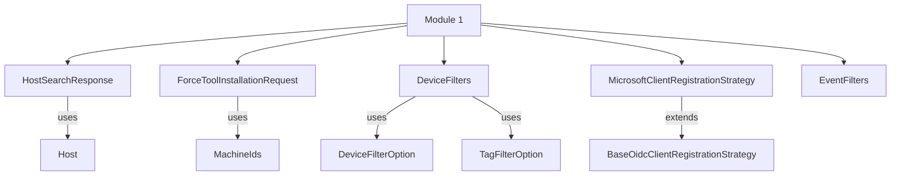

# Module 1 Documentation

## Introduction
Module 1 is designed to facilitate interactions with the Fleet MDM and related services. It provides core functionalities for managing host search responses, tool installation requests, device filtering, and event filtering, as well as integrating with Microsoft for client registration.

## Architecture Overview

## High-Level Functionality

### 1. HostSearchResponse
- For detailed documentation, refer to [HostSearchResponse](HostSearchResponse.md)
- **Purpose**: Represents the response from a host search in Fleet MDM.
- **Core Components**: [HostSearchResponse](sdk/fleetmdm/src/main/java/com/openframe/sdk/fleetmdm/model/HostSearchResponse.java)

### 2. ForceToolInstallationRequest
- For detailed documentation, refer to [ForceToolInstallationRequest](ForceToolInstallationRequest.md)
- **Purpose**: Encapsulates the request for installing tools on specified machines.
- **Core Components**: [ForceToolInstallationRequest](openframe-api-service-core/src/main/java/com/openframe/api/dto/force/request/ForceToolInstallationRequest.java)

### 3. DeviceFilters
- For detailed documentation, refer to [DeviceFilters](DeviceFilters.md)
- **Purpose**: Provides filtering options for devices based on various criteria.
- **Core Components**: [DeviceFilters](openframe-api-lib/src/main/java/com/openframe/api/dto/device/DeviceFilters.java)

### 4. MicrosoftClientRegistrationStrategy
- For detailed documentation, refer to [MicrosoftClientRegistrationStrategy](MicrosoftClientRegistrationStrategy.md)
- **Purpose**: Implements the client registration strategy for Microsoft.
- **Core Components**: [MicrosoftClientRegistrationStrategy](openframe-authorization-service-core/src/main/java/com/openframe/authz/service/auth/strategy/MicrosoftClientRegistrationStrategy.java)

### 5. EventFilters
- For detailed documentation, refer to [EventFilters](EventFilters.md)
- **Purpose**: Defines filters for events based on user IDs and event types.
- **Core Components**: [EventFilters](openframe-api-lib/src/main/java/com/openframe/api/dto/event/EventFilters.java)

## Related Modules
- For more information on related functionalities, refer to [Module 2](module_2.md), [Module 3](module_3.md), and [Module 4](module_4.md).