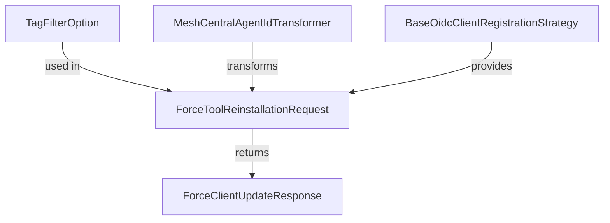

# Module 1 Documentation

## Introduction
Module 1 is responsible for handling various operations related to device management and force tool requests. It provides a set of data transfer objects (DTOs) that facilitate communication between different components of the system.

## Architecture Overview

## Core Components

### 1. TagFilterOption
- **Location**: [openframe-api-lib/src/main/java/com/openframe/api/dto/device/TagFilterOption.java](openframe-api-lib/src/main/java/com/openframe/api/dto/device/TagFilterOption.java)
- **Functionality**: Represents a filter option for tags with properties such as value, label, and count.

### 2. ForceToolReinstallationRequest
- **Location**: [openframe-api-service-core/src/main/java/com/openframe/api/dto/force/request/ForceToolReinstallationRequest.java](openframe-api-service-core/src/main/java/com/openframe/api/dto/force/request/ForceToolReinstallationRequest.java)
- **Functionality**: Contains a list of machine IDs and a tool agent ID for requesting a force reinstallation of a tool.

### 3. ForceClientUpdateResponse
- **Location**: [openframe-api-service-core/src/main/java/com/openframe/api/dto/force/response/ForceClientUpdateResponse.java](openframe-api-service-core/src/main/java/com/openframe/api/dto/force/response/ForceClientUpdateResponse.java)
- **Functionality**: Represents the response for a client update request, containing a list of update response items.

### 4. MeshCentralAgentIdTransformer
- **Location**: [openframe-client-core/src/main/java/com/openframe/client/service/agentregistration/transformer/MeshCentralAgentIdTransformer.java](openframe-client-core/src/main/java/com/openframe/client/service/agentregistration/transformer/MeshCentralAgentIdTransformer.java)
- **Functionality**: Transforms agent tool IDs for MeshCentral, ensuring they are formatted correctly for processing.

### 5. BaseOidcClientRegistrationStrategy
- **Location**: [openframe-authorization-service-core/src/main/java/com/openframe/authz/service/auth/strategy/BaseOidcClientRegistrationStrategy.java](openframe-authorization-service-core/src/main/java/com/openframe/authz/service/auth/strategy/BaseOidcClientRegistrationStrategy.java)
- **Functionality**: Abstract class that provides a strategy for registering OIDC clients, handling the configuration and registration process.

## Conclusion
Module 1 serves as a critical component in the overall system architecture, facilitating device management and tool reinstallation requests. For further details on related modules, refer to [Module 2](module_2.md) and [Module 3](module_3.md).