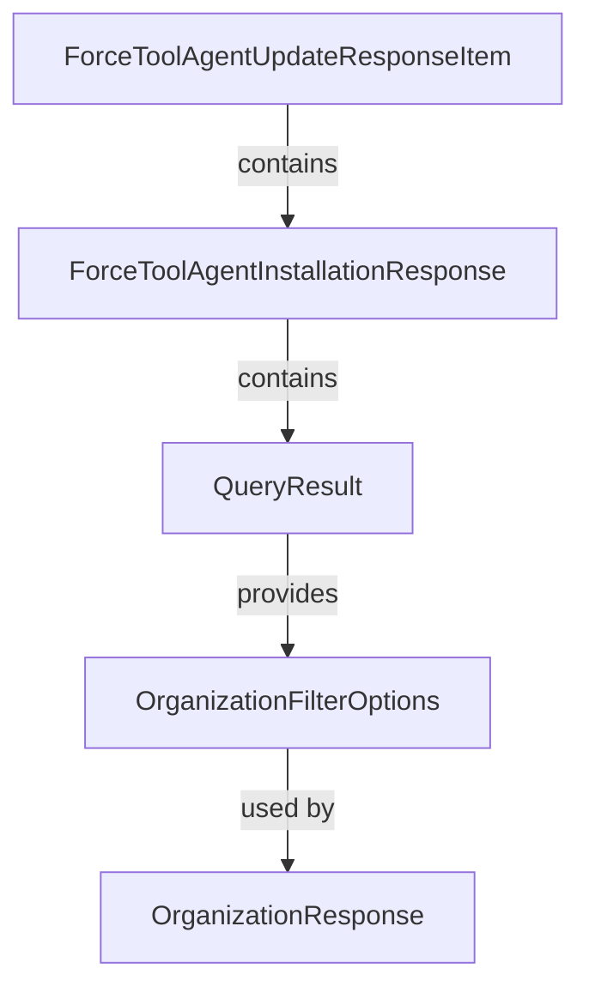

# Module 10 Documentation

## Sub-module Documentation

### ForceToolAgentUpdateResponseItem
- **File**: [ForceToolAgentUpdateResponseItem.java](openframe-api-service-core/src/main/java/com/openframe/api/dto/force/response/ForceToolAgentUpdateResponseItem.java)
- **Description**: Represents the response item for tool agent updates, containing the machine ID, tool agent ID, and the status of the update.

### ForceToolAgentInstallationResponse
- **File**: [ForceToolAgentInstallationResponse.java](openframe-api-service-core/src/main/java/com/openframe/api/dto/force/response/ForceToolAgentInstallationResponse.java)
- **Description**: Encapsulates a list of items related to tool agent installations, providing a structured response for installation requests.

### QueryResult
- **File**: [QueryResult.java](sdk/fleetmdm/src/main/java/com/openframe/sdk/fleetmdm/model/QueryResult.java)
- **Description**: Models the result of a Fleet MDM query execution, including details such as host ID, rows of data, and execution status.

### OrganizationFilterOptions
- **File**: [OrganizationFilterOptions.java](openframe-api-lib/src/main/java/com/openframe/api/dto/organization/OrganizationFilterOptions.java)
- **Description**: Defines the filter options for querying organizations, allowing for refined searches based on various criteria.

### OrganizationResponse
- **File**: [OrganizationResponse.java](openframe-api-lib/src/main/java/com/openframe/api/dto/organization/OrganizationResponse.java)
- **Description**: Represents the response structure for organization data, including various attributes such as name, category, and contact information.

## Introduction
Module 10 is responsible for handling responses related to tool agent updates and installations within the Fleet Management system. It provides data structures that facilitate the communication of status and results from various operations involving tool agents.

## Architecture Overview
The architecture of Module 10 consists of several core components that interact with each other to provide the necessary functionality. Below is a diagram illustrating the relationships between the components:

## Core Components

### 1. [ForceToolAgentUpdateResponseItem](openframe-api-service-core/src/main/java/com/openframe/api/dto/force/response/ForceToolAgentUpdateResponseItem.java)
This component represents the response item for tool agent updates, containing the machine ID, tool agent ID, and the status of the update.

### 2. [ForceToolAgentInstallationResponse](openframe-api-service-core/src/main/java/com/openframe/api/dto/force/response/ForceToolAgentInstallationResponse.java)
This component encapsulates a list of items related to tool agent installations, providing a structured response for installation requests.

### 3. [QueryResult](sdk/fleetmdm/src/main/java/com/openframe/sdk/fleetmdm/model/QueryResult.java)
This component models the result of a Fleet MDM query execution, including details such as host ID, rows of data, and execution status.

### 4. [OrganizationFilterOptions](openframe-api-lib/src/main/java/com/openframe/api/dto/organization/OrganizationFilterOptions.java)
This component defines the filter options for querying organizations, allowing for refined searches based on various criteria.

### 5. [OrganizationResponse](openframe-api-lib/src/main/java/com/openframe/api/dto/organization/OrganizationResponse.java)
This component represents the response structure for organization data, including various attributes such as name, category, and contact information.

## Conclusion
Module 10 plays a crucial role in managing tool agent responses and organization data within the Fleet Management system. For further details on each component, please refer to their respective documentation files.