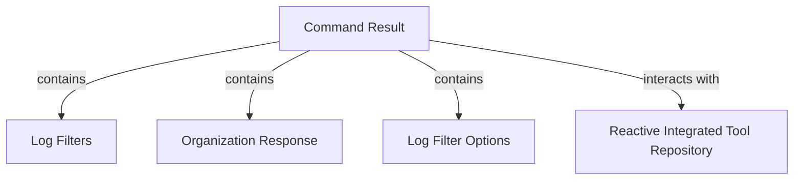

# Module 10 Documentation

## Introduction
Module 10 is responsible for managing command results, log filters, organization responses, and log filter options within the system. It provides essential data structures and repositories that facilitate the integration and management of tools in a reactive manner.

## Architecture Overview

## High-Level Functionality
- **CommandResult**: Represents the result of a command executed on an agent, including details such as agent ID, command output, and timeout settings. See [CommandResult Documentation](CommandResult.md).

  For more details, refer to the [CommandResult Documentation](CommandResult.md).
- **LogFilters**: Defines filters for log events based on tool types, event types, severities, and organizations. See [LogFilters Documentation](LogFilters.md).
- **OrganizationResponse**: A shared DTO for organization responses, used in both GraphQL and REST APIs. See [OrganizationResponse Documentation](OrganizationResponse.md).
- **LogFilterOptions**: Provides options for filtering logs based on date ranges, event types, and organization IDs. See [LogFilterOptions Documentation](LogFilterOptions.md).
- **ReactiveIntegratedToolRepository**: A reactive repository interface for managing integrated tools in a MongoDB database. See [ReactiveIntegratedToolRepository Documentation](ReactiveIntegratedToolRepository.md).

## Related Modules
- For more information on the audit-related components, refer to [Module 1](module_1.md) and [Module 2](module_2.md).
- For details on organization management, see [Module 8](module_8.md).