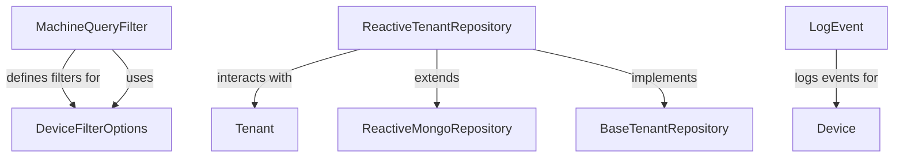

# Module 10 Documentation

## Introduction
Module 10 is responsible for managing device filtering and tenant repository functionalities within the OpenFrame system. It provides essential data structures and services to facilitate the querying and management of devices and tenants.

## Architecture Overview

## High-Level Functionality
### 1. MachineQueryFilter
- **Documentation**: [MachineQueryFilter](MachineQueryFilter.md)
- **Location**: [MachineQueryFilter.java](openframe-data-mongo/src/main/java/com/openframe/data/document/device/filter/MachineQueryFilter.java)
- **Purpose**: This class defines the filters that can be applied when querying for machines, including statuses, device types, OS types, organization IDs, and tag names.

### 2. DeviceFilterOptions
- **Documentation**: [DeviceFilterOptions](DeviceFilterOptions.md)
- **Location**: [DeviceFilterOptions.java](openframe-api-lib/src/main/java/com/openframe/api/dto/device/DeviceFilterOptions.java)
- **Purpose**: This class provides a structured way to filter devices based on various criteria such as statuses, device types, OS types, organization IDs, and tag names.

### 3. ReactiveTenantRepository
- **Documentation**: [ReactiveTenantRepository](ReactiveTenantRepository.md)
- **Location**: [ReactiveTenantRepository.java](openframe-data-mongo/src/main/java/com/openframe/data/reactive/repository/tenant/ReactiveTenantRepository.java)
- **Purpose**: This interface extends the ReactiveMongoRepository and provides methods to interact with tenant data in a reactive manner.

### 4. LogEvent
- **Documentation**: [LogEvent](LogEvent.md)
- **Location**: [LogEvent.java](openframe-api-lib/src/main/java/com/openframe/api/dto/audit/LogEvent.java)
- **Purpose**: This class represents an event log entry, capturing details about events related to devices and organizations.

### 5. MeshCentralAgentIdTransformer
- **Documentation**: [MeshCentralAgentIdTransformer](MeshCentralAgentIdTransformer.md)
- **Location**: [MeshCentralAgentIdTransformer.java](openframe-client-core/src/main/java/com/openframe/client/service/agentregistration/transformer/MeshCentralAgentIdTransformer.java)
- **Purpose**: This class transforms agent tool IDs specific to the MeshCentral tool, ensuring they are formatted correctly for processing.

## Conclusion
Module 10 plays a crucial role in the OpenFrame system by providing essential functionalities for device management and tenant interactions. For further details, refer to the documentation of the respective sub-modules.