# Module 11 Documentation

## Introduction
Module 11 is responsible for handling client update requests and managing host search functionalities within the system. It provides the necessary data structures for requesting updates to client tools and retrieving information about hosts in the Fleet MDM system.

## Architecture Overview

```mermaid
flowchart TD
    A["ForceClientUpdateRequest"] -->|contains| B["machineIds"]
    C["HostSearchRequest"] -->|contains| D["query"]
    C -->|contains| E["page"]
    C -->|contains| F["perPage"]
    C -->|contains| G["orderKey"]
    C -->|contains| H["orderDirection"]
    I["HostSearchResponse"] -->|contains| J["hosts"]
    I -->|contains| K["page"]
    I -->|contains| L["perPage"]
    I -->|contains| M["orderKey"]
    I -->|contains| N["orderDirection"]
    O["AgentInfo"] -->|contains| P["agentId"]
    O -->|contains| Q["platform"]
    O -->|contains| R["operatingSystem"]
    O -->|contains| S["hostname"]
    T["ForceToolAgentInstallationResponseItem"] -->|contains| U["machineId"]
    T -->|contains| V["toolAgentId"]
    T -->|contains| W["status"]
```

## High-Level Functionality
### 1. ForceClientUpdateRequest
- **Description**: Represents a request to update client tools on specified machines.
- **Core Component**: [ForceClientUpdateRequest](openframe-api-service-core/src/main/java/com/openframe/api/dto/force/request/ForceClientUpdateRequest.java)

### 2. HostSearchRequest
- **Description**: Encapsulates the parameters for searching hosts in the Fleet MDM system.
- **Core Component**: [HostSearchRequest](sdk/fleetmdm/src/main/java/com/openframe/sdk/fleetmdm/model/HostSearchRequest.java)

### 3. HostSearchResponse
- **Description**: Represents the response structure for host search results.
- **Core Component**: [HostSearchResponse](sdk/fleetmdm/src/main/java/com/openframe/sdk/fleetmdm/model/HostSearchResponse.java)

### 4. AgentInfo
- **Description**: Contains information about an agent in the Tactical RMM API responses.
- **Core Component**: [AgentInfo](sdk/tacticalrmm/src/main/java/com/openframe/sdk/tacticalrmm/model/AgentInfo.java)

### 5. ForceToolAgentInstallationResponseItem
- **Description**: Represents the response item for tool agent installation requests.
- **Core Component**: [ForceToolAgentInstallationResponseItem](openframe-api-service-core/src/main/java/com/openframe/api/dto/force/response/ForceToolAgentInstallationResponseItem.java)

## Conclusion
Module 11 plays a crucial role in managing client updates and host information retrieval, ensuring that the system can effectively communicate with the Fleet MDM and Tactical RMM services.