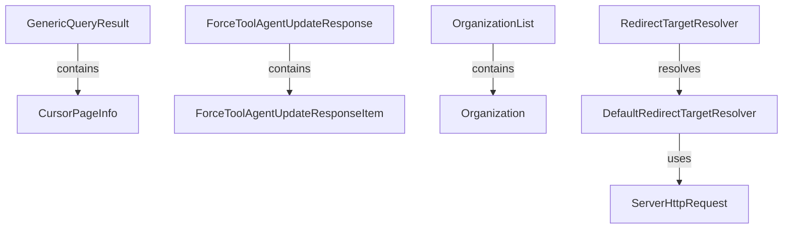

# Module 11 Documentation

## Introduction
Module 11 is responsible for handling various aspects of organization and redirect target resolution within the OpenFrame system. It provides data transfer objects (DTOs) for organization lists and manages redirect targets for OAuth services.

## Architecture Overview

## High-Level Functionality

### 1. GenericQueryResult
- **Location**: [GenericQueryResult.md](GenericQueryResult.md)
- **Functionality**: Represents a generic query result containing a list of items and pagination information.

### 2. ForceToolAgentUpdateResponse
- **Location**: [ForceToolAgentUpdateResponse.md](ForceToolAgentUpdateResponse.md)
- **Functionality**: Contains a list of items related to tool agent updates.

### 3. OrganizationList
- **Location**: [OrganizationList.md](OrganizationList.md)
- **Functionality**: DTO for organization list responses, encapsulating a list of organizations.

### 4. RedirectTargetResolver
- **Location**: [RedirectTargetResolver.md](RedirectTargetResolver.md)
- **Functionality**: Interface for resolving redirect targets based on tenant ID and requested URL.

### 5. DefaultRedirectTargetResolver
- **Location**: [DefaultRedirectTargetResolver.md](DefaultRedirectTargetResolver.md)
- **Functionality**: Default implementation of the RedirectTargetResolver interface, resolving redirect targets based on request headers.
### 1. GenericQueryResult
- **Location**: [GenericQueryResult.java](openframe-api-lib/src/main/java/com/openframe/api/dto/GenericQueryResult.java)
- **Functionality**: Represents a generic query result containing a list of items and pagination information.

### 2. ForceToolAgentUpdateResponse
- **Location**: [ForceToolAgentUpdateResponse.java](openframe-api-service-core/src/main/java/com/openframe/api/dto/force/response/ForceToolAgentUpdateResponse.java)
- **Functionality**: Contains a list of items related to tool agent updates.

### 3. OrganizationList
- **Location**: [OrganizationList.java](openframe-api-lib/src/main/java/com/openframe/api/dto/organization/OrganizationList.java)
- **Functionality**: DTO for organization list responses, encapsulating a list of organizations.

### 4. RedirectTargetResolver
- **Location**: [RedirectTargetResolver.java](openframe-security-oauth/src/main/java/com/openframe/security/oauth/service/redirect/RedirectTargetResolver.java)
- **Functionality**: Interface for resolving redirect targets based on tenant ID and requested URL.

### 5. DefaultRedirectTargetResolver
- **Location**: [DefaultRedirectTargetResolver.java](openframe-security-oauth/src/main/java/com/openframe/security/oauth/service/redirect/DefaultRedirectTargetResolver.java)
- **Functionality**: Default implementation of the RedirectTargetResolver interface, resolving redirect targets based on request headers.

## Conclusion
Module 11 plays a crucial role in managing organization data and redirect logic within the OpenFrame ecosystem. For further details, refer to the documentation of the respective components.