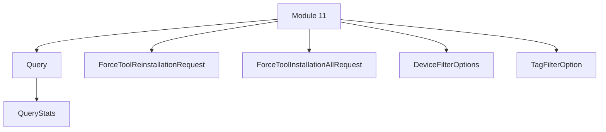

# Module 11 Documentation
## Sub-module Documentation

### Query
The `Query` class represents a saved or scheduled query in the Fleet MDM system. It includes metadata such as creation date, author information, and query statistics. The class provides methods to manage the query's properties and check if it is scheduled to run. For more details, refer to the [Query Documentation](sdk/fleetmdm/src/main/java/com/openframe/sdk/fleetmdm/model/Query.java).

### ForceToolReinstallationRequest
The `ForceToolReinstallationRequest` class is used to create requests for forcing the reinstallation of a tool on specified machines. It contains a list of machine IDs and the tool agent ID. For more details, refer to the [ForceToolReinstallationRequest Documentation](openframe-api-service-core/src/main/java/com/openframe/api/dto/force/request/ForceToolReinstallationRequest.java).

### ForceToolInstallationAllRequest
The `ForceToolInstallationAllRequest` class is used to create requests for installing a tool on all devices. It contains the tool agent ID. For more details, refer to the [ForceToolInstallationAllRequest Documentation](openframe-api-service-core/src/main/java/com/openframe/api/dto/force/request/ForceToolInstallationAllRequest.java).

### DeviceFilterOptions
The `DeviceFilterOptions` class provides filtering options for devices based on their status, type, OS, organization, and tags. For more details, refer to the [DeviceFilterOptions Documentation](openframe-api-lib/src/main/java/com/openframe/api/dto/device/DeviceFilterOptions.java).

### TagFilterOption
The `TagFilterOption` class represents a tag filter option with a value, label, and count. For more details, refer to the [TagFilterOption Documentation](openframe-api-lib/src/main/java/com/openframe/api/dto/device/TagFilterOption.java).

## Introduction
Module 11 is responsible for managing queries and tool installation requests within the Fleet MDM system. It provides functionalities to handle saved queries, force tool reinstallation, and installation requests for devices.

## Architecture Overview

### Core Components
1. **Query**: Represents a saved or scheduled query in the Fleet MDM system. It includes metadata such as creation date, author information, and query statistics. For more details, refer to [Query Documentation](sdk/fleetmdm/src/main/java/com/openframe/sdk/fleetmdm/model/Query.java).
2. **ForceToolReinstallationRequest**: A request model for forcing the reinstallation of a tool on specified machines. For more details, refer to [ForceToolReinstallationRequest Documentation](openframe-api-service-core/src/main/java/com/openframe/api/dto/force/request/ForceToolReinstallationRequest.java).
3. **ForceToolInstallationAllRequest**: A request model for installing a tool on all devices. For more details, refer to [ForceToolInstallationAllRequest Documentation](openframe-api-service-core/src/main/java/com/openframe/api/dto/force/request/ForceToolInstallationAllRequest.java).
4. **DeviceFilterOptions**: Contains filtering options for devices based on their status, type, OS, organization, and tags. For more details, refer to [DeviceFilterOptions Documentation](openframe-api-lib/src/main/java/com/openframe/api/dto/device/DeviceFilterOptions.java).
5. **TagFilterOption**: Represents a tag filter option with a value, label, and count. For more details, refer to [TagFilterOption Documentation](openframe-api-lib/src/main/java/com/openframe/api/dto/device/TagFilterOption.java).

## Conclusion
Module 11 plays a crucial role in the Fleet MDM system by providing essential functionalities for managing queries and tool installations. For further information, please refer to the documentation of related modules such as [Module 10](module_10.md) and [Module 12](module_12.md).