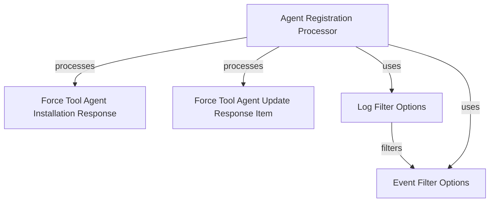

# Module 12 Documentation

## Introduction
Module 12 is responsible for handling agent registration and related responses in the OpenFrame system. It provides the necessary data structures and processing interfaces to manage agent installations and updates effectively.

## Architecture Overview

## High-Level Functionality
- **Agent Registration Processor**: This interface defines the contract for processing agent registrations, including a post-processing hook that can be overridden for custom behavior. For more details, see [AgentRegistrationProcessor](AgentRegistrationProcessor.md).
- **Force Tool Agent Installation Response**: This class encapsulates the response structure for agent installation requests, containing a list of installation response items. For more details, see [ForceToolAgentInstallationResponse](openframe-api-service-core.src.main.java.com.openframe.api.dto.force.response.ForceToolAgentInstallationResponse.ForceToolAgentInstallationResponse.md).
- **Force Tool Agent Update Response Item**: This class represents an individual item in the response for agent update requests, detailing the status of the update. For more details, see [ForceToolAgentUpdateResponseItem](openframe-api-service-core.src.main.java.com.openframe.api.dto.force.response.ForceToolAgentUpdateResponseItem.ForceToolAgentUpdateResponseItem.md).
- **Log Filter Options**: This class provides filtering options for log entries, allowing for date and type-based filtering. For more details, see [LogFilterOptions](openframe-api-lib.src.main.java.com.openframe.api.dto.audit.LogFilterOptions.LogFilterOptions.md).
- **Event Filter Options**: This class allows filtering of events based on user IDs, event types, and date ranges. For more details, see [EventFilterOptions](openframe-api-lib.src.main.java.com.openframe.api.dto.event.EventFilterOptions.EventFilterOptions.md).
