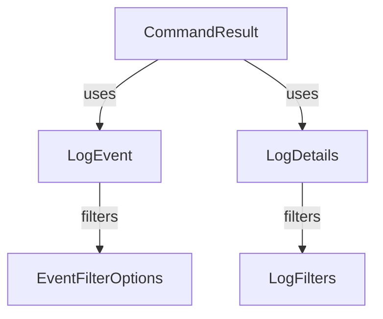

# Module 12 Documentation

## Introduction
Module 12 is responsible for handling audit logs and event filtering within the system. It provides core functionalities for managing log events, log details, and filtering options for events, which are essential for monitoring and auditing purposes.

## Sub-module Documentation

### CommandResult
- **Package**: `com.openframe.sdk.tacticalrmm.model`
- **Description**: Represents the result of a command executed on an agent, including details such as agent ID, command output, and timeout settings.

### LogEvent
- **Package**: `com.openframe.api.dto.audit`
- **Description**: Represents an event logged in the system, containing metadata such as event type, severity, and timestamps.

### LogDetails
- **Package**: `com.openframe.api.dto.audit`
- **Description**: Provides detailed information about a log event, including a message and additional details.

### EventFilterOptions
- **Package**: `com.openframe.api.dto.event`
- **Description**: Contains options for filtering events based on user IDs, event types, and date ranges.

### LogFilters
- **Package**: `com.openframe.api.dto.audit`
- **Description**: Represents filters that can be applied to logs, including tool types, event types, and severities.
## Architecture Overview
The architecture of Module 12 consists of several core components that interact with each other to provide the necessary functionalities. Below is a diagram illustrating the relationships between the components:

### Core Components
1. **CommandResult**: Represents the result of a command executed on an agent, including details such as agent ID, command output, and timeout settings. [Documentation](sdk.tacticalrmm/src/main/java/com/openframe/sdk/tacticalrmm/model/CommandResult.java)
2. **LogEvent**: Represents an event logged in the system, containing metadata such as event type, severity, and timestamps. [Documentation](openframe-api-lib/src/main/java/com/openframe/api/dto/audit/LogEvent.java)
3. **LogDetails**: Provides detailed information about a log event, including a message and additional details. [Documentation](openframe-api-lib/src/main/java/com/openframe/api/dto/audit/LogDetails.java)
4. **EventFilterOptions**: Contains options for filtering events based on user IDs, event types, and date ranges. [Documentation](openframe-api-lib/src/main/java/com/openframe/api/dto/event/EventFilterOptions.java)
5. **LogFilters**: Represents filters that can be applied to logs, including tool types, event types, and severities. [Documentation](openframe-api-lib/src/main/java/com/openframe/api/dto/audit/LogFilters.java)

## High-Level Functionality
- **CommandResult**: Manages the execution results of commands sent to agents.
- **LogEvent**: Captures and stores events for auditing purposes.
- **LogDetails**: Provides a detailed view of log events for better insights.
- **EventFilterOptions**: Allows users to filter events based on specific criteria.
- **LogFilters**: Enables filtering of logs to focus on relevant information.

## Conclusion
Module 12 plays a crucial role in the overall system by providing essential functionalities for logging and event management. For more information on related modules, refer to [Module 1](module_1.md), [Module 2](module_2.md), and [Module 3](module_3.md).