# Module 12 Documentation

## Introduction
Module 12 is designed to handle event filtering and organization filtering within the OpenFrame system. It provides essential data transfer objects (DTOs) for filtering events and organizations, as well as handling agent registration requests.

## Architecture Overview

```mermaid
flowchart TD
    A["EventFilterOptions"] -->|contains| B["userIds"]
    A -->|contains| C["eventTypes"]
    A -->|contains| D["startDate"]
    A -->|contains| E["endDate"]
    F["RedirectTargetResolver"] -->|resolves| G["requestedRedirectTo"]
    H["QueryResult"] -->|contains| I["hostId"]
    H -->|contains| J["rows"]
    H -->|contains| K["error"]
    H -->|contains| L["status"]
    H -->|contains| M["query"]
    H -->|contains| N["executedAt"]
    O["AgentRegistrationSecretRequest"] -->|contains| P["installMethod"]
    O -->|contains| Q["client"]
    O -->|contains| R["site"]
    O -->|contains| S["expires"]
    O -->|contains| T["agentType"]
    U["OrganizationFilterOptions"] -->|contains| V["category"]
    U -->|contains| W["minEmployees"]
    U -->|contains| X["maxEmployees"]
    U -->|contains| Y["hasActiveContract"]
```

## High-Level Functionality
### 1. EventFilterOptions
- **Documentation**: See [EventFilterOptions](EventFilterOptions.md)
- **Purpose**: Represents the options for filtering events based on user IDs, event types, and date range.
- **Documentation**: See [EventFilterOptions](openframe-api-lib/src.main.java.com.openframe.api.dto.event.EventFilterOptions.EventFilterOptions.md)

### 2. RedirectTargetResolver
- **Documentation**: See [RedirectTargetResolver](RedirectTargetResolver.md)
- **Purpose**: Interface for resolving redirect targets based on tenant ID and requested URL.
- **Documentation**: See [RedirectTargetResolver](openframe-security-oauth/src.main.java.com.openframe.security.oauth.service.redirect.RedirectTargetResolver.RedirectTargetResolver.md)

### 3. QueryResult
- **Documentation**: See [QueryResult](QueryResult.md)
- **Purpose**: Represents the result of a Fleet MDM query execution, including host ID, rows, and execution status.
- **Documentation**: See [QueryResult](sdk/fleetmdm/src.main.java.com.openframe.sdk.fleetmdm.model.QueryResult.QueryResult.md)

### 4. AgentRegistrationSecretRequest
- **Documentation**: See [AgentRegistrationSecretRequest](AgentRegistrationSecretRequest.md)
- **Purpose**: Represents the request for agent registration, including various parameters for installation.
- **Documentation**: See [AgentRegistrationSecretRequest](sdk/tacticalrmm/src.main.java.com.openframe.sdk.tacticalrmm.model.AgentRegistrationSecretRequest.AgentRegistrationSecretRequest.md)

### 5. OrganizationFilterOptions
- **Documentation**: See [OrganizationFilterOptions](OrganizationFilterOptions.md)
- **Purpose**: Represents options for filtering organizations based on various criteria.
- **Documentation**: See [OrganizationFilterOptions](openframe-api-lib/src.main.java.com.openframe.api.dto.organization.OrganizationFilterOptions.OrganizationFilterOptions.md)

## Conclusion
Module 12 plays a crucial role in managing event and organization filtering, as well as facilitating agent registration within the OpenFrame ecosystem.