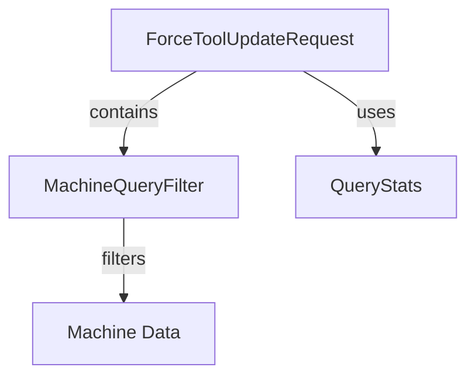

# Module 13 Documentation

## Introduction
Module 13 is responsible for managing tool updates and querying machine data within the system. It provides the necessary data structures to facilitate requests for tool updates and to filter machine data based on various criteria.

## Architecture Overview

### Core Components
1. **ForceToolUpdateRequest**: This component is used to create requests for updating tools on specified machines. It contains a list of machine IDs and a tool agent ID.
   - [ForceToolUpdateRequest Documentation](openframe-api-service-core/src/main/java/com/openframe/api/dto/force/request/ForceToolUpdateRequest.java)

2. **MachineQueryFilter**: This component is used to filter machine data based on various attributes such as status, device type, OS type, organization IDs, and tag names.
   - [MachineQueryFilter Documentation](openframe-data-mongo/src/main/java/com/openframe/data/document/device/filter/MachineQueryFilter.java)

3. **QueryStats**: This nested class within the Query component provides statistics related to the execution of queries, including user and system execution times.
   - [Query Documentation](sdk/fleetmdm/src/main/java/com/openframe/sdk/fleetmdm/model/Query.java)

## High-Level Functionality
- **ForceToolUpdateRequest**: Facilitates the creation of requests to update tools on specified machines. See [ForceToolUpdateRequest Documentation](sub-module_ForceToolUpdateRequest.md).
- **MachineQueryFilter**: Allows filtering of machine data based on various criteria, enabling efficient data retrieval. See [MachineQueryFilter Documentation](sub-module_MachineQueryFilter.md).
- **QueryStats**: Provides insights into the performance of queries executed within the system.
- **ForceToolUpdateRequest**: Facilitates the creation of requests to update tools on specified machines.
- **MachineQueryFilter**: Allows filtering of machine data based on various criteria, enabling efficient data retrieval.
- **QueryStats**: Provides insights into the performance of queries executed within the system.

## Conclusion
Module 13 plays a crucial role in managing tool updates and querying machine data, ensuring that the system can efficiently handle requests and provide relevant data.