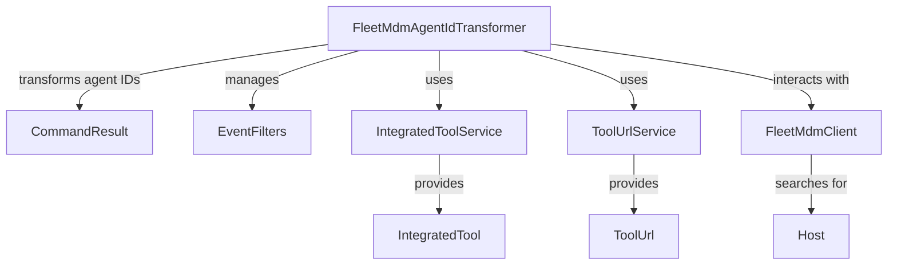

# Module 13 Documentation

## Introduction
Module 13 is responsible for transforming agent IDs for the Fleet MDM tool, handling command results, and managing event filters. It integrates with various services to ensure accurate data transformation and retrieval.

## Architecture Overview

## High-Level Functionality
### FleetMdmAgentIdTransformer
- **Documentation**: See [FleetMdmAgentIdTransformer](FleetMdmAgentIdTransformer.md)
- **Purpose**: Transforms agent tool IDs for the Fleet MDM tool.
- **Core Responsibilities**:
  - Retrieves integrated tool configurations.
  - Transforms agent tool IDs based on host data.
  - Logs relevant information during the transformation process.
- **Documentation**: See [FleetMdmAgentIdTransformer](openframe-client-core.src.main.java.com.openframe.client.service.agentregistration.transformer.FleetMdmAgentIdTransformer.FleetMdmAgentIdTransformer.md)

### CommandResult
- **Purpose**: Represents the result of a command executed on an agent.
- **Core Responsibilities**:
  - Holds command execution details such as agent ID, output, timeout, shell, and command string.
- **Documentation**: See [CommandResult](sdk.tacticalrmm.src.main.java.com.openframe.sdk.tacticalrmm.model.CommandResult.CommandResult.md)

### EventFilters
- **Purpose**: Defines filters for events based on user IDs and event types.
- **Core Responsibilities**:
  - Provides a structure for filtering events in the system.
- **Documentation**: See [EventFilters](openframe-api-lib.src.main.java.com.openframe.api.dto.event.EventFilters.EventFilters.md)

## Conclusion
Module 13 plays a crucial role in the overall system by ensuring that agent IDs are accurately transformed and that command results and event filters are effectively managed. For more details on related modules, refer to their respective documentation.