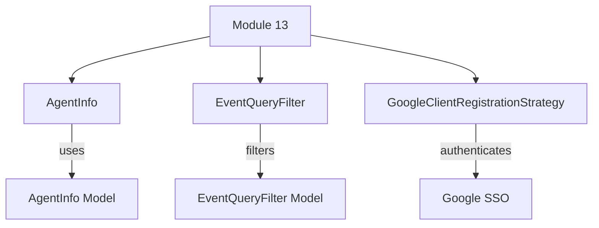

# Module 13 Documentation

## Introduction
Module 13 is responsible for managing agent information and event filtering within the Tactical RMM system. It integrates with the authorization service to handle Google client registration and provides a structured way to query events based on various filters.

## Architecture Overview

### Core Components
1. **AgentInfo**: This component represents the agent information model used in Tactical RMM API responses. It includes properties such as agent ID, platform, operating system, and hostname. For more details, refer to [AgentInfo Documentation](AgentInfo.md).

2. **EventQueryFilter**: This component is used to filter events based on user IDs, event types, and date ranges. For more details, refer to [EventQueryFilter Documentation](openframe-data-mongo.src.main.java.com.openframe.data.document.event.filter.EventQueryFilter.EventQueryFilter.md).

3. **GoogleClientRegistrationStrategy**: This component handles the registration strategy for Google clients, extending the base OIDC client registration strategy. For more details, refer to [GoogleClientRegistrationStrategy Documentation](openframe-authorization-service-core.src.main.java.com.openframe.authz.service.auth.strategy.GoogleClientRegistrationStrategy.GoogleClientRegistrationStrategy.md).

## High-Level Functionality
- **Agent Information Management**: The `AgentInfo` class provides methods to retrieve and manipulate agent data.
- **Event Filtering**: The `EventQueryFilter` class allows for the creation of complex queries to filter events based on specified criteria.
- **Client Registration**: The `GoogleClientRegistrationStrategy` class facilitates the registration of clients with Google SSO, ensuring secure authentication.

## Conclusion
Module 13 plays a crucial role in the Tactical RMM system by managing agent data and providing robust event filtering capabilities. It also integrates with the authorization service to support Google client registration.