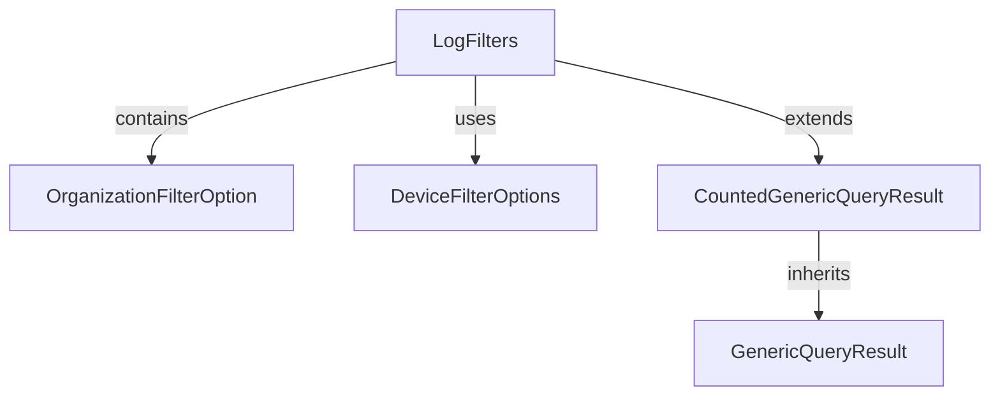

# Module 2 Documentation

## Introduction
The `module_2` module is responsible for handling various audit and device filter options within the system. It provides a structured way to filter logs and devices based on specific criteria, enhancing the overall data retrieval and management capabilities.

## Architecture Overview

### High-Level Functionality of Sub-Modules
- **LogFilters**: This component encapsulates various filtering options for logs, including tool types, event types, severities, and organizations. For more details, refer to [LogFilters Documentation](LogFilters.md).
- **OrganizationFilterOption**: Represents an organization filter option with an ID and name, used in log filters. For more details, refer to [OrganizationFilterOption Documentation](OrganizationFilterOption.md).
- **DeviceFilterOptions**: Provides filtering options for devices, including statuses, types, OS types, organization IDs, and tag names. For more details, refer to [DeviceFilterOptions Documentation](DeviceFilterOptions.md).
- **CountedGenericQueryResult**: Extends the `GenericQueryResult` to include a filtered count of items, enhancing the query result capabilities. For more details, refer to [CountedGenericQueryResult Documentation](CountedGenericQueryResult.md).
- **GenericQueryResult**: A generic class for query results that includes a list of items and pagination information. For more details, refer to [GenericQueryResult Documentation](GenericQueryResult.md).
- **OrganizationFilterOption**: Represents an organization filter option with an ID and name, used in log filters. For more details, refer to [OrganizationFilterOption Documentation](OrganizationFilterOption.md).
- **DeviceFilterOptions**: Provides filtering options for devices, including statuses, types, OS types, organization IDs, and tag names. For more details, refer to [DeviceFilterOptions Documentation](DeviceFilterOptions.md).
- **CountedGenericQueryResult**: Extends the `GenericQueryResult` to include a filtered count of items, enhancing the query result capabilities. For more details, refer to [CountedGenericQueryResult Documentation](CountedGenericQueryResult.md).
- **GenericQueryResult**: A generic class for query results that includes a list of items and pagination information. For more details, refer to [GenericQueryResult Documentation](GenericQueryResult.md).
