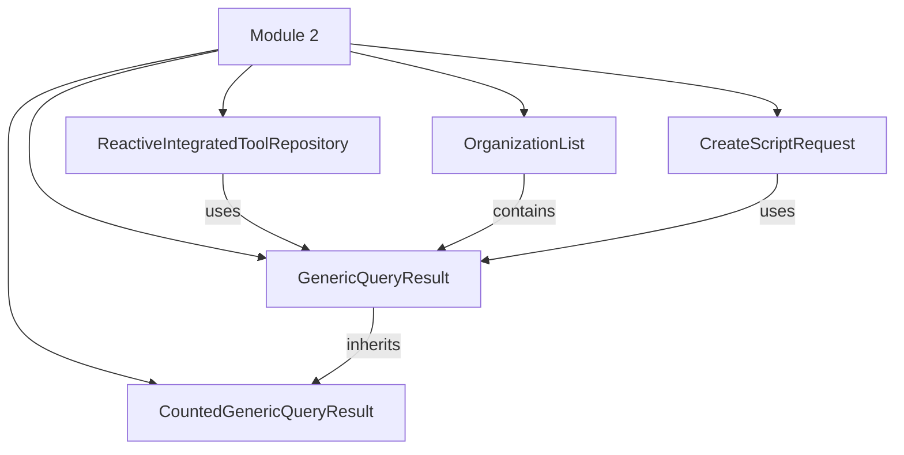

# Module 2 Documentation

## Introduction
Module 2 is a core component of the OpenFrame system, designed to handle various data transfer and processing tasks related to organizations and scripts. It provides essential data structures and repositories that facilitate the interaction with integrated tools and organization data.

## Architecture Overview

### Core Components
1. **GenericQueryResult**: A generic data structure that holds a list of items and pagination information. See [GenericQueryResult Documentation](openframe-api-lib/src.main.java.com.openframe.api.dto.GenericQueryResult.md).
2. **ReactiveIntegratedToolRepository**: A reactive repository for managing integrated tools in a MongoDB database. See [ReactiveIntegratedToolRepository Documentation](openframe-data-mongo/src.main.java.com.openframe.data.reactive.repository.tool.ReactiveIntegratedToolRepository.md).
3. **CountedGenericQueryResult**: Extends GenericQueryResult to include a count of filtered items. See [CountedGenericQueryResult Documentation](openframe-api-lib/src.main.java.com.openframe.api.dto.CountedGenericQueryResult.md).
4. **OrganizationList**: A data transfer object for returning a list of organizations. See [OrganizationList Documentation](openframe-api-lib/src.main.java.com.openframe.api.dto.organization.OrganizationList.md).
5. **CreateScriptRequest**: A model for creating scripts in Tactical RMM. See [CreateScriptRequest Documentation](sdk/tacticalrmm/src.main.java.com.openframe.sdk.tacticalrmm.model.CreateScriptRequest.md).

## High-Level Functionality
- **GenericQueryResult**: Provides a structure for paginated query results.
- **ReactiveIntegratedToolRepository**: Facilitates CRUD operations for integrated tools in a reactive manner.
- **CountedGenericQueryResult**: Enhances the generic query result with additional count information.
- **OrganizationList**: Encapsulates a list of organizations for easy retrieval and manipulation.
- **CreateScriptRequest**: Defines the parameters required to create a new script, including its body and execution context.

## Conclusion
Module 2 plays a vital role in the OpenFrame ecosystem by providing essential data structures and repositories that support the management of organizations and integrated tools. For further details, refer to the documentation of the respective components.