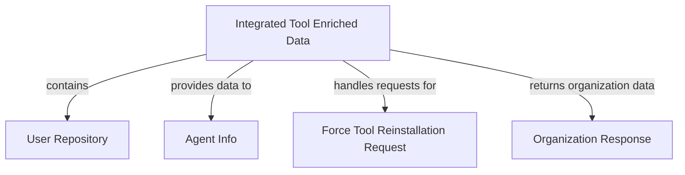

# Module 2 Documentation

## Introduction
Module 2 is responsible for managing and processing data related to integrated tools and user information within the OpenFrame system. It serves as a bridge between various components, facilitating the flow of information and ensuring that data is accurately represented and accessible.

## Architecture Overview

### High-Level Functionality of Sub-Modules
- **IntegratedToolEnrichedData**: Represents enriched data for integrated tools, including machine and organization details. See [IntegratedToolEnrichedData Documentation](IntegratedToolEnrichedData.md).
- **ReactiveUserRepository**: A reactive repository for managing user data in MongoDB. See [ReactiveUserRepository Documentation](ReactiveUserRepository.md).
- **AgentInfo**: Contains information about agents in the Tactical RMM API. See [AgentInfo Documentation](AgentInfo.md).
- **ForceToolReinstallationRequest**: Represents a request to reinstall a tool on specified machines. See [ForceToolReinstallationRequest Documentation](ForceToolReinstallationRequest.md).
- **OrganizationResponse**: DTO for organization responses used across different services. See [OrganizationResponse Documentation](OrganizationResponse.md).
- **ReactiveUserRepository**: A reactive repository for managing user data in MongoDB. See [ReactiveUserRepository Documentation](openframe-data-mongo/src.main.java.com.openframe.data.reactive.repository.user.ReactiveUserRepository.md).
- **AgentInfo**: Contains information about agents in the Tactical RMM API. See [AgentInfo Documentation](sdk.tacticalrmm/src.main.java.com.openframe.sdk.tacticalrmm.model.AgentInfo.md).
- **ForceToolReinstallationRequest**: Represents a request to reinstall a tool on specified machines. See [ForceToolReinstallationRequest Documentation](openframe-api-service-core/src.main.java.com.openframe.api.dto.force.request.ForceToolReinstallationRequest.md).
- **OrganizationResponse**: DTO for organization responses used across different services. See [OrganizationResponse Documentation](openframe-api-lib/src.main.java.com.openframe.api.dto.organization.OrganizationResponse.md).

## Conclusion
Module 2 plays a crucial role in the OpenFrame ecosystem by integrating various components and ensuring seamless data flow. For more detailed information on each sub-module, please refer to the respective documentation files.