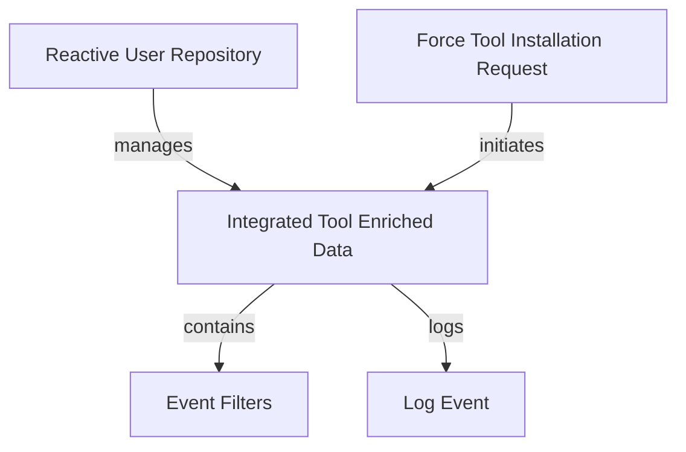

# Module 2 Documentation

## Introduction
Module 2 is responsible for managing event filters, logging events, and user data within the system. It integrates various components to provide a cohesive service for handling enriched data related to tools and events.

## Architecture Overview

## High-Level Functionality
- **IntegratedToolEnrichedData**: Represents enriched data for tools, including machine and organization details. See [IntegratedToolEnrichedData](openframe-stream-service-core.src.main.java.com.openframe.stream.model.fleet.debezium.IntegratedToolEnrichedData.md).
- **EventFilters**: Provides filtering options for events based on user IDs and event types. See [EventFilters](openframe-api-lib.src.main.java.com.openframe.api.dto.event.EventFilters.md).
- **LogEvent**: Represents an event log with details such as event type, severity, and timestamps. See [LogEvent](openframe-api-lib.src.main.java.com.openframe.api.dto.audit.LogEvent.md).
- **ReactiveUserRepository**: A reactive repository for managing user data. See [ReactiveUserRepository](openframe-data-mongo.src.main.java.com.openframe.data.reactive.repository.user.ReactiveUserRepository.md).
- **ForceToolInstallationAllRequest**: Represents a request to install all tools for a specific agent. See [ForceToolInstallationAllRequest](openframe-api-service-core.src.main.java.com.openframe.api.dto.force.request.ForceToolInstallationAllRequest.md).
