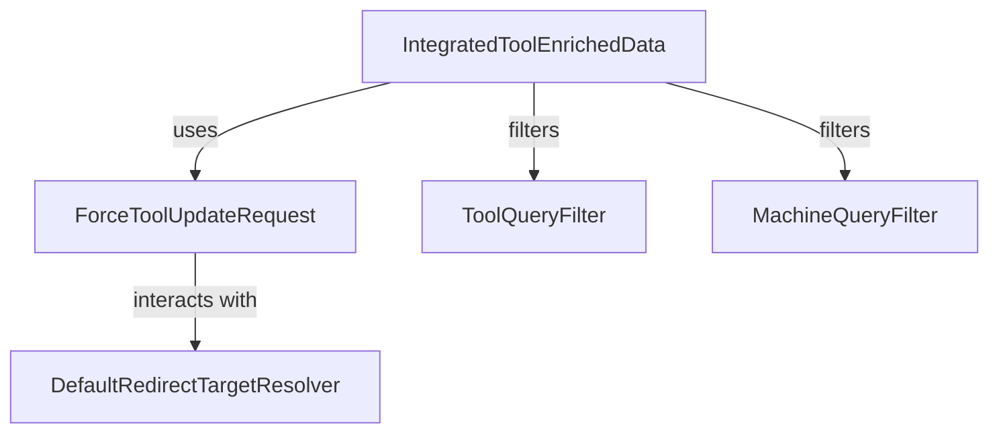

# Module 3 Documentation

## Sub-module Documentation

### IntegratedToolEnrichedData
- **Location**: [IntegratedToolEnrichedData.java](openframe-stream-service-core/src/main/java/com/openframe/stream/model/fleet/debezium/IntegratedToolEnrichedData.java)
- **Description**: This class represents enriched data for tools, including machine ID, hostname, organization ID, organization name, and user ID.

### ForceToolUpdateRequest
- **Location**: [ForceToolUpdateRequest.java](openframe-api-service-core/src/main/java/com/openframe/api/dto/force/request/ForceToolUpdateRequest.java)
- **Description**: This class is used to request updates for tools based on a list of machine IDs and a tool agent ID.

### ToolQueryFilter
- **Location**: [ToolQueryFilter.java](openframe-data-mongo/src/main/java/com/openframe/data/document/tool/filter/ToolQueryFilter.java)
- **Description**: This class provides filtering capabilities for tools based on various attributes such as enabled status, type, category, and platform category.

### DefaultRedirectTargetResolver
- **Location**: [DefaultRedirectTargetResolver.java](openframe-security-oauth/src/main/java/com/openframe/security/oauth/service/redirect/DefaultRedirectTargetResolver.java)
- **Description**: This class resolves redirect targets based on the requested URL and the referer header, ensuring that users are redirected appropriately after actions.

### MachineQueryFilter
- **Location**: [MachineQueryFilter.java](openframe-data-mongo/src/main/java/com/openframe/data/document/device/filter/MachineQueryFilter.java)
- **Description**: This class filters machines based on their statuses, device types, OS types, organization IDs, and tag names.

## Introduction
Module 3 is responsible for managing and processing tool updates and enriched data related to machines within an organization. It provides functionalities to filter and update tools based on various criteria, ensuring that the tools are effectively managed across different machines.

## Architecture Overview
The architecture of Module 3 consists of several core components that interact with each other to provide the necessary functionalities. Below is a diagram illustrating the relationships between the components:

## Core Components

### 1. IntegratedToolEnrichedData
- **Location**: [openframe-stream-service-core/src/main/java/com/openframe/stream/model/fleet/debezium/IntegratedToolEnrichedData.java](openframe-stream-service-core/src/main/java/com/openframe/stream/model/fleet/debezium/IntegratedToolEnrichedData.java)
- **Functionality**: This component holds enriched data related to tools, including machine ID, hostname, organization ID, organization name, and user ID.

### 2. ForceToolUpdateRequest
- **Location**: [openframe-api-service-core/src/main/java/com/openframe/api/dto/force/request/ForceToolUpdateRequest.java](openframe-api-service-core/src/main/java/com/openframe/api/dto/force/request/ForceToolUpdateRequest.java)
- **Functionality**: This component is used to request updates for tools based on a list of machine IDs and a tool agent ID.

### 3. ToolQueryFilter
- **Location**: [openframe-data-mongo/src/main/java/com/openframe/data/document/tool/filter/ToolQueryFilter.java](openframe-data-mongo/src/main/java/com/openframe/data/document/tool/filter/ToolQueryFilter.java)
- **Functionality**: This component provides filtering capabilities for tools based on various attributes such as enabled status, type, category, and platform category.

### 4. DefaultRedirectTargetResolver
- **Location**: [openframe-security-oauth/src/main/java/com/openframe/security/oauth/service/redirect/DefaultRedirectTargetResolver.java](openframe-security-oauth/src/main/java/com/openframe/security/oauth/service/redirect/DefaultRedirectTargetResolver.java)
- **Functionality**: This component resolves redirect targets based on the requested URL and the referer header, ensuring that users are redirected appropriately after actions.

### 5. MachineQueryFilter
- **Location**: [openframe-data-mongo/src/main/java/com/openframe/data/document/device/filter/MachineQueryFilter.java](openframe-data-mongo/src/main/java/com/openframe/data/document/device/filter/MachineQueryFilter.java)
- **Functionality**: This component filters machines based on their statuses, device types, OS types, organization IDs, and tag names.

## Conclusion
Module 3 plays a crucial role in managing tool updates and enriched data for machines. Its components work together to provide a robust framework for filtering and updating tools effectively. For more information on related modules, please refer to their respective documentation files.