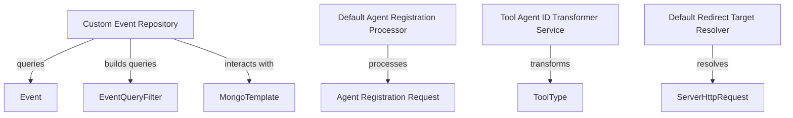

# Module 3 Documentation

## Introduction
Module 3 is responsible for handling agent registration and event management within the OpenFrame system. It provides functionalities for processing agent registrations, transforming agent IDs, and querying event data from a MongoDB database.

## Architecture Overview

## Core Components

### 1. CustomEventRepositoryImpl
For detailed documentation, refer to [CustomEventRepositoryImpl](CustomEventRepositoryImpl.md).

### 2. DefaultAgentRegistrationProcessor
For detailed documentation, refer to [DefaultAgentRegistrationProcessor](DefaultAgentRegistrationProcessor.md).

### 3. ToolAgentIdTransformerService
For detailed documentation, refer to [ToolAgentIdTransformerService](ToolAgentIdTransformerService.md).

### 4. DefaultRedirectTargetResolver
For detailed documentation, refer to [DefaultRedirectTargetResolver](DefaultRedirectTargetResolver.md).

### 5. DeviceFilterOption
For detailed documentation, refer to [DeviceFilterOption](DeviceFilterOption.md).
### 1. CustomEventRepositoryImpl
- **Purpose**: Implements the `CustomEventRepository` interface to provide custom querying capabilities for events stored in MongoDB.
- **Key Methods**:
  - `buildEventQuery(EventQueryFilter filter, String search)`: Constructs a query based on the provided filter and search criteria.
  - `findEventsWithCursor(Query query, String cursor, int limit)`: Retrieves events with pagination support using a cursor.
  - `findDistinctUserIds()`: Fetches distinct user IDs from the event collection.
  - `findDistinctEventTypes()`: Fetches distinct event types from the event collection.

### 2. DefaultAgentRegistrationProcessor
- **Purpose**: Default implementation of the `AgentRegistrationProcessor` interface, providing a no-op method for post-processing agent registrations.
- **Key Method**:
  - `postProcessAgentRegistration(Machine machine, AgentRegistrationRequest request)`: Logs the registration process without additional actions.

### 3. ToolAgentIdTransformerService
- **Purpose**: Transforms agent tool IDs based on the tool type using a list of transformers.
- **Key Method**:
  - `transform(ToolType toolType, String agentToolId, boolean lastAttempt)`: Applies the appropriate transformation based on the tool type.

### 4. DefaultRedirectTargetResolver
- **Purpose**: Resolves redirect targets for OAuth flows, determining where to redirect users after authentication.
- **Key Method**:
  - `resolve(String tenantId, String requestedRedirectTo, ServerHttpRequest request)`: Determines the redirect target based on the request and provided parameters.

### 5. DeviceFilterOption
- **Purpose**: Represents filter options for devices, including value, label, and count.
- **Key Attributes**:
  - `value`: The value of the filter option.
  - `label`: The display label for the filter option.
  - `count`: The count of items associated with this filter option.

## Related Modules
- For more information on event handling, refer to [Module 2](module_2.md).
- For agent registration processes, see [Module 1](module_1.md).
- For device filtering options, check [Module 8](module_8.md).