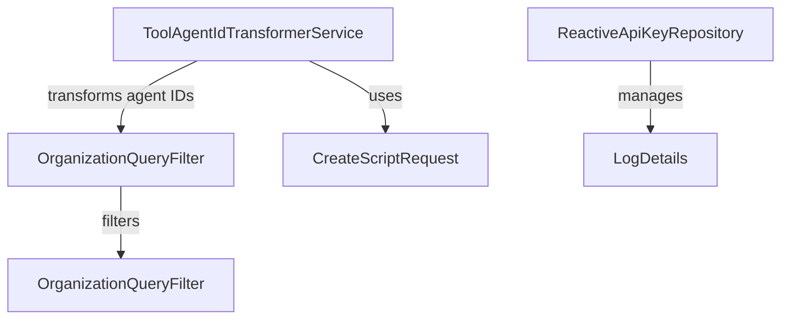

# Module 3 Documentation

## Introduction
Module 3 is responsible for managing agent registration and related functionalities within the OpenFrame system. It provides services for transforming agent IDs, querying organizations, creating scripts, and managing API keys.

## Architecture Overview

## Core Components
### 1. ToolAgentIdTransformerService
- **Documentation**: [ToolAgentIdTransformerService](ToolAgentIdTransformerService.md)
- **Purpose**: Transforms agent IDs based on the tool type.
- **Documentation**: [ToolAgentIdTransformerService](openframe-client-core.src.main.java.com.openframe.client.service.agentregistration.transformer.ToolAgentIdTransformerService.ToolAgentIdTransformerService.md)

### 2. OrganizationQueryFilter
- **Documentation**: [OrganizationQueryFilter](OrganizationQueryFilter.md)
- **Purpose**: Defines filter criteria for querying organizations in MongoDB.
- **Documentation**: [OrganizationQueryFilter](openframe-data-mongo.src.main.java.com.openframe.data.document.organization.filter.OrganizationQueryFilter.OrganizationQueryFilter.md)

### 3. CreateScriptRequest
- **Documentation**: [CreateScriptRequest](CreateScriptRequest.md)
- **Purpose**: Represents a request to create a new script in Tactical RMM.
- **Documentation**: [CreateScriptRequest](sdk.tacticalrmm.src.main.java.com.openframe.sdk.tacticalrmm.model.CreateScriptRequest.CreateScriptRequest.md)

### 4. ReactiveApiKeyRepository
- **Documentation**: [ReactiveApiKeyRepository](ReactiveApiKeyRepository.md)
- **Purpose**: Provides reactive access to API keys in MongoDB.
- **Documentation**: [ReactiveApiKeyRepository](openframe-data-mongo.src.main.java.com.openframe.data.reactive.repository.apikey.ReactiveApiKeyRepository.ReactiveApiKeyRepository.md)

### 5. LogDetails
- **Documentation**: [LogDetails](LogDetails.md)
- **Purpose**: Contains details about log events for auditing purposes.
- **Documentation**: [LogDetails](openframe-api-lib.src.main.java.com.openframe.api.dto.audit.LogDetails.LogDetails.md)

## Conclusion
Module 3 plays a crucial role in the OpenFrame system by providing essential services for agent registration and management. For more information on related modules, refer to [Module 1](module_1.md), [Module 2](module_2.md), and [Module 4](module_4.md).