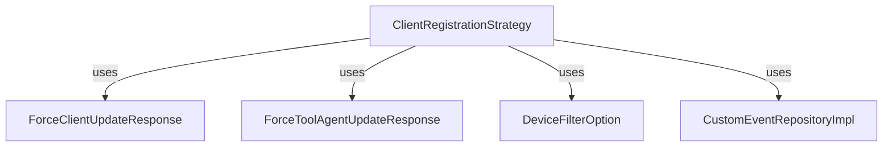

# Module 4 Documentation
# Module 4 Documentation

## Introduction
Module 4 is responsible for managing client registration strategies and handling responses related to client updates and tool agent updates. It provides a structured way to manage device filter options and custom event repositories.

## Architecture Overview

## High-Level Functionality
### 1. ClientRegistrationStrategy
- **Purpose**: Interface for defining client registration strategies.
- **Documentation**: [ClientRegistrationStrategy](openframe-authorization-service-core/src/main/java/com/openframe/authz/service/auth/strategy/ClientRegistrationStrategy.java)

### 2. ForceClientUpdateResponse
- **Purpose**: Represents the response structure for client updates, containing a list of update items.
- **Documentation**: [ForceClientUpdateResponse](openframe-api-service-core/src/main/java/com/openframe/api/dto/force/response/ForceClientUpdateResponse.java)

### 3. DeviceFilterOption
- **Purpose**: Defines options for filtering devices, including value, label, and count.
- **Documentation**: [DeviceFilterOption](openframe-api-lib/src/main/java/com/openframe/api/dto/device/DeviceFilterOption.java)

### 4. ForceToolAgentUpdateResponse
- **Purpose**: Represents the response structure for tool agent updates, containing a list of update items.
- **Documentation**: [ForceToolAgentUpdateResponse](openframe-api-service-core/src/main/java/com/openframe/api/dto/force/response/ForceToolAgentUpdateResponse.java)

### 5. CustomEventRepositoryImpl
- **Purpose**: Implementation of a custom event repository that handles event queries and data retrieval.
- **Documentation**: [CustomEventRepositoryImpl](openframe-data-mongo/src/main/java/com/openframe/data/repository/event/impl/CustomEventRepositoryImpl.java)

## Conclusion
Module 4 integrates various components to facilitate client registration and event management, ensuring a cohesive approach to handling device and event data.

## Introduction
Module 4 is responsible for managing client registration strategies and handling responses related to client updates and tool agent updates. It provides a structured way to manage device filter options and custom event repositories.

## Architecture Overview

## High-Level Functionality
### 1. ClientRegistrationStrategy
- **Purpose**: Interface for defining client registration strategies.
- **Documentation**: [ClientRegistrationStrategy](openframe-authorization-service-core/src/main/java/com/openframe/authz/service/auth/strategy/ClientRegistrationStrategy.java)

### 2. ForceClientUpdateResponse
- **Purpose**: Represents the response structure for client updates, containing a list of update items.
- **Documentation**: [ForceClientUpdateResponse](openframe-api-service-core/src/main/java/com/openframe/api/dto/force/response/ForceClientUpdateResponse.java)

### 3. DeviceFilterOption
- **Purpose**: Defines options for filtering devices, including value, label, and count.
- **Documentation**: [DeviceFilterOption](openframe-api-lib/src/main/java/com/openframe/api/dto/device/DeviceFilterOption.java)

### 4. ForceToolAgentUpdateResponse
- **Purpose**: Represents the response structure for tool agent updates, containing a list of update items.
- **Documentation**: [ForceToolAgentUpdateResponse](openframe-api-service-core/src/main/java/com/openframe/api/dto/force/response/ForceToolAgentUpdateResponse.java)

### 5. CustomEventRepositoryImpl
- **Purpose**: Implementation of a custom event repository that handles event queries and data retrieval.
- **Documentation**: [CustomEventRepositoryImpl](openframe-data-mongo/src/main/java/com/openframe/data/repository/event/impl/CustomEventRepositoryImpl.java)

## Conclusion
Module 4 integrates various components to facilitate client registration and event management, ensuring a cohesive approach to handling device and event data.