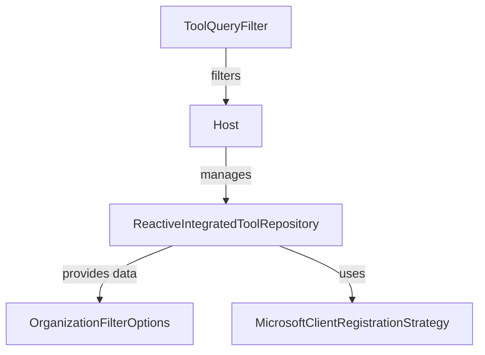

# Module 4 Documentation
## Sub-module Documentation

### ToolQueryFilter
- **Location**: [openframe-data-mongo/src/main/java/com/openframe/data/document/tool/filter/ToolQueryFilter.java](openframe-data-mongo/src/main/java/com/openframe/data/document/tool/filter/ToolQueryFilter.java)
- **Description**: This class is used to filter tools based on various attributes such as enabled status, type, and category.

### Host
- **Location**: [sdk/fleetmdm/src/main/java/com/openframe/sdk/fleetmdm/model/Host.java](sdk/fleetmdm/src/main/java/com/openframe/sdk/fleetmdm/model/Host.java)
- **Description**: Represents a host model from Fleet MDM, encapsulating various properties related to the host's configuration and status.

### ReactiveIntegratedToolRepository
- **Location**: [openframe-data-mongo/src/main/java/com/openframe/data/reactive/repository/tool/ReactiveIntegratedToolRepository.java](openframe-data-mongo/src/main/java/com/openframe/data/reactive/repository/tool/ReactiveIntegratedToolRepository.java)
- **Description**: A reactive repository interface for managing integrated tools, extending the capabilities of the base repository with reactive programming support.

### OrganizationFilterOptions
- **Location**: [openframe-api-lib/src/main/java/com/openframe/api/dto/organization/OrganizationFilterOptions.java](openframe-api-lib/src/main/java/com/openframe/api/dto/organization/OrganizationFilterOptions.java)
- **Description**: DTO for filtering organizations based on various criteria such as employee count and contract status.

### MicrosoftClientRegistrationStrategy
- **Location**: [openframe-authorization-service-core/src/main/java/com/openframe/authz/service/auth/strategy/MicrosoftClientRegistrationStrategy.java](openframe-authorization-service-core/src/main/java/com/openframe/authz/service/auth/strategy/MicrosoftClientRegistrationStrategy.java)
- **Description**: Implements the client registration strategy for Microsoft, handling the configuration and properties specific to Microsoft SSO.

## Introduction
Module 4 is responsible for managing tools and their associated data within the system. It provides functionalities for querying tools, managing their properties, and integrating with external systems through a reactive repository pattern.

## Architecture Overview

## Core Components

### 1. ToolQueryFilter
- **Location**: [openframe-data-mongo/src/main/java/com/openframe/data/document/tool/filter/ToolQueryFilter.java](openframe-data-mongo/src/main/java/com/openframe/data/document/tool/filter/ToolQueryFilter.java)
- **Functionality**: Represents the filter options for querying tools based on various attributes such as enabled status, type, and category.

### 2. Host
- **Location**: [sdk/fleetmdm/src/main/java/com/openframe/sdk/fleetmdm/model/Host.java](sdk/fleetmdm/src/main/java/com/openframe/sdk/fleetmdm/model/Host.java)
- **Functionality**: Represents a host model from Fleet MDM, encapsulating various properties related to the host's configuration and status.

### 3. ReactiveIntegratedToolRepository
- **Location**: [openframe-data-mongo/src/main/java/com/openframe/data/reactive/repository/tool/ReactiveIntegratedToolRepository.java](openframe-data-mongo/src/main/java/com/openframe/data/reactive/repository/tool/ReactiveIntegratedToolRepository.java)
- **Functionality**: A reactive repository interface for managing integrated tools, extending the capabilities of the base repository with reactive programming support.

### 4. OrganizationFilterOptions
- **Location**: [openframe-api-lib/src/main/java/com/openframe/api/dto/organization/OrganizationFilterOptions.java](openframe-api-lib/src/main/java/com/openframe/api/dto/organization/OrganizationFilterOptions.java)
- **Functionality**: DTO for filtering organizations based on various criteria such as employee count and contract status.

### 5. MicrosoftClientRegistrationStrategy
- **Location**: [openframe-authorization-service-core/src/main/java/com/openframe/authz/service/auth/strategy/MicrosoftClientRegistrationStrategy.java](openframe-authorization-service-core/src/main/java/com/openframe/authz/service/auth/strategy/MicrosoftClientRegistrationStrategy.java)
- **Functionality**: Implements the client registration strategy for Microsoft, handling the configuration and properties specific to Microsoft SSO.

## Conclusion
Module 4 plays a crucial role in the overall system by providing essential functionalities for tool management and integration with external services. For more details on related modules, refer to [Module 1](module_1.md), [Module 2](module_2.md), and [Module 3](module_3.md).