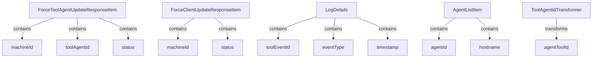

# Module 4 Documentation

## Introduction
Module 4 is responsible for handling agent updates and client updates within the system. It provides data structures for responses related to tool agent updates and client updates, as well as logging details for auditing purposes.

## Architecture Overview

## High-Level Functionality
### 1. ForceToolAgentUpdateResponseItem
- **Purpose**: Represents the response item for tool agent updates.
- **Core Components**: `machineId`, `toolAgentId`, `status`.
- **Documentation**: Refer to [ForceToolAgentUpdateResponseItem](openframe-api-service-core/src/main/java/com/openframe/api/dto/force/response/ForceToolAgentUpdateResponseItem.java).

### 2. ForceClientUpdateResponseItem
- **Purpose**: Represents the response item for client updates.
- **Core Components**: `machineId`, `status`.
- **Documentation**: Refer to [ForceClientUpdateResponseItem](openframe-api-service-core/src/main/java/com/openframe/api/dto/force/response/ForceClientUpdateResponseItem.java).

### 3. LogDetails
- **Purpose**: Contains details for logging events.
- **Core Components**: `toolEventId`, `eventType`, `timestamp`, etc.
- **Documentation**: Refer to [LogDetails](openframe-api-lib/src/main/java/com/openframe/api/dto/audit/LogDetails.java).

### 4. AgentListItem
- **Purpose**: Represents an item in the agent list for Tactical RMM API responses.
- **Core Components**: `id`, `agentId`, `hostname`, etc.
- **Documentation**: Refer to [AgentListItem](sdk/tacticalrmm/src/main/java/com/openframe/sdk/tacticalrmm/model/AgentListItem.java).

### 5. ToolAgentIdTransformer
- **Purpose**: Interface for transforming agent tool IDs.
- **Core Components**: `getToolType()`, `transform()`. 
- **Documentation**: Refer to [ToolAgentIdTransformer](openframe-client-core/src/main/java/com/openframe/client/service/agentregistration/transformer/ToolAgentIdTransformer.java).

## Conclusion
Module 4 plays a crucial role in managing agent and client updates, ensuring that the system can effectively track and log these updates for auditing and operational purposes.