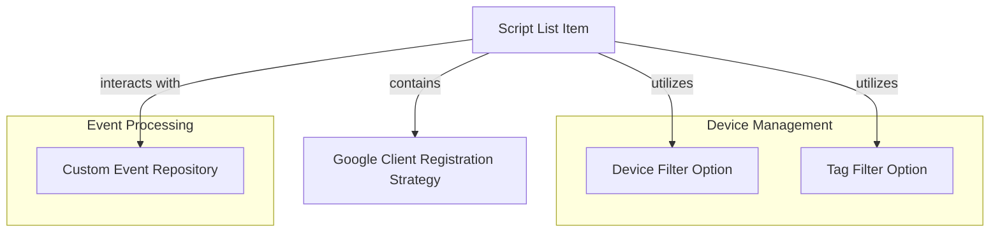

# Module 5 Documentation

## Introduction
Module 5 is responsible for handling various functionalities related to device management and event processing within the Tactical RMM system. It includes components for managing script lists, device filtering options, and custom event repositories.

## Architecture Overview

## High-Level Functionality of Sub-Modules
- **ScriptListItem**: Represents a script item in the Tactical RMM API responses. For more details, refer to [ScriptListItem Documentation](sdk_tacticalrmm.md).
- **GoogleClientRegistrationStrategy**: Implements the client registration strategy for Google OAuth. For more details, refer to [GoogleClientRegistrationStrategy Documentation](google_client_registration_strategy.md).
- **DeviceFilterOption**: Represents filter options for devices. For more details, refer to [DeviceFilterOption Documentation](device_filter_option.md).
- **TagFilterOption**: Represents tag filter options for devices. For more details, refer to [TagFilterOption Documentation](tag_filter_option.md).
- **CustomEventRepositoryImpl**: Implements custom event repository functionalities. For more details, refer to [CustomEventRepositoryImpl Documentation](custom_event_repository_impl.md).
- **GoogleClientRegistrationStrategy**: Implements the client registration strategy for Google OAuth. For more details, refer to [GoogleClientRegistrationStrategy Documentation](google_client_registration_strategy.md).
- **DeviceFilterOption**: Represents filter options for devices. For more details, refer to [DeviceFilterOption Documentation](device_filter_option.md).
- **TagFilterOption**: Represents tag filter options for devices. For more details, refer to [TagFilterOption Documentation](tag_filter_option.md).
- **CustomEventRepositoryImpl**: Implements custom event repository functionalities. For more details, refer to [CustomEventRepositoryImpl Documentation](custom_event_repository_impl.md).

## Conclusion
Module 5 integrates various components to facilitate device management and event processing, ensuring a cohesive operation within the Tactical RMM system.